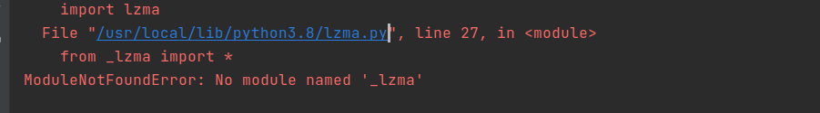

# Fashion-Mnist数据集

## 代码

```Python
import os
import sys
import torchvision

from torch.utils.data import DataLoader
from torchvision.transforms import transforms


CUR = os.path.dirname(os.path.abspath(__file__))
PROJECT_ROOT = os.path.dirname(os.path.dirname(CUR))


def get_data_fashion_mnist(batch_size):
    train_mnist = torchvision.datasets.FashionMNIST(
        root=os.path.join(PROJECT_ROOT, "Datasets", "Fashion-Mnist"),
        train=True,
        download=True,
        transform=transforms.ToTensor(),
    )
    test_mnist = torchvision.datasets.FashionMNIST(
        root=os.path.join(PROJECT_ROOT, "Datasets", "Fashion-Mnist"),
        train=False,
        download=True,
        transform=transforms.ToTensor(),
    )
    if sys.platform.startswith("win"):
        num_worker = 0
    else:
        num_worker = 4
    train_iter = DataLoader(train_mnist, batch_size=batch_size, shuffle=True, num_workers=num_worker)
    test_iter = DataLoader(test_mnist, batch_size=batch_size, shuffle=True, num_workers=num_worker)
    return train_iter, test_iter

```

## 使用

```Python
train_iter, test_iter = get_data_fashion_mnist(256)
for data, label in train_iter:
	...
```


## 加载遇到的问题

1 lzma加载失败，找不到模块



解决方法：

1 执行以下命令

```Bash
sudo apt-get update
sudo apt-get install make build-essential libssl-dev zlib1g-dev \
libbz2-dev libreadline-dev libsqlite3-dev wget curl llvm \
libncursesw5-dev xz-utils tk-dev libxml2-dev libxmlsec1-dev libffi-dev liblzma-dev
```

2 重新编译Python

```Bash
# cd 到Python安装路径
./configure
make
sudo make install
```

