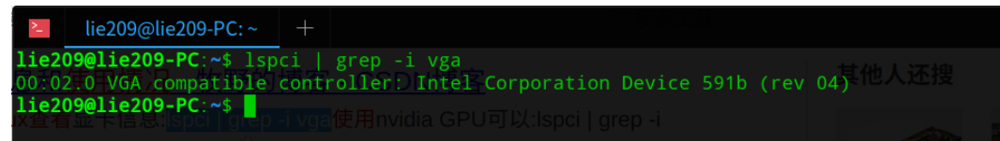
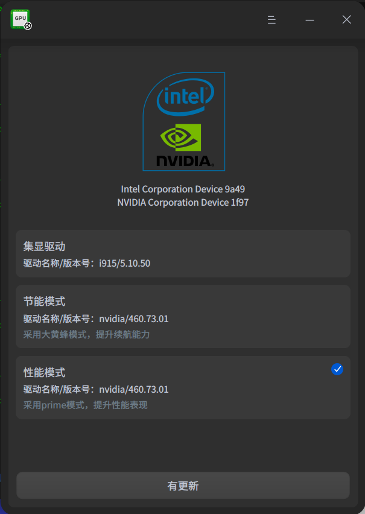

# 安装Cuda（Deepin）

## 环境说明

操作系统： Deepin 20.1

CPU：I7 1165

显卡：MX450 + Intel集县

## 参考

https://blog.csdn.net/qq_27386899/article/details/104113553


## 1.安装显卡驱动

查看当前使用的显卡：

```bash
lspci | grep -i vga
```

如果显示如下，则当前使用的是集成显卡




1 如果当前使用的不是集成显卡，或者使用的为内置闭源驱动，需要先将显卡切换为集成显卡

方法1：应用市场搜索：显卡驱动管理器，可一键切换



下载安装后，点击集显驱动切换即可


方法2 自己进入Bios，关闭独显

这个具体看机器，无法明确指导


## 2.安装CUDA

还没开始动工。。

## 3.安装cudnn

还没开始动工。。

## 安装完的问题

如果安装完成后出现

```bash
UserWarning: CUDA initialization: CUDA unknown error - this may be due to an incorrectly set up environment, 
e.g. changing env variable CUDA_VISIBLE_DEVICES after program start. Setting the available devices to be zero.
 (Triggered internally at  /opt/conda/conda-bld/pytorch_1623448255797/work/c10/cuda/CUDAFunctions.cpp:115.)
  return torch._C._cuda_getDeviceCount() > 0
```

我们可以尝试以下2种方法：

1. 安装nvidia-modprobe

```bash
apt-get install nvidia-modprobe
```


1. 修改～/.bashrc文件，添加这一行：

```bash
export CUDA_VISIBLE_DEVICES=0,1,2,3
```

