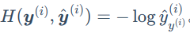

# 线性回归

# Softmax回归

## 交叉熵损失函数

为什么要有交叉熵损失函数：

平方损失过于严格，例如预测分为3个概率：p1, p2, p3=0.6(正解)，假如p1=p2=0.2，那么损失会比p1=0, p2=0.4的损失小得多，虽然两者都具有同样的预测效果

公式：

由于y~j~ 只有一个正确值，其他值都为0，所以经过**优化后的交叉熵损失函数**为： 

**说明**：

交叉熵损失函数只关心正确结果的预测概率，只要其足够大，就能保证分类正确

在n个样本的训练中，我们使用平均值来评估总体损失值

