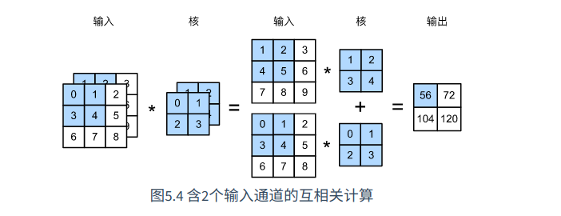
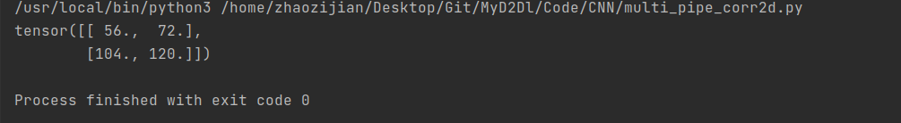
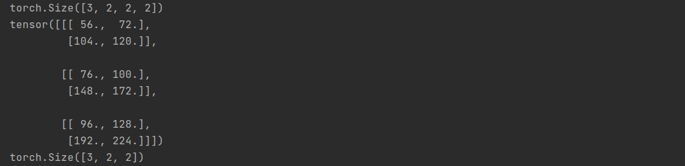
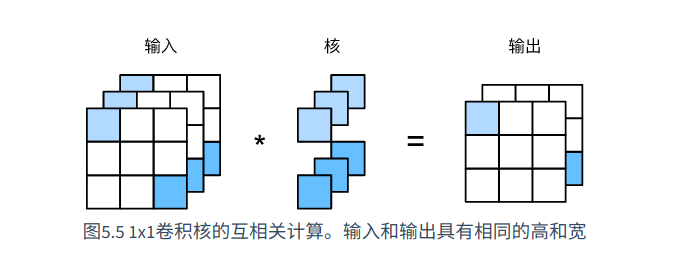
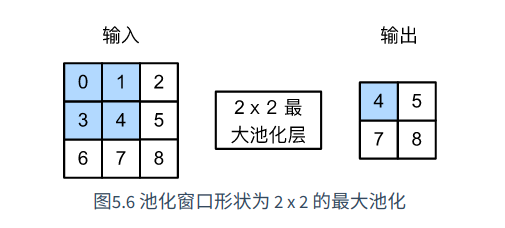
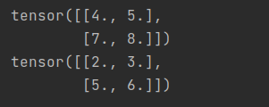
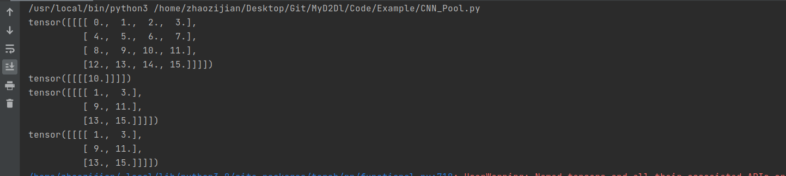
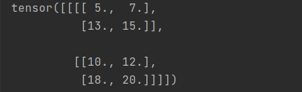

查看上一节-卷积神经网络基础

[卷积神经网络基础][./03.卷积神经网络-基础.md] 


# 多输入通道和多输出通道

前面讲的都是基于二维数组进行的卷积运算，实际可能维度更高

例如彩色图像在高和宽之外，还有RGB 3个颜色通道，假设图像高和宽为h和w，那么图像表示为一个（3, h, w）的数组

我们将大小为3的这一维称为**通道维**


## 多输入通道

我们需要构造一个与输入通道数与输入的通道数一致的卷积核，当输入通道不为1时，我们需要为每个通道都增加一个k~h~*k~w~的数组

我们在各个通道上分别做互相关运算，最后将互相关运算结果汇总：



### 代码实现

```Python
import torch

from Code.CNN.corr2d import corr2d

def corr2d_multi_pipe(X, K):
    res = corr2d(X[0, :, :], K[0, :, :])
    for i in range(1, X.shape[0]):
        res += corr2d(X[i, :, :], K[i, :, :])
    return res	
```

### 验证

```Python
    X = torch.tensor([[[0, 1, 2], [3, 4, 5], [6, 7, 8]],
                      [[1, 2, 3], [4, 5, 6], [7, 8, 9]]])
    K = torch.tensor([[[0, 1], [2, 3]], [[1, 2], [3, 4]]])

    print(corr2d_multi_pipe(X, K))
```

结果：




## 多输出通道

假设输入通道为c~i~ 输出通道为c~o~ ,高和宽为k~h~和k~w~，每个输出通道都有多个输入通道，所以我们定义一个形状为(c~o~, c~i~, k~h~, k~w~)的卷积核

对卷积核进行多输出通道互相关运算后，得到一个(c~o~, k~h~, k~w~)的输出


### 代码实现

```Python
def corr2d_multi_outpipe(X, K):
    return torch.stack([corr2d_multi_pipe(X, K[i]) for i in range(K.shape[0])])
```

### 验证

```Python
X = torch.tensor([[[0, 1, 2], [3, 4, 5], [6, 7, 8]],
                      [[1, 2, 3], [4, 5, 6], [7, 8, 9]]])
K = torch.tensor([[[0, 1], [2, 3]], [[1, 2], [3, 4]]])

K = torch.stack([K, K + 1, K + 2])
print(K.shape)  # torch.Size([3, 2, 2, 2])
res = corr2d_multi_outpipe(X, K)
print(res)
print(res.shape)
```

输出：

得到的输出为包含3个通道的卷积结果




# 1×1卷积层

卷积核形状为1*1的**多通道**卷积层称为1×1卷积层

因为使用了最小窗口，它失去了在高和宽维度上分析相邻元素构成的功能

它的主要计算主要发生在通道维上

如果我们把输入作为线性回归中的数据样本，通道作为特征维，那么**1*1卷积层就和全连接层等价**



## 代码实现

```Python
import torch


def corr2d_1x1(X, K):
    pipe_input, h, w = X.shape
    pipe_output = K.shape[0]
    # 将高和宽压缩成1维
    X = X.view(pipe_input, h*w)
    # 将卷积层转为适合计算的维度
    K = K.view(pipe_output, pipe_input)
    Y = torch.mm(X, K)
    # 计算结果恢复形状
    return Y.view(pipe_output, h, w)
```


# 池化层

## 引入

二维卷积层中，我们使用卷积核判断图像边缘，如果Y[i, j] != 0，说明输入中X[i,j]和X[i, j+1]不一致，意味着物体边缘通过这两像素，但在实际图像中，我们连续拍摄的物体，边缘像素往往会出现偏移，对后面的模式识别造成不便

**池化层就是为了缓解卷积层对位置的敏感性**

## 说明

同卷积层，池化层每次也会使用一个固定形状的窗口迭代输入并计算输出

池化层内部没有数据，只有形状，池化层一般计算迭代窗口的最大值或者平均值，称为**最大池化**或者**平均池化**



如图，上面的例子计算的是2*2滑动区间内的最大值并输出到Y

一般我们把池化层形状为p*q的池化计算叫做**p×q池化**

**池化层的作用：**

让我们再次回到边缘检测，我们将卷积层的输出作为池化层的输入

我们对输出进行2*2最大池化，那么不论是Y[i, j+1]还是Y[i, j+2]，值都是1，也就是说，当边缘不超过1个元素时，依然能被识别出来

### 代码实现：

```Python
import torch


def pool2d(Y, pool_size, mod="max"):
    """
    :param Y:卷积完的输出
    :param pool_size: 池化层大小
    :param mod: 池化模式，平均(avg)or最大(max)
    """
    Y = Y.float()
    ph, pw = pool_size
    output = torch.zeros(Y.shape[0]-ph+1, Y.shape[1]-pw+1)
    for x in range(output.shape[0]):
        for y in range(output.shape[1]):
            if mod == "max":
                output[x][y] = Y[x:x+ph, y:y+pw].max()
            elif mod == "avg":
                output[x][y] = Y[x:x+ph, y:y+pw].mean()
    return output

```

**代码验证**

```Python
X = torch.tensor([[0, 1, 2], [3, 4, 5], [6, 7, 8]])
print(pool2d(X, (2, 2)))
print(pool2d(X, (2, 2), 'avg'))
```

打印：



## 填充和步幅

同卷积层一样，我们可以给池化层定义填充和步幅

这里不做过多介绍，详情可以看卷积层那一章


## 使用nn.MaxPool2d实现池化层

注意：torch默认的步幅和该池化层的形状相同

代码：

```Python
import torch

# 4个维度分别代表：批次，维度，高，宽
X = torch.arange(16, dtype=torch.float).view(1, 1, 4, 4)
print(X)


pool2d_1 = torch.nn.MaxPool2d(3)
print(pool2d_1(X))

pool2d_2 = torch.nn.MaxPool2d((2,3), padding=1, stride=2)
print(pool2d_2(X))

pool2d_3 = torch.nn.MaxPool2d((2, 4), padding=(1, 2), stride=(2, 3))
print(pool2d_3(X))
```

打印：




## 多通道

池化层的多通道计算和卷积层的多通道计算是不一样的

卷积层的每个通道都有不同的卷积核，但是池化层只有一种核，依次对每个卷积进行池化

也就是说，**池化层的输出通道数与输入通道数只能相同**

### 代码

```Python
X1 = torch.arange(start=5, end=21, dtype=torch.float).view(1, 1, 4, 4)
# 按照通道数进行拼接，组成一个2通道的tensor
X_all = torch.cat([X, X1], dim=1)

pool2d = torch.nn.MaxPool2d(3, padding=1, stride=2)
print(pool2d(X_all))
```

输出：



我们可以看到，输出也是2个通道的


