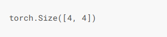

# 卷积神经网络-介绍

含有卷积层的网络，一般都为2维，具有高和宽2个维度


## 二维互相关运算（Cross-correlation）

虽然卷积层得名于卷积运算，但二维互相关运算更加常用

在二维卷积层中，一个二维输入数组，和一个二维核（kernel），也可以成为过滤器，通过互相关运算，输出一个二维数组


如图，输入一个3×3的数组，核为2×2，输出的单个元素计算过程为：

0×0+1×1+3×2+4×3 = 19

二维互相关运算从左上方开始，按照从左向右，从上到下的顺序滑动，每次对应元素相乘求和


### 实现二维互相关运算代码

```Python
import torch


def corr2d(x: torch.Tensor, k: torch.Tensor) -> torch.Tensor:
    """
    :param x: 输入数组
    :param k: 卷积核数组
    :return: 输出一个经过二维互相关运算torch
    """
    h, w = k.shape
    y = torch.zeros((x.shape[0] - h + 1, x.shape[1] - w + 1))
    for i in range(y.shape[0]):
        for j in range(y.shape[1]):
            y[i][j] = (x[i:i + h, j: j+w] * k).sum()
    return y

```

位置：Code/CNN/corr2d.py


## 二维卷基层

二维卷基层就是拿输入和卷积层做互相关运算，然后加上标量偏差，得到输出

一般我们随机对卷积核进行初始化。不断迭代卷积核和偏差

### 实现一个二维卷基层

```Python
class Conv2d(torch.nn.Module):
    def __init__(self, kernel_size:(int, int)):
        super(Conv2d, self).__init__()
        # definite kernel
        self.weight = torch.nn.Parameter(torch.randn(kernel_size))
        self.bias = torch.nn.Parameter(torch.randn(1))

    def forward(self, x):
        return corr2d(x, self.weight) + self.bias

```

位置：Code/CNN/Conv2D.py


## 卷基层简单应用-图像边缘检测

1 自定义一个Tensor模拟图像

```Python
# 模拟图像
x = torch.ones((4, 6))
x[:, 2:4] = 0
print(x)
```

打印图像:


2 构造一个1*2的核,如果横向不一致的话,输出非0 否则为0

```
k = torch.tensor([[1, -1]])
y = corr2d(x, k)
print(y)
```

打印出的y为:


计算完成后,我们发现由于是横向判断边界,所以少了一列,但是边界值已经被标记出来了

# 案例-通过数据学习核数组

这个案例我们随机生成一个卷积核数组，通过随机梯度下降，不断的优化

```Python
from Code.CNN.Conv2D import *

x = torch.ones((6, 8))
x[2:4, 4:6] = 0
y = corr2d(x, torch.tensor([[1, -1]]))
c = Conv2d(kernel_size=(1, 2))
# 学习次数
step = 200
# 学习率
lr = 0.005

for t in range(step):
    y_hat = c(x)
    loss = ((y_hat - y)**2).sum()
    loss.backward()
    c.weight.data -= lr * c.weight.grad
    c.bias.data -= lr * c.bias.grad

    c.weight.grad.zero_()
    c.bias.grad.zero_()
    if (t + 1) % 5 == 0:
        print("step %d, loss: %.3f" % (t+1, loss.item()))


print(c.weight)
```

输出：


我们发现经过不断地训练，随机化的卷积核越来越接近[1, -1]


# 互相关运算和卷积运算

实际上，卷积运算就是将数组左右翻转，并上下翻转，然后再求互相关运算，他们如果使用同一个核数组，结果往往不尽相同


# 特征图和感受野

## 特征图（Feature map）

二维卷积层输出的二维数组，可以看成是在空间维度上的某一表征，我们叫他特征图

## 感受野（receptive field）

影响输入x的前向运算的所有可能输入区域（可能大于x的尺寸），叫感受野


例如：输入中阴影部分的4个元素为输出中第一行第一列的感受野

如果我们在输出Y后再加一层互相关运算，最终输出一个单元素输出，那么，不管是Y还是X都是最终输出的感受野


# 填充和步幅

上面的例子里，我们通过3 * 3的输入和2 * 2的卷积核计算出了2 * 2的结果

输出形状的公式一般为


我们介绍填充和步幅，他可以对给定形状的输入和卷积核改变输出形状


## 填充

**说明**：填充是指在输入的高和宽两侧添加元素，通常添加0元素

假设2侧增加的高和宽是 P~w~ 和 P~h~

那么输出为：


一般我们设置P~h~和P~w~为k~h~ - 1和k~w~ - 1，这样，我们输入和输出就是相同的高和宽，方便在构造网络时方便推测输出形状


**关于奇偶数问题**：


**卷积核选取规则**：

卷积神经网络一般选取奇数高宽的卷积核，所以一般两端的填充数量相同，所以当卷积过后，Y~[i,j]~ 能方便的理解为卷积核以X~[i,j]~为中心的卷积运算结果

### 示例代码

```Python
import torch
from torch import nn

# 定义一个函数来计算卷积层。它对输入和输出做相应的升维和降维
def comp_conv2d(conv2d, X):
    # (1, 1)代表批量大小和通道数（“多输入通道和多输出通道”一节将介绍）均为1
    X = X.view((1, 1) + X.shape)
    Y = conv2d(X)
    return Y.view(Y.shape[2:])  # 排除不关心的前两维：批量和通道

# 注意这里是两侧分别填充1行或列，所以在两侧一共填充2行或列
conv2d = nn.Conv2d(in_channels=1, out_channels=1, kernel_size=3, padding=1)

X = torch.rand(8, 8)
comp_conv2d(conv2d, X).shape	
```

代码说明：查看padding参数，为int，代表X四面都补1行或者1列，这时，左右和上下其实都增加了2 列/行

输出：


我们发现，输入和输出都是8*8

**当卷积核不是正方形矩阵时**：

​	

输出也是个8*8的矩阵

代表上下方向各加2行，总共加4行

左右各加1列，共加2列


# 步幅

二维互相关运算的顺序一般为从上到下，从左到右，我们把每次滑动的行数和列数称为**步幅**

目前我们的例子中的步幅都是1


我们发现当剩余能移动的步数不足以匹配当前步幅时，剩余的部分会被抛弃，如上图，最后一列被抛弃了（不过这一列是填充上去的无所谓）

带步幅的卷积运算输出的shape计算公式：

s~h~ 和 s~w~ 代表高和宽的步幅


注：图中的类似中括号的符号，代表向下约分

## 示例代码

X是一个8*8的输入矩阵

设置一个高和宽步幅都为2的卷积层：

```Python
# 设置步幅为2
conv2d = nn.Conv2d(1, 1, kernel_size=3, padding=1, stride=2)
comp_conv2d(conv2d, X).shape	
```

输出：




稍微复杂点的例子：

```Python
conv2d = nn.Conv2d(1, 1, kernel_size=(3, 5), padding=(0, 1), stride=(3, 4))
comp_conv2d(conv2d, X).shape
```

输出：


