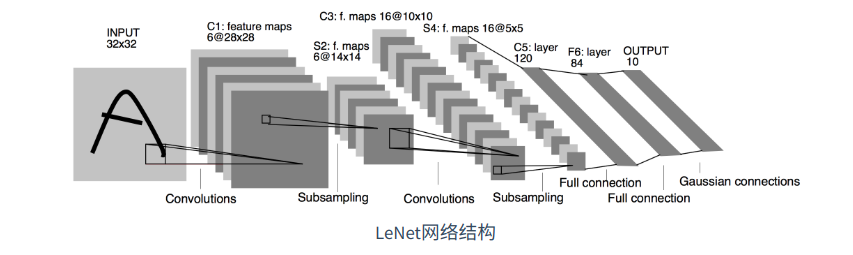
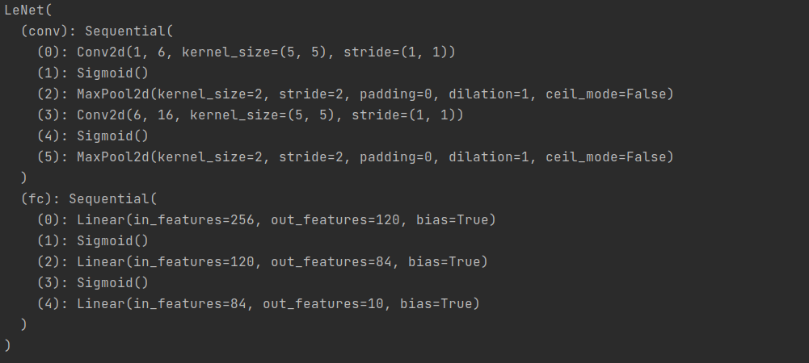
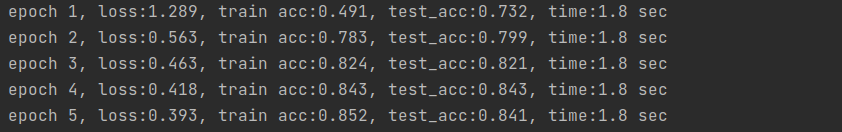
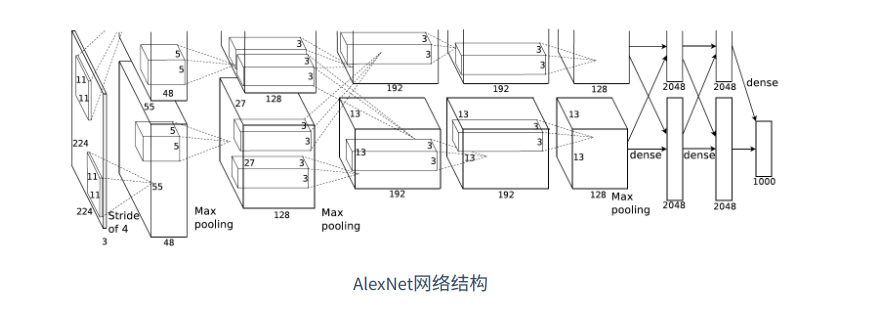
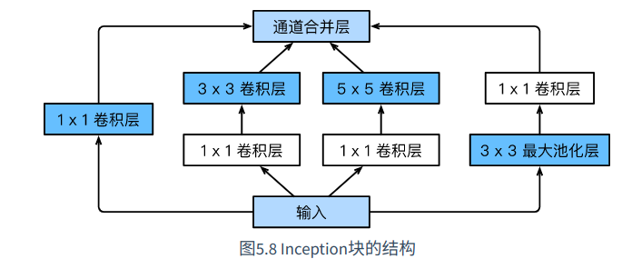

# 卷积神经网络(LeNet)

**引入**：

前一章节，我们实现了含单隐藏层的多层感知机模型来对Fashion-Mnist进行分类，每张图像为1*784的向量，然而这种分类方法有一定的局限性：

1 图像在同一列的像素可能在转换成向量后距离较远，构成的模式可能难以被识别

2 对于大尺寸图像，使用全连接层容易造成模型过大，假设高和宽为1000*1000的3通道图片，全连接层输出数为256，那么他会占用大概3000000 * 256 ≈ 3GB的内存或显存空间

卷积层尝试解决这些问题，一方面，卷积层保留输入性状，使得图像在高和宽的相关性得到保留，其次通过滑动窗口，避免重复计算，避免参数尺寸过大

**说明**：

卷积神经网络就是含有卷积层的网络，本节介绍一个早期的用来识别手写数字的卷积神经网络：LeNet，这个名字来源于LeNet论文作者Yann LeCun，Lenet展示了通过梯度下降训练卷积神经网络能够达到的最先进效果。



## Lenet模型

分类2个部分：卷积层和全连接层

卷积层：基本单位是卷积层+最大池化层，卷积层用来识别图像空间模式，最大池化层用来降低对位置的敏感度，卷积层块由这样的2个单位重复堆叠而成，所有卷积层使用5*5窗口，输出使用sigmod激活函数，第一个卷积层输出通道为6，第二个是16，因为第二个卷积层输入比第一层高和宽要小，增加输出通道使2个卷积层的尺寸类似，最大池化层的尺寸为2 * 2，步幅为2

卷积层块的形状为（批量大小，通道数，高，宽），当输出传入全连接层后，全连接层会将输入压缩成2维，数据维度的长度为**通道数 * 长 * 宽**， 包含3个全连接层，输出个数为120， 84， 10


## 代码实现

```Python
import torch
from torch import nn, optim

from Code.Utils.train import train
from Code.Utils.load_data import get_data_fashion_mnist


device = torch.device("cuda" if torch.cuda.is_available() else "cpu")


class LeNet(nn.Module):
    def __init__(self):
        super(LeNet, self).__init__()
        # 定义卷积层
        self.conv = nn.Sequential(
            # in_channels, out_channels, kernel_size
            nn.Conv2d(1, 6, 5),
            nn.Sigmoid(),
            nn.MaxPool2d(2, 2),
            nn.Conv2d(6, 16, 5),
            nn.Sigmoid(),
            nn.MaxPool2d(2, 2)
        )
        # 定义线性层（全连接层）
        self.fc = nn.Sequential(
            nn.Linear(16*4*4, 120),
            nn.Sigmoid(),
            nn.Linear(120, 84),
            nn.Sigmoid(),
            nn.Linear(84, 10)
        )

    def forward(self, img):
        feature = self.conv(img)
        output = self.fc(feature.view(img.shape[0], -1))
        return output
```

(训练代码，准确率评估代码见/Code/Utils/train.py 和 evaluate_accuracy.py)

打印模型：

```Python
net = LeNet()
print(net)
```



## 开始训练

```Python
net = LeNet()
batch_size = 256
train_iter, test_iter = get_data_fashion_mnist(batch_size)
lr = 0.01
num_epoch = 5
optimizer = optim.Adam(net.parameters(), lr)
train(net, train_iter, test_iter, batch_size, optimizer, device, num_epoch)
```

输出：




# 深度卷积神经网络

虽然leNet可以在早期的小数据集上表现出更好的成绩，但是在更大的数据集上表现的不尽如人意

在图像识别中，我们直接将像素点转化为输出结果，这种端到端的方式节省了很多中间步骤，但是还有更长的时间，人们研究模型参数，并生成一段手工特征，然后进行分类，主要流程为：

1. 获取图像数据集；
2. 使用已有的特征提取函数生成图像的特征；
3. 使用机器学习模型对图像的特征分类。

但是也有人认为特征应当学习得来，他们提出，复杂模型下的特征应当分级表示，多级神经网络可以学习到数据的多级表征。然而，由于数据和硬件方面的原因，这种通过多级表征学习的方法一直没有实现。


## Alexnet



### 结构

AlexNet 2012年提出，使用了8层神经网络，他首次证明了学习到的特征能够超越手工设计的特征。

它包含了5层卷积和2层全连接层，和一层全连接输出层

第一层：卷积窗口形状为11*11， 由于图片较大，所以需要较大的卷积窗口捕获物体

第二层：卷积窗口形状为5*5

第3-5层：卷积窗口为3*3

1，2，5层后，都用了3*3，步幅为2的池化层，而且输入通道数也比LeNet大数10倍。

全连接6-7层：输出都为4096

### 特性

1 AlexNet将Sigmod换成了更加简单的ReLU激活函数，这使得计算更加简单，其次，ReLU函数在不同的参数初始化方法下使得模型更容易训练，这是因为Sigmod函数输出绝对值越大时，斜率越趋近于0，这使得每次迭代的优化值越趋近于0，而RELU函数在正区间内的斜率永远为1，Sigmod函数可能在正区间取得几乎为0的梯度，使得模型无法有效训练。

2 AlexNet使用丢弃法来控制全连接层的模型复杂度，LeNet没有

3 AlexNet使用了大量的图像增广，如翻转，剪裁和颜色变化，从而进一步扩大数据集，减少过拟合，后面详述。

### 代码实现-简化版AlexNet

代码位置：Code/Example/AlexNet.py

```Python

import time
import torch
from torch import nn
import torchvision


device = torch.device("cuda" if torch.cuda.is_available() else "cpu")


class AlexNet(nn.Module):
    def __init__(self):
        super(AlexNet, self).__init__()
        self.conv = nn.Sequential(
            # in_channel, out_channel, kernel_size, stride
            nn.Conv2d(1, 96, 11, 4),
            nn.ReLU(),
            nn.MaxPool2d(3, 2),
            # 减小卷积窗口，使用填充为2，保证输入输出形状一致
            nn.Conv2d(96, 256, 5, 1, 2),
            nn.ReLU(),
            nn.MaxPool2d(3, 2),
            # 连续3个卷积层，进一步增大了通道数
            nn.Conv2d(256, 384, 3, 1, 1),
            nn.ReLU(),
            nn.Conv2d(384, 384, 3, 1, 1),
            nn.ReLU(),
            nn.Conv2d(384, 256, 3, 1, 1),
            nn.ReLU(),
            nn.MaxPool2d(3, 2)
        )
        self.fc = nn.Sequential(
            nn.Linear(256*5*5, 4096),
            nn.ReLU(),
            nn.Dropout(0.5),
            nn.Linear(4096, 4096),
            nn.ReLU(),
            nn.Dropout(0.5),
            # 这里使用FashionMnist，所以就不将输出搞成1000了
            nn.Linear(4096, 10),
        )

    def forward(self, img):
        features = self.conv(img)
        out = self.fc(features.view(img.shape[0], -1))
        return out

```


# 重复元素的网络（VGG）

虽然AlexNet在识别中取得了非常不错的结果，但是创作者并没有指明如何去设计一个新的网络，我们这边指出一项神经网络的设计思路之一：VGG网络

VGG网络提出了使用简单的基础块构建深度模型


## VGG块

定义：

连续使用数个相同的 填充为1，窗口形状为3*3的卷基层，随后接上一个步幅为2的2 * 2最大池化层

### 代码实现

代码位置：Code/CNN/VGG.py

```Python
import torch


def vgg_block(num_convs, in_channel, out_channel):
    """
    Param num_convs: 卷基层数
    Param in_channel: 输入通道数
    Param out_channel: 输出通道数
    """
    blk = []
    for i in range(num_convs):
        if i == 0:
            blk.append(torch.nn.Conv2d(in_channel, out_channel, (3, 3), padding=1))
        else:
            blk.append(torch.nn.Conv2d(out_channel, out_channel, (3, 3), padding=1))
        blk.append(torch.nn.ReLU())
    blk.append(torch.nn.MaxPool2d(2, 2))
    return torch.nn.Sequential(*blk)

```


## VGG网络

和AlexNet和LeNet差不多，VGG网络由卷积模块后接全连接层构成

**构造一个VGG-11网络**

卷基层模块：串联数个VGG块，其超参数由变量**conv_arch**定义，该变量指定了每个VGG块中的卷基层个数和输入输出通道数

全连接模块：和AlexNet一样，也采用了丢弃法进行隐藏层丢弃。我们采用3层全连接层

现在，我们构造一个5个VGG卷积块（2个单卷积层+3个双卷积层）总计8个卷积层

因为总共8+3层，我们一般称此网络为**VGG-11网络**

```Python
conv_arch = ((1, 1, 64), (1, 64, 128), (2, 128, 256), (2, 256, 512), (2, 512, 512))
# 经过5个vgg_block, 宽高会减半5次, 变成 224/32 = 7
fc_features = 512 * 7 * 7 # c * w * h
fc_hidden_units = 4096 # 任意
```

说明：我们定义的第一层输入通道为1（因为Fashion-Mnist的输入通道为1），输出通道为64，此后的通道一直翻倍，直到512

### 代码

```Python
def vgg_11(conv_arch, fc_features, fc_hidden_units):
    net = torch.nn.Sequential()
    for i, (num_conv, in_channel, out_channel) in enumerate(conv_arch):
        # 由于池化层的关系，每次VGG输出的形状，会比输入的形状减小1/2
        net.add_module("VGG_%d" % i, vgg_block(num_conv, in_channel, out_channel))

    net.add_module("fc", torch.nn.Sequential(
        FlattenLayer(),
        # 1
        torch.nn.Linear(fc_features, fc_hidden_units),
        torch.nn.ReLU(),
        torch.nn.Dropout(0.5),
        # 2
        torch.nn.Linear(fc_hidden_units, fc_hidden_units),
        torch.nn.ReLU(),
        torch.nn.Dropout(0.5),
        # 3
        torch.nn.Linear(fc_hidden_units, 10)
    ))
    return net
```

### 验证层级变化

代码：

```Python
x = torch.rand((1, 1, 224, 224))
print("original x shape:", x.shape)
net = vgg_11(conv_arch, fc_features, fc_hidden_units)
for name, blk in net.named_children():
    x = blk(x)
    print(name, "output shape:", x.shape)
```

输出：

```
original x shape: torch.Size([1, 1, 224, 224])
VGG_0 output shape: torch.Size([1, 64, 112, 112])
VGG_1 output shape: torch.Size([1, 128, 56, 56])
VGG_2 output shape: torch.Size([1, 256, 28, 28])
VGG_3 output shape: torch.Size([1, 512, 14, 14])
VGG_4 output shape: torch.Size([1, 512, 7, 7])
fc output shape: torch.Size([1, 10])
```

结论：

我们发现，每次我们将输入的高和宽减半，直到最后为7*7，穿入最后的全连接层，与此同时，输出通道数却翻倍，变成512

因为每个卷积核大小一致，所以每层的模型参数尺寸和模型复杂度与输入的高，宽，输入输出通道数成正比。

VGG这种高宽减半的设计和通道翻倍，使得多数模型都拥有相同的尺寸和复杂度。


### 数据获取和模型训练

因为VGG在训练上比AlexNet更加复杂，处于测试目的，我们构造一个通道数更窄的训练集方便训练

训练代码：

```Python
device = torch.device("cuda")
    ratio = 8
    conv_arch = ((1, 1, 64//ratio),
                 (1, 64//ratio, 128//ratio),
                 (2, 128//ratio, 256//ratio),
                 (2, 256//ratio, 512//ratio),
                 (2, 512//ratio, 512//ratio))
    net = vgg_11(conv_arch, fc_features//ratio, fc_hidden_units//ratio)
    from Code.Utils.train import train
    from Code.Utils.load_data import get_data_fashion_mnist
    batch_size = 64
    train_iter, test_iter = get_data_fashion_mnist(batch_size, resize=224)
    lr, num_epoch = 0.01, 5
    optimizer = torch.optim.Adam(net.parameters(), lr=lr)
    train(net, train_iter, test_iter, batch_size, optimizer, device, num_epoch)
```

由于本人电脑显卡不太行（MX450），有点拉跨，这边开始训练，显存直接拉满，就不演示了，有NB显卡的哥们，能否帮忙训练下？

---


# 网络中的网络（NiN）

前几节介绍的网络，其共同之处是都是以卷积层为构成的模块抽取空间特征，再以全连接层输出分类结果

AlexNet和VGG对于Lenet的优化主要在于对通道数的增加和层数加深。

NiN提供了另外一种思路：串联多个由卷积层和全连接层构成的小网络来组成一个大深层网络


## NiN块

我们知道，卷积层的形状为(批次，通道，高，宽)， 而全连接层的形状则为二维数组（样本，特征），想要在全连接层后再连接卷积层，需要将样本变换成4维，我们在前一节中介绍了1*1卷积层，我们使用1 * 1卷积层代替全连接层


NiN块是NiN网络中的基础块，由1个卷积层+2个充当全连接层的1*1卷积层组成，卷积层的超参数一般自定义，而全连接层一般是固定的。


### 代码实现

NiN使用卷积窗口为11 * 11， 5 * 5， 3 * 3的卷积层，输出通道和AlexNet一致，每个NiN块后接一个步幅为2，形状3*3的池化层

NiN模型和AlexNet还有一处不同，NiN在全连接层最后添加了平均池化层用于分类，好处是减小模型参数尺寸，但也可能造成训练时间的增加。

**模型代码**：

```Python
import torch

from Code.Utils.global_avg_pool2d import GlobalAvgPool2D
from Code.Utils.flatten_layer import FlattenLayer
from Code.CNN.NiN import NiN_block


class NiN(torch.nn.Module):
    def __init__(self):
        super(NiN, self).__init__()
        self.net = torch.nn.Sequential(
            # in_channel, out_channel, kernel_size, stride, padding
            NiN_block(1, 96, 11, 4, 8),
            # kernel_size, stride
            torch.nn.MaxPool2d(3, 2),

            NiN_block(96, 256, 5, 1, 2),
            torch.nn.MaxPool2d(3, 2),

            NiN_block(256, 384, 3, 1, 1),
            torch.nn.MaxPool2d(3, 2),

            torch.nn.Dropout(0.5),
            NiN_block(384, 10, 3, 1, 1),

            GlobalAvgPool2D(),
            FlattenLayer(),
        )

    def forward(self, x):
        return self.net(x)
```

### 验证

```Python
x = torch.randn(1, 1, 224, 224)
net = NiN()
for name, blk in net.net.named_children():
    x = blk(x)
    print(name, "calc shape:", x.shape)
```

输出：

```
0 calc shape: torch.Size([1, 96, 58, 58])
1 calc shape: torch.Size([1, 96, 28, 28])
2 calc shape: torch.Size([1, 256, 28, 28])
3 calc shape: torch.Size([1, 256, 13, 13])
4 calc shape: torch.Size([1, 384, 13, 13])
5 calc shape: torch.Size([1, 384, 6, 6])
6 calc shape: torch.Size([1, 384, 6, 6])
7 calc shape: torch.Size([1, 10, 6, 6])
8 calc shape: torch.Size([1, 10, 1, 1])
9 calc shape: torch.Size([1, 10])
```

我们发现，由于KernelSize的不同，图片压缩的尺寸也会有所不同。例如第一层的KernelSize为4，图片的输出被压缩成原来的1/4


### 获取数据集，训练模型

```Python
from Code.Utils.load_data import get_data_fashion_mnist
from Code.Utils.train import train
device = torch.device("cuda")
net = NiN()
batch_size = 32
train_iter, test_iter = get_data_fashion_mnist(batch_size, resize=224)
lr, num_epoch = 0.001, 5
optimizer = torch.optim.Adam(net.parameters(), lr=lr)
train(net, train_iter, test_iter, batch_size, optimizer, device, num_epoch)
```

如果你的GPU比较强，可以将BatchSize改为128或者64，我的MX450 5分钟只能训练1轮次，太慢了。

---

# 含并行连接的网络-GoogleNet

GoogleNet起始于2014年ImageNet图像识别挑战赛，它吸收了NiN中串联网络的思想，并做了很大改进，本章介绍这个模型的第一个版本

## GoogleNet基础卷积块-Inception块

基础块名称来源于《盗梦空间》，这个结构比较NiN块更加复杂



**介绍**：

Inception块有4条并行的路线

前三条使用了1 * 1， 3 * 3， 5 * 5的卷积层，抽取不同空间尺寸下的信息，其中中间2个层会使用1*1卷积层改变通道数，降低复杂模型

第四条使用3*3最大池化层，后接1 * 1卷积层改变通道数。

四条线路都使用了填充来使输入和输出高宽一致。

最后将4条线路在通道维进行连接，输出到下一层。

可自定义的超参数为：**每一层的输出通道数**，以此来确定模型复杂度


**代码实现**：

```Python
import torch
import torch.nn as nn

from torch.nn.functional import relu


class Inception(nn.Module):
    def __init__(self, in_channel, channel_1: int, channel_2: tuple, channel_3: tuple, channel_4: int):
        super(Inception, self).__init__()
        # 线路1
        self.net1 = nn.Conv2d(in_channel, channel_1, 1)

        # 线路2
        self.net2_1 = nn.Conv2d(in_channel, channel_2[0], 1)
        self.net2_2 = nn.Conv2d(channel_2[0], channel_2[1], 3, padding=1)

        # 线路3
        self.net3_1 = nn.Conv2d(in_channel, channel_3[0], 1)
        self.net3_2 = nn.Conv2d(channel_3[0], channel_3[1], 5, padding=2)

        # 线路4
        self.net4_1 = nn.MaxPool2d(3, padding=1)
        self.net4_2 = nn.Conv2d(in_channel, channel_4, kernel_size=1)

    def forward(self, x):
        o1 = relu(self.net1(x))
        o2 = relu(self.net2_2(relu(self.net2_1(x))))
        o3 = relu(self.net3_2(relu(self.net3_1(x))))
        o4 = relu(self.net4_2(self.net4_1(x)))
        return torch.cat((o1, o2, o3, o4), dim=1)
```

## GoogleNet模型

模型介绍：主体部分采用5层，**每层之间使用步幅为2的3*3最大池化层减小输出高宽。**

**第一层**： 使用一个卷积核为7*7的步幅为2，填充为3的二维卷积层

**第二层**：使用64通道的1*1卷积层，然后是将输出通道增大3倍的3 * 3卷积层，对应Inception的第二路线

**第三层**：串联2个完整的Inception块:

​	第一个块的输出通道为64+128+32+32 = 256

​	第二个块的输出通道为128+192+96+64=480

​	输出通道为超参数，算力强时，可以手动修改数量，但要保持比例不变。

* 此层第二路和第三路将输入通道改成了 In_channel * 1/2和In_channel * 1/8,以此减小模型复杂度（具体可以看示例代码）


**第四层**：串联了5个Inception模块，输出通道为：

​	192+208+48+64=512

​	160+224+64+64=512

​	128+256+64+64=512

​	112+288+64+64=528

​	256+320+128+128=832

* 同上一层一样，此层的Inception的第二三层都减小了。但是每路的减小比例都不一样。

**第五层**：包含2个Inception块，输出通道数为：

​	256+320+128+128=832

​	384+384+128+128=1024

第五层后紧接着一个全局平均池化层，将每个通道的高和宽变为1。

**输出层**：

包含一个FlattenLayer，将每个通道的高和宽变为1维，然后将这1024个通道接着一个线性回归层。


### 代码实现

脚本路径：Code/CNN/google_net.py

```Python
import torch
import torch.nn as nn


from Code.CNN.googlenet_inception import Inception
from Code.Utils.global_avg_pool2d import GlobalAvgPool2D
from Code.Utils.flatten_layer import FlattenLayer


class GoogleNet(nn.Module):
    def __init__(self):
        super(GoogleNet, self).__init__()
        self.b1 = nn.Sequential(
            # 由于使用Fashion-Mnist，这里的输入通道数为1
            nn.Conv2d(1, 64, kernel_size=7, stride=2, padding=3),
            nn.ReLU(),
            nn.MaxPool2d(kernel_size=3, stride=2, padding=1)
        )

        self.b2 = nn.Sequential(
            nn.Conv2d(64, 64, kernel_size=1),
            nn.Conv2d(64, 192, kernel_size=3, padding=1),
            nn.MaxPool2d(kernel_size=3, stride=2, padding=1)
        )

        self.b3 = nn.Sequential(
            Inception(192, 64, (96, 128), (16, 32), 32),
            Inception(256, 128, (128, 192), (32, 96), 64),
            nn.MaxPool2d(kernel_size=3, stride=2, padding=1)
        )

        self.b4 = nn.Sequential(Inception(480, 192, (96, 208), (16, 48), 64),
                                Inception(512, 160, (112, 224), (24, 64), 64),
                                Inception(512, 128, (128, 256), (24, 64), 64),
                                Inception(512, 112, (144, 288), (32, 64), 64),
                                Inception(528, 256, (160, 320), (32, 128), 128),
                                nn.MaxPool2d(kernel_size=3, stride=2, padding=1))

        self.b5 = nn.Sequential(Inception(832, 256, (160, 320), (32, 128), 128),
                                Inception(832, 384, (192, 384), (48, 128), 128),
                                GlobalAvgPool2D())

    def forward(self, x):
        net = nn.Sequential(
            self.b1, self.b2, self.b3, self.b4, self.b5,
            FlattenLayer(),
            # 第五层最后的通道数为1024,经过全局平均池化和FlattenLayer,形状为(1024, 1),将此作为线性回归的输入
            # 进行最后的分类任务
            nn.Linear(1024, 10)
        )
        return net(x)
```

### 验证

```Python
    net = GoogleNet()
    x = torch.rand(1, 1, 96, 96)
    for blk in net.children():
        x = blk(x)
        print(x.shape)
```

---

# 批量归一化层

**作用**：让较深的神经网络计算变得更加容易,标准化特征使得所有样本的均值为0，标准差为1，使得各个特征分布相近，这往往能够更加容易的训练出有效的模型。

对于深层网络模型来说，往往特征变更时，会对最后的结果数值产生很大的波动，批量归一化正是为了应对这种训练的问题，训练时，批量归一化利用小批量上的均值和标准差，不断地调整网络中间输出，使得整个神经网络在各层的中间输出更稳定。

对全连接层和卷积层做的归一化的方法有些区别。

## 对全连接层进行批量归一化

**说明**：通常，我们将批量归一化层置于仿射变换层和激活函数之间。

我们设全连接层输入为 ***u***, 权重和偏差为W和b,激活函数为*ϕ*，设批量归一化的运算符为BN，那么批量归一化的全连接输出为：

```
ϕ(BN(x)),  x=uW+b
```

假设有一个小批量m, 仿射变换的输出为β = {x^1^, x^2^, x^3^..., x^m^},作为批量归一化的输入，对于其中的任意样本x^i^, 批量归一化的输出为

```
yi = BN(xi)
```

**BN(xi)计算**：

首先求出平均值μ和方差**σ**


随后，对每个批次的数据进行修改（这里的*ϵ*是一个>0的很小的常数，目的是保证分母大于0）


我们引入了2个可以学习的模型参数：拉伸**γ**（scale）和偏移**β**（shift），这两个参数和x^i^ 的形状相同，他们与x^i^分别做元素乘法⊙运算和按位相加运算


至此，我们得到了批量归一化的输出y^i^

如果我们不想做批量归一化，那么我们令即可，假如批量归一化无益，理论上可以不使用。


## 对卷积层做批量归一化

**说明**：卷积层的批量归一化发生在卷积计算之后，激活函数之前

如果输出多个通道，我们需要对这些通道都进行批量归一化

每个通道都拥有独立的拉伸和偏移，且都为标量。


假设，一个批量中有m个样本，每个样本的单通道下高和宽为p 和 q,我们需要对单个通道中m * p * q个元素同时做批量归一化

我们使用的均值和方差，为该通道下的m * p * q个元素的均值和方差


## 预测时的批量归一化

我们获取批量样本时，可以将样本取值取大一点，会使样本内均值和方差较为准确，和丢弃层一样，在训练集和测试集上，计算结果也是不一样的。

