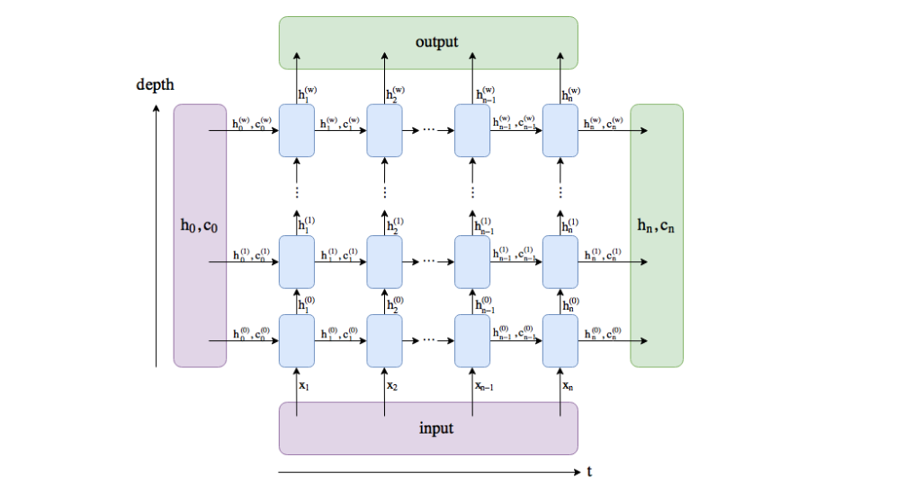

# 循环神经网络

## 语言模型

语言模型是自然语言处理的重要技术，这其中最常见的数据是文本数据，我们可以把自然语言文本看做一段离散的时间序列

假设一段长度为T的文本中的词依次为w1, w2, w3....w~t~, 那么在离散的时间序列中，w~t~可看做在时间部t的输出或者标签，给定一个长度为T的词序列w1, w2, w3....w~t~，语言模型将计算该序列的概率：


语言模型可以作为机器翻译或者语音识别的功能。例如，在语音识别中，给定一段“厨房里食油用完了”的语音，有可能会输出“厨房里食油用完了”和“厨房里石油用完了”这两个读音完全一样的文本序列。如果语言模型判断出前者的概率大于后者的概率，我们就可以根据相同读音的语音输出“厨房里食油用完了”的文本序列。在机器翻译中，如果对英文“you go first”逐词翻译成中文的话，可能得到“你走先”“你先走”等排列方式的文本序列。如果语言模型判断出“你先走”的概率大于其他排列方式的文本序列的概率，我们就可以把“you go first”翻译成“你先走”。


### 语言模型的计算

假设w1, w2....w~t~每个词都是依次生成的，我们有


例如：一个含有4个词的文本序列概率


说明：

我们可以使用一个大型的语言文本库，如维基百科的所有条目，词的概率可以通过改词在训练集的词频（词出现的次数）与总词数之比来计算，根据条件概率，一个词在给定前几个词的情况下条件概率可以计算。例如P(w2|w1)可以理解为w1w2相邻的概率除以w1

### n元语法

当序列长度增加时，计算和存储多个词共同出现的概率的复杂度会成指数级增加。n元模型通过**马尔科夫假设**简化了语言模型的计算。

**马尔科夫假设**指的是假设一个词的出现只与前面n个词相关，假设n=1，那么w3的出现只与w2相关，与w1不相关：P(w3|w1,w2) = P(w3|w2)

基于n-1阶马尔科夫假设链，我们可以将语言模型改写为：


上面的语法也称作n元语法，它是基于n-1阶马尔科夫链，当n分别为1,2,3时，也称为**1元语法，2元语法，3元语法**


当n较小时，往往结果并不准确，例如，在一元语法中，由三个词组成的句子“你走先”和“你先走”的概率是一样的。当n较大时，n元语法需要存储大量的词频和多词相邻概率。有没有方法在语言模型中更好的平衡以上2点呢？那就是**循环神经网络**。


## 循环神经网络-RNN

循环神经网络通过隐藏状态存储之前时间部的信息.类似于之前的多层感知机。

### 不含隐藏状态的神经网络

考虑我们有个单隐藏层的多层感知机，假如激活函数为*ϕ*，那么隐藏层的输出为


隐藏层权重参数W~xh~ ∈ R^nxh^, 偏差函数b ∈ R^1xh^,h为隐藏单元数，经过输出层：


我们通过softmax函数可以进行分类计算


### 含隐藏状态的循环神经网络

假设时间步为t, 我们基于多层感知机，引入一个隐藏状态进行计算：


这个隐藏状态包含了一个新的权重参数W~hh~, 代表在时间步t-1的计算结果，也就是说当前Ht的计算也同时依赖于上一步的计算值，H~t-1~同理依赖H~t-2~的计算结果。那么我们就构造了一个带有隐藏状态的循环神经网路。

最后，我们在加上一层输出层就ok了


**循环神经网络的参数**

循环神经网络的参数包括隐藏层的W~xh~ W~hh~,和偏差b~h~,还包括输出层的W~hq~和B~q~,**即使是在不同的时间步，循环神经网络也依然使用这些参数**，因此它的参数数量不随着时间步的增加而增长。

**循环神经网络的结构**


如图展示了三个时间步内的计算逻辑，在时间步t中，隐藏状态的计算可以看成是将输入与H~t-1~联结后输出到激活函数的全连接层。

**示例**：

```Python
import torch

X, W_xh = torch.randn(3, 1), torch.randn(1, 4)
H, W_hh = torch.randn(3, 4), torch.randn(4, 4)
torch.matmul(X, W_xh) + torch.matmul(H, W_hh)
```

我们的输入形状如果为(3,1), 权重参数形状为(1,4),他们计算出来的结果形状为(3,4)，此时也就限制了H~t-1~的形状和W~hh~的形状。H~t-1~的形状必须为(3,4), W~hh~必须保证H~t-1~与其计算后形状仍是H~t-1~的形状。


优化计算：其实我们将X和H~t-1~在列维度(dim=1)进行相连，形状为(3,1) + (3, 4) = (3,5), 

W_xh和W_hh在行维度相连，形状为(1,4)+(4,4) = (5,4)，

我们将两个组合后的结果进行运算，还是同样得到一个(3,4)的结果，其结果与上面的计算一致

```Python
torch.matmul(torch.cat((X, H), dim=1), torch.cat((W_xh, W_hh), dim=0))
```


## 语言模型数据集

本节将介绍一个处理语言模型的数据集，并将其转换成字符级循环神经网络所需要的输入格式，我们收集了周杰伦的十张专辑的歌词，并在循环神经网络中训练，训练好后，可以使用其来生成歌词。

### 数据集加载

1. **读取数据集**

```Python
def get_lyric(filepath=os.path.join(Root, "Datasets", "jaychou_lyrics.txt.zip")):
    if not os.path.isfile(filepath):
        raise FileNotFoundError("Cant find datasets of jaychou_lyrics")
    with zipfile.ZipFile(filepath) as zip:
        with zip.open("jaychou_lyrics.txt") as f:
            corpus_chars = f.read().decode("utf-8")
            return corpus_chars
```

查看数据集的前四十个字符为：


为了方便训练，我们使用前10000个字符，并将换行符替换成空格。

```Python
corpus_chars = get_lyric()
corpus_chars = corpus_chars.replace('\n', ' ').replace('\r', ' ')
corpus_chars = corpus_chars[0:10000]
```

2. **建立字符索引**

我们将每个字符映射成从0开始的连续整数，又称索引，方便后续的数据处理，我们将其映射到字典，并打印出vocab_size,也就是不同字符的个数。

代码：

```Python
def load_data_jay_lyrics():
    """加载歌词数据集"""
    strings = get_lyric_string()[:10000]
    string_chars = strings.replace('\n', ' ').replace('\r', ' ')
    string_chars = string_chars[0:10000]
    idx2char = list(set(string_chars))
    char2idx = get_string_dict(idx2char)
    vocab_size = len(char2idx)
    indics = [char2idx[x] for x in string_chars]
    return indics, char2idx, idx2char, vocab_size
```

代码路径封装在Code/Utils/load_data_jay_lyrics.py


### 时序数据的采样

我们训练时需要随机读取小批量样本和标签，但是与之前不同的是，标签通常包含连续的字符，假设时间步为5，样本序列有5个字符组成：“想要有直升”，该样本的标签序列为字符集中的下一个字符，即：“要有直升机”、

我们可以采取随机采样和相邻采样两种方式进行采样。

#### 随机采样

随机采样中，每个样本是原始序列上任意截取的一段序列。相邻的2条数据在原始数据中不一定相邻，我们无法使用小批量的隐藏状态来初始化下一个批量的状态，因此在每次训练新的批次时，都需要清零隐藏状态。

代码：

```Python
def data_iter_random(index_list, batch_size, num_steps, device=None):
    """
    随机获取数据集
    index_list: 字符串转换成index后的列表,函数会从该list中抽取连续的字符片段作为训练的输入
    batch_size: 批量大小
    num_steps: 时间步大小
    device: 数据设备
    """
    num_example = (len(index_list) - 1) // num_steps
    epoch_size = num_example // batch_size
    example_indices = list(range(num_example))
    random.shuffle(example_indices)

    # 返回从pos开始的，长度为num_steps的序列
    def _data(pos):
        return index_list[pos: pos + num_steps]
    if device is None:
        device = torch.device("cuda" if torch.cuda.is_available() else "cpu")

    for i in range(epoch_size):
        i = i * batch_size
        batch_indices = example_indices[i: i+batch_size]
        X = [_data(j*num_steps) for j in batch_indices]
        Y = [_data(j*num_steps+1) for j in batch_indices]
        yield (torch.tensor(X, dtype=torch.float32, device=device),
               torch.tensor(Y, dtype=torch.float32, device=device))
```

验证：

```Python
x = list(range(30))
for x, y in data_iter_random(x, 2, 6):
    print(x)
    print(y)
    print("---")
```

打印：


#### 相邻采样

相邻采样使得在几个批次样本之间维度相同的变量相邻，这样做可以使计算时下一次的输入与这一次的隐藏状态输出相关联

代码：

```Python
def data_iter_consecutive(index_list, batch_size, num_steps, device=None):
    if device is None:
        device = torch.device("cuda" if torch.cuda.is_available() else "cpu")
    index_list = torch.tensor(index_list, dtype=torch.float32, device=device)
    data_len = len(index_list)
    batch_len = data_len // batch_size
    indices = index_list[0: batch_size * batch_len].view((batch_size, batch_len))
    epoch_size = (batch_len - 1) // num_steps
    for i in range(epoch_size):
        i = i * num_steps
        X = indices[:, i:i+num_steps]
        Y = indices[:, i+1: i+num_steps+1]
        yield X, Y
```

验证：

```Python
x = list(range(30))
for x, y in data_iter_consecutive(x, 2, 6):
    print(x)
    print(y)
    print("---")
```

输出：


## 循环神经网络代码实现

本节将会从零开始实现一个基于字符级的循环神经网络的语言模型，用来训练歌词创作。本节中将会使用上一节介绍的数据集加载方法。


### **one hot向量**

为了将词表示成向量输入到神经网络，一个简单的方法是使用one hot向量，假设词典中不同的字符数为**N**(vocab_size)，每个字符都同一个从0到N-1的连续整数一一对应，如果一个字符的索引为i, 我们创建一个值全为0的长度为N的向量，并将其在i位置的值设置为1。

```Python
def one_hot(x, n_class, dtype=torch.float32):
    x = x.long()
    res = torch.zeros(x.shape[0], n_class, dtype=dtype, device=x.device)
    # scatter_(dim, index, src): 将src写到指定的dim中,其索引由第二个参数指定。
    res.scatter_(1, x.view(-1, 1), 1)
    return res
```

验证：

```Python
x = torch.tensor([0, 2, 3])
print(x)
print(one_hot(x, 4))
```


我们再**定义一个将输入转换成one hot向量**的方法：

```Python
def to_onehot(X, n_class):
    # X shape: (batch, seq_len), output: seq_len elements of (batch, n_class)
    return [one_hot(X[:, i], n_class) for i in range(X.shape[1])]
```

验证

```Python
    x = torch.arange(10).view(2, 5)
    print(x)
    print(to_onehot(x, 10))
```

输出


以上代码保存在Code/Utils/one_hot.py


### 初始化模型参数

```Python
def get_params():
    # 初始化一个均值为0，标准差为0.01的tensor
    def _one(shape):
        ts = torch.tensor(np.random.normal(0, 0.01, size=shape), device=device, dtype=torch.float32)
        return torch.nn.Parameter(ts, requires_grad=True)
    # 隐藏层参数
    W_xh = _one((num_inputs, num_hidden))
    W_hh = _one((num_hidden, num_hidden))
    b_h = torch.nn.Parameter(torch.zeros(num_hidden, device=device, requires_grad=True))
    # 输出层参数
    W_hq = _one((num_hidden, num_output))
    b_q = torch.nn.Parameter(torch.zeros(num_output, device=device, requires_grad=True))
    return nn.ParameterList([W_xh, W_hh, b_h, W_hq, b_q])
```

### 定义模型

1. 初始化隐藏状态

我们根据循环神经网络的计算表达式实现该模型，先定义一个函数返回初始化的隐藏状态。隐藏状态的形状为(批量大小，隐藏单元个数)。所有的值都会被初始化为0，这里返回一个元组，是为了便于处理隐藏状态含有多个NDArray的状态。

```Python
def init_rnn_state(batch_size, num_hidden, device):
    return (torch.zeros(batch_size, num_hidden, device=device), )
```


2. 定义一个RNN计算方法

根据RNN计算公式，我们的计算如下

```Python
def rnn(input, state, params):
    W_xh, W_hh, b_h, W_hq, b_q = params
    H, = state
    outputs = []
    for x in input:
        # tanh激活函数
        H = torch.tanh(torch.matmul(x, W_xh) + torch.matmul(H, W_hh) + b_h)
        Y = torch.mm(H, W_hq) + b_q
        outputs.append(Y)
    return outputs, (H,)
```

我们使用如下方法验证它：

```Python
x = torch.arange(10).view(2, 5)
state = init_rnn_state(x.shape[0], num_hidden, device)
input = to_onehot(x.to(device), vocab_size)
params = get_params()
outputs, state_new = rnn(input, state, params)
print(len(outputs), outputs[0].shape, state_new[0].shape)
```

输出：


### 定义预测函数

下面的函数实现了基于前缀（前面的数个字符）来预测接下来的num_chars个字符。这个函数有点复杂，我们将循环神经单元rnn设置成了参数。后面介绍其他循环神经网络时可以使用到这个参数。

代码位置：Code/Utils/predict_rnn.py

```Python
def predict_rnn(prefix, num_chars, rnn, params, init_rnn_state, num_hiddens,
                vocab_size, device, idx_to_char, char_to_idx):
    """
    prefix: 前面已存在的字符
    num_chars: rnn需要前向预测的字符数。
    rnn: 循环模型
    params: 权重列表，为(权重，隐藏状态权重，偏差，输出层权重，输出层偏差)
    init_rnn_state: 初始化隐藏状态的方法，为function类型
    num_hiddens:
    vocab_size: 将所有字符提取出来，汇总具有的字符的总数
    device: 设备类型，由torch.device初始化
    idx_to_char: {index:字符}字典，将index转换为字符。
    char_to_idx: {字符:index}字典，作用是将字符串转换成int类型的字典。
    """
    state = init_rnn_state(1, num_hiddens, device)
    # 添加第一个字符
    output = [char_to_idx[prefix[0]]]
    for t in range(len(prefix) + num_chars - 1):
        # 将上一时间步的输出作为这一时间步的输入
        X = to_onehot(torch.tensor([[output[-1]]], device=device), vocab_size)
        # 计算输出和隐藏状态。
        Y, state = rnn(X, state, params)
        if t < len(prefix) - 1:
            output.append(char_to_idx[prefix[t+1]])
        else:
            # 本训练批次设置为1，所以只需获取Y[0]即可
            output.append(int(Y[0].argmax(dim=1).item()))
    return "".join(idx_to_char[i] for i in output
```

我们使用"分开"这个词来验证它：

```Python
from Code.Utils.predict_rnn import predict_rnn
params = get_params()
state = init_rnn_state(1, num_hidden, device)
res = predict_rnn("分开", 10, rnn, params, init_rnn_state, num_hidden, vocab_size, device, idx2char, char2idx)
print(res)
```

结果：


没有经过训练的打印，会让人看不懂


### 裁剪梯度

循环神经网络在训练中比较容易出现梯度衰减或者梯度爆炸，我们可以通过裁剪梯度，假设我们的梯度是一个向量g，裁剪的阈值为$\theta$, 裁剪后的梯度为:

​						$min(\frac{\theta}{||g||}, 1)g$

它的L2范数不超过$\theta$

```Python
def grad_clipping(params, theta, device):
    norm = torch.tensor([0, 0], device=device)
    for param in params:
        norm += (param.grad.data ** 2).sum()
    norm = norm.sqrt().item()
    if norm > theta:
        for param in params:
            param.grad.data *= (theta / norm)
```


### 困惑度

我们通常使用困惑度形容语言模型的好坏，回忆下交叉熵的定义，困惑度是对交叉熵损失做指数运算得到的值。特别的：

* 最佳情况下，模型总是把标签类型预测为1。此时的困惑度为1
* 最坏情况下，模型总是把标签类别概率预测为0，此时困惑度为正无穷。
* 基线情况，模型所有类别概率相同，此时困惑度为类别个数。

显然，任何模型的困惑度必须小于类别数，本例中，困惑度必须小于词典大小vocab_size。


### 定义模型的训练函数

之前我们的预测函数没有经过训练，效果很差，这次的有几点不同：

1. 使用困惑度评价模型
2. 迭代模型参数前裁剪梯度
3. 对时序数据的不同采样方法将导致隐藏状态初始化方法不同。

```Python
def train_and_predict_rnn(rnn, get_params, init_rnn_state, num_hiddens, vocab_size,
                          device, corpus_indices, idx_to_char, char_to_idx, is_random_iter,
                          num_epoch, num_step, lr, clipping_theta, batch_size, pred_period,
                          pred_len, prefixes):
    if is_random_iter:
        # 随机采样
        data_iter_fn = data_iter_random
    else:
        # 连续采样
        data_iter_fn = data_iter_consecutive
    params = get_params()
    loss = torch.nn.CrossEntropyLoss()
    for epoch in range(num_epoch):
        if not is_random_iter:
            state = init_rnn_state(batch_size, num_hiddens, device)
        # 总损失，计数，计时
        l_sum, n, start = 0.0, 0, time.time()
        data_iter = data_iter_fn(corpus_indices, batch_size, num_step, device)
        for x, y in data_iter:
            if is_random_iter:
                # 随机采样的批次数据连续，所以每次训练完成之后重设初始状态
                state = init_rnn_state(batch_size, num_hiddens, device)
            else:
                for s in state:
                    # 分离计算图，减轻训练复杂度
                    s.detach_()
            inputs = to_onehot(x, vocab_size)
            # outputs有num_steps个形状为(batch_size, vocab_size)的list
            output, state = rnn(inputs, state, params)
            # 将list的所有tensor按照行为单位进行拼接
            output = torch.cat(output, dim=0)
            # 计算完成后，Y是一个长度为batch*num_steps的向量
            Y = torch.transpose(y, 0, 1).contiguous().view(-1)
            # 交叉熵损失计算误差
            l = loss(output, Y.long())
            # 梯度清零
            if params[0].grad is not None:
                for param in params:
                    param.grad.data.zero_()
            l.backward()
            grad_clipping(params, clipping_theta, device)
            sgd(params, lr, 1)
            l_sum += l.item() * y.shape[0]
            n += y.shape[0]

        if (epoch + 1) % pred_period == 0:
            print("epoch %d, perplexity %f, time %.2f sec" % (epoch, math.exp(l_sum / n), time.time()-start))
            for prefix in prefixes:
                print("-", predict_rnn(prefix, pred_len, rnn, params, init_rnn_state, num_hiddens, vocab_size,
                                       device, idx_to_char, char_to_idx))


```


### 训练RNN并创作模型

```Python
def test2():
    """训练 + 预测"""
    from Code.Utils.predict_rnn import train_and_predict_rnn
    num_epoch, num_steps, batch_size, lr, clipping_theta = 250, 35, 32, 1e2, 1e-2
    pred_period, pred_len, prefixes = 50, 50, ["分开", "天晴"]
    train_and_predict_rnn(rnn, get_params, init_rnn_state, num_hidden, vocab_size, device, index_list,
                          idx2char, char2idx, True, num_epoch, num_steps, lr, clipping_theta,
                          batch_size, pred_period, pred_len, prefixes)

```

直接执行，输出如下：


我们可以发现，困惑度逐渐减小，但是生成的歌词有点离谱，但是相比之前越来越正常了（RNN的训练速度还是比CNN快的多的）。


### RNN简洁实现（使用torch提供的方法简化代码）



与上一节中的RNN稍有区别，这里的RNN输入性状为（时间步数，批量大小，输入个数），输入个数代表onehot向量长度，此外，rnn_layer作为`nn.RNN`实例，在前向计算后会返回输出和隐藏状态h，输出是指隐藏层在各个时间步计算并输出的隐藏状态，他们通常作为后续输出层的输入，需要注意的是，该输出并不涉及输出层计算，形状为(时间步数, 批量大小, 隐藏单元个数)。而`nn.RNN`实例在前向计算中返回的隐藏状态指的是**隐藏层在最后的时间步返回的隐藏状态**：当隐藏层有多层时，每一层的隐藏状态都会记录到该变量中。对于像长短期记忆（LSTM），隐藏状态是一个元组（h,c）即hidden state和cell state，我们将在后面几章介绍长短期记忆和深度循环神经网络，关于循环神经网络的输出，可以参考上图。（[图片来源](https://stackoverflow.com/questions/48302810/whats-the-difference-between-hidden-and-output-in-pytorch-lstm/48305882)）


**1 初始化**

```Python
"""使用torch的api实现歌词预测"""
import time
import math
import numpy as np
import sys
import torch

from torch import nn, optim
import torch.nn.functional as F

from Code.Utils.load_data_jay_lyrics import load_data_jay_lyrics

device = torch.device("cuda" if torch.cuda.is_available() else "cpu")


index_list, char2idx, index2char, vocab_size = load_data_jay_lyrics()
```

**2 定义RNN层**

```Python
# -- 定义模型 --
num_hiddens = 256
rnn_layer = nn.RNN(input_size=vocab_size, hidden_size=num_hiddens)
```

说明：rnn_layer的输入为（时间步数，批量大小，输入个数），其中的输入个数代表one-hot向量长度。其前向传播的返回值为一个"输出"和一个隐藏状态。"输出"的作用是为了传入到后续的输出层，或者传递到下一个隐藏层中，而不是直接计算出输出的结果，其形状为：（时间步数，批量大小，隐藏单元个数）。

而前向计算中返回的隐藏状态是指最后的时间步的隐藏状态，当隐藏层有多层时，每一层的隐藏状态都会被记录在这个变量中，形状为（层数，批量大小，隐藏单元个数）

```python
num_steps = 35
batch_size = 2
state = None
X = torch.rand(num_steps, batch_size, vocab_size)
Y, state_new = rnn_layer(X, state)
print(Y.shape, len(state_new), state_new[0].shape)
```

输出：

```
torch.Size([35, 2, 256]) 1 torch.Size([2, 256])
```


**3 定义模型**

```Python
class RNNModel(nn.Module):
    def __init__(self, rnn_layer, vocab_size):
        super(RNNModel, self).__init__()
        self.rnn = rnn_layer
        # Bi-direction RNN当前不需要太过关注，正常RNN只乘1
        self.hidden_size = rnn_layer.hidden_size * (2 if rnn_layer.bidirectional else 1)
        self.vocab_size = vocab_size
        self.dense = nn.Linear(self.hidden_size, vocab_size)
        self.state = None

    def forward(self, inputs, state):
        # 获取one-hot向量表示
        X = to_onehot(inputs, self.vocab_size)
        Y, self.state = self.rnn(torch.stack(X), state)
        # 全连接层首先会将Y的形状变为(num_steps * batch_size, num_hiddens),它的输出
        # 形状为(num_steps * batch_size, vocab_size)
        output = self.dense(Y.view(-1, Y.shape[-1]))
        return output, self.state
```


**4 定义预测函数**

```Python
def predict_rnn_torch(prefix, num_chars, model, vocab_size, device, idx_to_char, char_to_idx):
    """基于torch的Module进行预测"""
    state = None
    output = [char_to_idx[prefix[0]]]
    for t in range(num_chars + len(prefix) - 1):
        X = torch.tensor([output[-1]], device=device).view(1, 1)
        if state is not None:
            if isinstance(state, tuple):
                state = (state[0].to(device), state[1].to(device))
            else:
                state = state.to(device)
        Y, state = model(X, state)
        if t < len(prefix)-1:
            output.append(char_to_idx[prefix[t+1]])
        else:
            output.append(int(Y.argmax(dim=1).item()))
    return "".join([idx_to_char[x] for x in output])
```

尝试直接预测（不经过训练）

```Python
rnn = RNNModel(rnn_layer, vocab_size)
str = predict_rnn_torch("雨天", 10, rnn, vocab_size, device, index2char, char2idx)
print(str)
```

输出

```Python
雨天隐早仔灵刀壁早瑰壁狠
```


**5 定义训练函数**

```Python
def train_and_predict_rnn_torch(model, num_hidden, vocab_size, device, corpus_indices,
                                idx_to_char, char_to_idx, num_epoch, num_steps, lr,
                                clipping_theta, batch_size, pred_period, pred_len, prefixes):
    loss = torch.nn.CrossEntropyLoss()
    optimizer = torch.optim.Adam(model.parameters(), lr=lr)
    model.to(device)
    state = None
    for epoch in range(num_epoch):
        l_sum, n, start = 0.0, 0, time.time()
        data_iter = data_iter_consecutive(corpus_indices, batch_size, num_steps, device)
        for X, Y in data_iter:
            if state is not None:
                # 使用detach使隐藏状态从计算图分离,这是为了
                # 使模型参数的梯度计算只依赖一次迭代的小批量序列，减小开销。
                if isinstance(state, tuple):
                    state = (state[0].detach(), state[1].detach())
                else:
                    state = state.detach()
            output, state = model(X, state)

            y = torch.transpose(Y, 0, 1).contiguous().view(-1)
            l = loss(output, y.long())
            optimizer.zero_grad()
            l.backward()
            # 梯度裁剪
            grad_clipping(model.parameters(), clipping_theta, device)
            # 执行梯度下降
            optimizer.step()
            l_sum += l.item() * y.shape[0]
            n += y.shape[0]
        try:
            # 评估困惑度
            perplexity = math.exp(l_sum / n)
        except OverflowError:
            perplexity = float("inf")
        if (epoch + 1) % pred_period == 0:
            print("epoch %d, the perplexity is %f, time %.2f" % (epoch, perplexity, time.time()-start))
            for prefix in prefixes:
                print(" - " + predict_rnn_torch(prefix, pred_len, model, vocab_size, device, idx_to_char,
                                        char_to_idx))
```

**6 使用上一节一样的超参数训练模型**

代码路径：Code/Example/RNN_JayLyric_Simple.py

```python
import time
import math
import numpy as np
import sys
import torch

from torch import nn, optim
import torch.nn.functional as F

from Code.Utils.load_data_jay_lyrics import load_data_jay_lyrics
from Code.Utils.one_hot import to_onehot
from Code.Utils.predict_rnn import predict_rnn_torch, train_and_predict_rnn_torch
from Code.CNN.RNN import RNNModel

device = torch.device("cuda" if torch.cuda.is_available() else "cpu")


index_list, char2idx, index2char, vocab_size = load_data_jay_lyrics()


# -- 定义模型 --
num_epoch = 250

num_hiddens = 256
rnn_layer = nn.RNN(input_size=vocab_size, hidden_size=num_hiddens)

num_steps = 35
batch_size = 32
lr = 1e-3
clipping_theta = 1e2
state = None
X = torch.rand(num_steps, batch_size, vocab_size)

predict_period = 50
predict_len = 50

if __name__ == '__main__':
    rnn = RNNModel(rnn_layer, vocab_size)
    train_and_predict_rnn_torch(rnn, num_hiddens, vocab_size, device, index_list, index2char, char2idx, num_epoch,
                                num_steps, lr, clipping_theta, batch_size, predict_period, predict_len, ["离开以后"])

```

执行结果：


## 通过时间反向传播

前面两节中,如果不裁剪梯度,模型将无法正常训练,为了深刻理解这一现象,本节将介绍循环神经网络中的梯度计算和存储方法,即通过时间反向传播(Back propagation though time).

在介绍梯度反向传播时,介绍了梯度计算和存储的一般思路,并强调正向传播和反向传播相互依赖,正向传播在循环神经网络比较直观,而通过时间反向传播其实是反向传播在循环神经网络的具体应用.我们需要将循环神经网络按照时间步展开,从而得到模型变量和参数之间的关系.并依赖链式法则反向计算并存储梯度.


### 定义模型

我们考虑一个无偏差的循环神经网络,并设置激活函数为恒等映射 $\phi(x)=x$ ,设时间t的输入为单样本 x~t~ $\in$ R^d^,标签为y~t~ ,那么隐藏状态h~t~$\in$ R^h^的计算表达式为

 $h_t=W_{hx}x_t + W_{hh}h_{t-1}$

其中W~hx~和W~hh~是隐藏层权重参数，设输出层的权重参数为W~qh~，时间步t输出层变量o~t~计算为

​                                                  $o_t = W_{qh}h_t$

设时间步t的损失为l(o~t~, y~t~), 时间步T的损失函数L定义为：

​                                                    $L = \dfrac{1}{T}\sum_{t=1}^{T}l(o_t, y_t)$

我们将LL*L*称为有关给定时间步的数据样本的**目标函数**，并在本节后续讨论中简称为目标函数。


### 模型计算图

 为了可视化循环神经网络中模型变量和参数在计算中的依赖关系，我们可以绘制模型计算图，如图所示。例如，时间步3的隐藏状态h3的计算依赖模型参数W~hx~、W~hh~,上一时间步隐藏状态h2以及当前时间步输入x3。


​    时间步数为3的循环神经网络模型计算中的依赖关系。方框代表变量（无阴影）或参数（有阴影），圆圈代表运算符

### 方法

