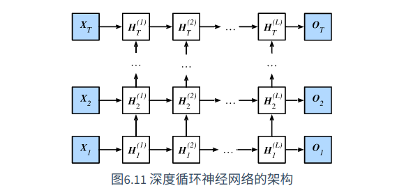

# 深度循环神经网络

RNN到目前为止，都介绍了只有一层单向隐藏层的循环神经网络，但是在应用中我们会经常用多个隐藏层的循环神经网络。

下图展示了一个拥有L个隐藏层的循环神经网络，每个隐藏状态不断传递至当前层的下一时间步和当前时间步的下一层。

具体来说，当前时间步中，设小批量输入$X_t \in \mathbb{R}^{n\times d}$, 第$\ell$隐藏层（$\ell \in 1,...,L$）的隐藏状态为$H_t^{(\ell)} \in \mathbb{R}^{n \times h}$, 隐藏单元个数为h，

输出层变量为$O_t \in \mathbb{R}^{n \times q}$(输出个数为q)，且隐藏层的激活函数为$\phi$

* 第一层的隐藏装填计算和之前一样：

​			$H_t^{(1)}=\phi(X_tW_{xh}^{(1)}+H_{t-1}^{(1)}W_{hh}^{(1)}+b_h^{(1)})$

* 当 $1< \ell \le L$时, 第L层的隐藏装填表达式为：

​			$H_t^{(\ell)} = \phi(H_t^{(\ell - 1)}W_{xh}^{(\ell)}+H_{t-1}^{(\ell)}W_{hh}^{(\ell)}+b_h^{(\ell)})$

* 最终，输出层的输出只需基于L层的隐藏状态：

  ​	$O_t=H_t^{(L)}W_{hq}+b_q$

类似于多层感知机，隐藏层数L和隐藏单元个数h都是超参数。此外，如果将隐藏状态的计算换成GRU或者LSTM也能得到深度门控神经网络。

# 双向循环神经网络

之前介绍的循环神经网络都是假设当前时间步的隐藏状态是由前面较早的时间步决定的，因此隐藏状态的传递是单向的。

有时候，当前时间步也有可能由后面的时间步决定，例如，我们写下一个句子，可能会根据句子后面的词修改句子前面的词，双向循环神经网络通过增加了从后向前的传递步骤来更加灵活的处理这类信息，如下图：

具体如下：

给定时间步t的小批量输入$X_t \in \mathbb{R}^{n \times d}$（样本数为n，输入个数为d）和隐藏层激活函数$\phi$，在双向循环神经网络架构中，设该时间步正向隐藏状态为$\overrightarrow{H}_t \in \mathbb{R}^{n \times h}$（正向隐藏单元个数为h），反向隐藏状态为$\overleftarrow{H}_t \in \mathbb{R}^{n \times h}$（反向隐藏单元个数为h）。

* 正向和反向隐藏状态计算：

  ​	$\overrightarrow{H}_t=\phi(X_tW_{xh}^{(f)}+\overrightarrow{H}_{t-1}W_{hh}^{(f)}+b_h^{(f)})$

  ​	$\overleftarrow{H}_t = \phi(X_tW_{xh}^{(b)}+H_{t+1}W_{hh}^{(b)}+b_h^{(b)})$

计算前后向后，可以**连接**正向和反向状态得到一个最终的隐藏状态$H_t \in \mathbb{R}^{n \times2h}$,并将其计算于输出层，输出$O_t \in \mathbb{R}^{n \times q}$计算如下

​			$O_t=H_tW_{hq}+b_q$

其中$W_{hq} \in \mathbb{R}^{2h \times q}$, $b_q \in \mathbb{R}^{1 \times q}$

注：不同方向上的隐藏单元个数也可以不同。

