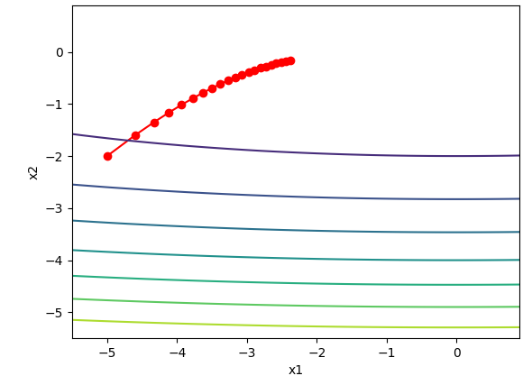
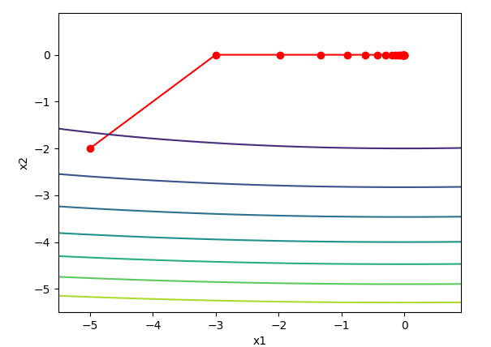

# 优化与深度学习

## 优化与深度学习的关系

虽然优化为深度学习提供了最小化损失函数的方法，但优化实际上与深度学习的目标是有区别的，由于优化算法的目标函数通常是一个基于训练数据集的损失函数，优化的目标在于降低训练误差。 而深度学习的目标在于降低泛化误差。为了降低泛化误差，除了使用优化算法降低训练误差以外，还需要注意应对过拟合。


## 优化在深度学习中的挑战

深度学习中很多优化都很复杂，因此目标函数大多没有解析解，而需要使用基于数值方法的优化算法找到数值解，为了找到最小化目标函数的数值解，我们将通过有限次迭代模型来尽可能的降低损失。

下面描述了2种挑战，即局部最小值和鞍点。


### 局部最小值

对于目标函数f(x)，如果f(x)在x上的值比在x邻近的其他点的值要小，那么f(x)可能是一个局部最小值，如果f(x)在x上的值是在整个定义域的最小值，那么f(x)代表全局最小值。

举个例子：

​		给定函数$f(x)=x\cdot cos(\pi x) -1.0 \leq x \leq 2.0$  

我们可以大致找出该函数的局部最小值和全局最小值的位置，需要注意的是，图中箭头所指的是大致位置。


```python
import numpy as np
import matplotlib.pyplot as plt
import matplotlib

from mpl_toolkits import mplot3d


matplotlib.use("TkAgg")

def f(x):
    return x * np.cos(np.pi * x)


fig, ax = plt.subplots()
x = np.arange(-1.0, 2.0, 0.1)
ax.annotate("local minimum", xy=(-0.3, -0.25), xytext=(-0.77, -1.0), arrowprops=dict(arrowstyle="->"))
ax.annotate("global minimum", xy=(1.1, -0.95), xytext=(0.6, 0.8), arrowprops=dict(arrowstyle="->"))
ax.plot(x, f(x), linewidth=2.0)

plt.show()
```

深度学习模型的目标函数可能有若干局部最优值。当一个优化问题的数值解在局部最优解附近时，由于目标函数有关解的梯度接近或变成零，最终迭代求得的数值解可能只令目标函数局部最小化而非全局最小化。


### 鞍点

刚刚我们提到，梯度变成0可能是由于当前解为局部最优解附近造成的，事实上，还有另一种可能是当前解在**鞍点(saddle point)**附近。

举个例子，给定函数

​		$f(x) = x^3$

我们可以找出其鞍点所在位置：


```python
import matplotlib
import numpy as np
import matplotlib.pyplot as plt


matplotlib.use("TkAgg")


x = np.arange(-2.0, 2.0, 0.1)
fig, ax = plt.subplots()

ax.plot(x, x**3)
ax.annotate("saddle point", xy=(0, -0.2), xytext=(-0.52, -5.0), arrowprops=dict(arrowstyle="->"))

plt.show()
```


使用二维空间的例子表示:

​		$f(x, y)=x^2-y^2$

我们可以找出该函数鞍点的位置，该函数类似马鞍，而鞍点正好在图中心。


```python
import matplotlib

matplotlib.use("TkAgg")

from mpl_toolkits.mplot3d import axes3d
import matplotlib.pyplot as plt
import numpy as np

# 第三个值为实数表步长，第三个数为复数表形状
x, y = np.mgrid[-1:1:31j, -1:1:31j]
z = x**2 - y**2

fig = plt.figure()
ax = fig.add_subplot(projection="3d")
ax.plot_wireframe(x, y, z, rstride=2, cstride=2)
ax.plot([0], [0], [0], "rx")
plt.xlabel("X")
plt.ylabel("Y")
plt.show()
```

我们发现，中心点在x的方向上是局部最小值，在y的方向上为局部最大值。

假设一个函数的输入为*k*维向量，输出为标量，那么它的海森矩阵（Hessian matrix）有*k*个特征值。该函数在梯度为0的位置上可能是局部最小值、局部最大值或者鞍点。

- 当函数的海森矩阵在梯度为零的位置上的特征值全为正时，该函数得到局部最小值。
- 当函数的海森矩阵在梯度为零的位置上的特征值全为负时，该函数得到局部最大值。
- 当函数的海森矩阵在梯度为零的位置上的特征值有正有负时，该函数得到鞍点。

随机矩阵理论告诉我们，对于一个大的高斯随机矩阵来说，任一特征值是正或者是负的概率都是0.5。那么，以上第一种情况的概率为 0.5^k^。由于深度学习模型参数通常都是高维的（*k*很大），目标函数的鞍点通常比局部最小值更常见。

在深度学习中，虽然找到目标函数的全局最优解很难，但这并非必要。我们将在本章接下来的几节中逐一介绍深度学习中常用的优化算法，它们在很多实际问题中都能够训练出十分有效的深度学习模型。


## 梯度下降和随机梯度下降

本节中介绍梯度下降(gradient descent)的工作原理，虽然梯度下降在深度学习中很少被直接使用，但理解梯度的意义以及沿着梯度反方向更新自变量可能降低目标函数值的原因是理解后面优化算法的基础。随后引出随机梯度下降（stochastic gradient descent）。

### 一维梯度下降

我们以简单的一维梯度下降为例，解释梯度下降算法可能降低目标函数值的原因。假设连续可导函数$f:\mathbb{R} \rightarrow \mathbb{R}$的输入和输出都是标量，给定绝对值足够小的数$\epsilon$，根据泰勒展开公式，我们得到以下的近似：

​																						$f(x+\epsilon)\approx f(x)+\epsilon f'(x)$

这里*f*′(*x*)是函数*f*在*x*处的梯度。一维函数的梯度是一个标量，也称导数。

接下来找到一个常数$\eta > 0$,使得$|\eta f'(x)|$足够小，那么可以将$\epsilon$替换为$-\eta f'(x)$并得到

​																					$f(x-\eta f'(x)) \approx f(x)-\eta f'(x)^2$

如果导数$f'(x)\neq 0$，那么$\eta f'(x)^2>0$,所以：

​																					$f(x-\eta f'(x))$ ≲ $f(x)$

这意味着，如果通过

​																					$x \leftarrow x-\eta f'(x)$

来迭代x，函数f(x)的值可能会降低。因此在梯度下降中，我们先选取一个初始值x和常数$\eta > 0$，然后不断地通过上式迭代x，直到达到停止条件，例如$f'(x)^2$的值已经足够小或迭代次数已达到某个值。


下面我们使用目标函数$f(x)=x^2$为例来看下梯度下降是如何工作的，我们知道函数梯度为0时的解为x=0，我们依然使用这个简单的函数来观察x是如何被迭代的。代码如下：

```python
import numpy as np
import matplotlib.pyplot as plt
import matplotlib

matplotlib.use("TkAgg")


# gradian descend
def gd(eta):
    x = 10
    results = [x]
    for i in range(10):
        # x -= eta * f'(x)
        x -= eta * 2 * x
        results.append(x)
    print("epoch 10:", x)
    return results


def show(array):
    n = max(abs(min(array)), abs(max(array)), 10)
    f_line = np.arange(-n, n, 0.1)
    fig, ax = plt.subplots(figsize=(5, 3))
    ax.plot(f_line, [x**2 for x in f_line])
    ax.plot(array, [x**2 for x in array], "-o")
    ax.set(xlabel="x", ylabel="y", title="$f(x)=x^2$")
    plt.show()


if __name__ == '__main__':
    show(gd(0.2))

```


### 学习率

上述梯度下降算法中的$\eta$通常叫做学习率，这是一个超参数，需要人工设定，如果设置过小的学习率，通常会导致x更新缓慢从而需要更多的迭代才会得到更好的解，下面展示学习率为0.05时的迭代轨迹，同样迭代10次后的x依然与标准解存在一定差距。

````python
show(gd(0.05))
````


​	

如果使用过大的学习率，$|\eta f'(x)|$可能会过大从而导致前面提到的一阶泰勒展开式不再成立，这是我们无法保证迭代x会降低f(x)的值，例如：当$\eta=1.1$时，可以看到x不断越过（overshoot）最优解x=0并发散。


### 多维梯度下降

让我们考虑一种更广的情景，目标函数的输入为向量，输出为标量，假设目标函数$f:\mathbb{R}^d \rightarrow \mathbb{R}$输入是一个d维向量$x=[x_1,x_2,...,x_d]^\top$,目标函数关于x的梯度是一个由d个偏导数组成的向量：

​																	$\large \nabla_x f(x)=[\frac{\partial f(x)}{\partial x_1},\frac{\partial f(x)}{\partial x_2}...\frac{\partial f(x)}{\partial x_d}]^\top$

梯度中每个偏导数$\frac{\partial f(x)}{x_i}$代表向量中第i个元素对f(x)的变化率，为了测量f沿着单位向量u(即$|u|=1$)方向上的变化率，在多元微积分中，我们定义f在x上沿着u方向的导数为:

​																	$\large D_uf(x)=\lim_{h\rightarrow0} \frac{f(x+hu)-f(x)}{h}$

又可写为：

​																	$\large D_u f(x)=\nabla f(x)\cdot u$

方向导数$D_uf(x)$给出了f在x上沿着所有的可能方向的变化率，为了最小化f，我们希望找到f能被降低的最快的方向，因此，我们可以通过的单位向量u来最小化方向导数$D_uf(x)$。

由于$D_uf(x)=||\nabla f(x)||\cdot ||u|| \cdot \cos(\theta)$，其中$\theta$为梯度$\nabla f(x)$与向量u之间的夹角，当$\theta = \pi$时，cos($\theta$)取得最小值-1。因此当u在梯度方向$\nabla f(x)$相反方向时，方向导数$D_u f(x)$被最小化。因此，我们可能通过梯度下降算法来不断降低目标函数f的值：

​																	$x \leftarrow x-\eta f(x)$

$\eta$被称作学习率。

下面我们创造一个输入为2维向量$x=[x_1,x_2]^\top$，输出为标量的目标函数$f(x)=x_1^2+2x_2^2$。那么梯度$\nabla f(x)=[2x_1, 4x_2]^\top$,我们将观察梯度下降从初始位置$[-5, -2]$开始对自变量x的迭代轨迹，我们先定义2个辅助函数，第一个函数使用指定的自变量更新函数从初始位[-5, -2]开始迭代自变量20次，第二个函数对自变量x的迭代轨迹进行可视化。

```python

def train_2d(trainer):
    x1, x2 = -5, -2
    s1, s2 = 0, 0
    results = [(x1, x2)]
    for i in range(20):
        x1, x2, s1, s2 = trainer(x1, x2, s1, s2)
        results.append((x1, x2))
    print("epoch %d, x1 %.2f x2 %.2f" % (i+1, x1, x2))
    return results


def show_trace_2d(f, results):
    plt.plot(*zip(*results), "-o", color="#ff7f0e")
    x1, x2 = np.meshgrid(np.arange(-5.5, 1.0, 0.1), np.arange(-3.0, 1.0, 0.1))
    plt.contour(x1, x2, f(x1, x2), colors="#1f77b4")
    plt.xlabel("x1")
    plt.ylabel("x2")
    plt.show()
    
```


定义训练

```python

eta = 0.1

# 定义目标函数
def f_2d(x1, x2):
    return x1 ** 2 + 2 * x2 ** 2

# 梯度下降函数
def gd_2d(x1, x2, s1, s2):
    return (x1 - eta * 2 * x1, x2 - eta * 4 * x2, 0, 0)

show_trace_2d(f_2d, train_2d(gd_2d))

```

结果展示：


### 随机梯度下降

深度学习中，损失函数通常计算各个样本的损失平均值，设$f_i(x)$是索引为i的训练数据样本的损失函数，n是训练数据样本数，x是模型参数向量，那么目标函数定义为:

​																			$f(x)=\frac{1}{n}\sum^n_{i=1}f_i(x)$

目标函数在x处的梯度计算为：

​																			$\nabla f(x)=\frac{1}{n}\nabla f_i(x)$

如果使用梯度下降，每次自变量迭代的计算开销为$O(n)$，它随着n线性增加，当训练样本数很大时，梯度下降每次迭代开销很高。

随机梯度下降（stochastic gradient descend,SGD）减少了每次迭代的计算开销，在随机梯度下降的每次迭代中，我们随机均匀采样的一个样本索引$i \in \{1,2,...n\}$，并计算梯度$\nabla f_i(x)$来迭代x：

​																			$x \leftarrow x - \eta \nabla f_i(x)$

这里的$\eta$同样是学习率。可以看到每次迭代每次迭代的计算开销从梯度下降的O(n)下降到O(1)，值得强调的是，随机梯度$\nabla f_i(x)$是对梯度$\nabla f(x)$的无偏估计：

​																			$E_i\nabla f_i(x)=\frac{1}{n}\sum \nabla f_i(x)=\nabla f(x)$

这意味着，平均来说，随机梯度是对梯度的一个良好估计。

下面我们通过在梯度中随机添加均值为0的噪声来模拟随机梯度下降，以此来与梯度下降相区别。

```python
# 代码路径：Code/Other/sgd_example.py
def sgd_2d(x1, x2, s1, s2):
    return x1 - eta * (2 * x1 + np.random.normal(0.1)),\
           x2 - eta * (4 * x2 + np.random.normal(0.1)),\
           0, 0

show_trace_2d(f_2d, train_2d(sgd_2d))

```


可以看到，随机梯度下降中自变量的迭代轨迹相对于梯度下降更为曲折，这是由于实验添加的噪声导致的准确度下降，在实际中，这些噪声一般代表无意义的干扰。


### 小批量随机梯度下降

在每次迭代中，梯度下降使用整个数据集来计算梯度，因此也被称为批量梯度下降（Batch gradient descent）而随机梯度下降在每次迭代中只随机采样一个样本来计算梯度。正如前几章，我们可以在每轮迭代中，随机均匀采样多个样本来组成一个小批量，然后使用这个小批量来计算梯度，下面就来描述小批量随机梯度下降。

* 推导

设目标函数$f(x):\mathbb{R}^d \rightarrow \mathbb{R}$,在迭代开始前的时间步设为0，时间步的自变量$x_0 \in \mathbb{R}^d$,通常由随机初始化得到，在接下来的时间步t>0中，小批量随机梯度下降随机均匀采样一个由训练数据样本索引组成的小批量$B_t$，我们可以通过重复采样（sample with replacement）或者不重复采样（sample without replacement）得到小批量中的各个样本，前者允许同一个批量中存在相同的样本，后者不允许如此，且更常见，对于这两种方式都可以使用：

​																$g_t \leftarrow \nabla f_{B_t}(x_{t-1}) = \frac{1}{|B|}\sum_{i \in B_t} \nabla f_i(x_t-1)$

来计算时间步t的小批量$B_t$上目标函数位于$x_{t-1}$处的梯度$g$,这里$|B|$代表批量大小，即小批量样本中的个数，是一个超参数，同随机梯度，重复采样所得的小批量随机梯度$g_t$也是对梯度$\nabla f(x_t-1)$的无偏估计，给定学习率$\eta_t$(取正数)，小批量随机梯度下降对自变量的迭代如下：

​																$x_t \leftarrow x_{t-1} - \eta_t g_t$

* 梯度下降的学习率自我衰减

基于随机采样得到的梯度的方差在迭代过程中无法减小，因此在实际中，（小批量）随机梯度下降的学习率可以在迭代过程中自我衰减，

例如$\eta_t=\eta t^\alpha$（通常$\alpha=-1$或者-0.5），$\eta t = \eta \alpha^t$（$\alpha = 0.95$），或者没迭代若干次后将学习率衰减一次，如此一来学习率和随机梯度的乘积方差会减小。而梯度下降在迭代过程中一直使用目标函数的真实梯度，无须自我衰减学习率。


小批量随机梯度下降每次迭代的开销为$O(|B|)$,当批量大小为1时，该算法即为随机梯度下降，当批量数为训练样本总数时，该算法即为随机梯度下降，当批量比较小时，每次迭代使用的样本少，导致内存使用效率和和计算性能的降低，这使得在计算同样数目样本的情况下使用的时间比更大批量的样本使用时间更长。当批量较大时，每个小批量梯度里可能含有更多冗余信息，为了得到较好的解，批量较大时比批量较小时需要计算的样本数目可能更多，例如增大迭代周期数。


#### 代码

* 数据读取

本章里我们将使用一个来自NASA的测试不同飞机机翼噪音的数据集来比较各个优化算法。我们使用该数据集的前1,500个样本和5个特征，并使用标准化对数据进行预处理。

```python
import numpy as np
import time
import torch
from torch import nn, optim
import sys
import os


CUR = os.path.dirname(os.path.abspath(__file__))
TXT = os.path.join(os.path.dirname(os.path.dirname(CUR)), "Datasets", "airfoil_self_noise.dat")


def get_data():
    data = np.genfromtxt(TXT, delimiter="\t")
    data = (data - data.mean(axis=0)) / data.std(axis=0)
    return torch.tensor(data[:1500, :-1], dtype=torch.float32), \
            torch.tensor(data[:1500, -1], dtype=torch.float32)


features, labels = get_data()
# features.shape  --  [1500, 5]

```

* 从零开始

在一开始我们已经实现过小批量随机梯度下降算法，这里将他的输入参数变得更加通用，主要是方便本章后面介绍其他优化算法也可以使用同样的输入，我们添加了一个`status`并将超参放到字典`hyperparam`里，此外我们将在训练函数中对各个小批量样本损失求平均，因此优化算法中不需要对各个小批量样本求平均，因此优化算法里的梯度不需要除以批量大小。

```python
def sgd(params, status, hyperparams):
    for p in params:
        p.data -= hyperparams["lr"] * p.grad.data

```

下面实现一个通用的训练函数，方便后续其他优化算法使用，它初始化一个线性回归模型，可以使小批量随机梯度下降以及后续的其他章节训练模型。

```python

def linereg(X, w, b):
    return torch.mm(X, w) + b


def squared_loss(y, label):
    return 0.5 * (y - label.view(y.size())) ** 2


def train(optimizer_fn, status, hyperparams, features, labels, batchsize=10, num_epoch=2):
    # 初始化模型
    net, loss = linereg, squared_loss
    w = torch.nn.Parameter(torch.tensor(np.random.normal(0, 0.01, size=(features.shape[1], 1)), dtype=torch.float32),
                           requires_grad=True)
    b = torch.nn.Parameter(torch.zeros(1,dtype=torch.float32), requires_grad=True)

    def eval_loss():
        return loss(net(features, w, b), labels).mean().item()

    ls = [eval_loss()]
    data_iter = torch.utils.data.DataLoader(torch.utils.data.TensorDataset(features, labels), batchsize, shuffle=True)
    for _ in range(num_epoch):
        start = time.time()
        for batch_i, (X, y) in enumerate(data_iter):
            l = loss(net(X, w, b), y).mean()

            # 梯度清零
            if w.grad is not None:
                w.grad.data.zero_()
                b.grad.data.zero_()
            l.backward()
            optimizer_fn([w, b], status, hyperparams)
            if (batch_i + 1) * batchsize % 100 == 0:
                # 每100个样本记录当前误差
                ls.append(eval_loss())
        # 打印结果和作图
        print("Loss: %f, %f sec per epoch." % (ls[-1], time.time()-start))
    fig, ax = plt.subplots()
    ax.plot(np.linspace(0, num_epoch, len(ls)), ls)
    ax.set(xlabel="epochs", ylabel="loss")
    ax.grid()
```

当批量大小为样本总数1500时,优化使用的是梯度下降。梯度下降的一个迭代周期对模型参数只迭代一次 ，可以看到2次迭代后目标函数值下降趋于平稳。

```python
features, labels = get_data()
train(sgd, None, {"lr": 1}, features, labels, 1500, 10)
plt.show()
```


当批量大小为1时，优化使用的随机梯度下降，为了简化实现，我们未对学习率进行自我衰减，而是直接采用较小的学习率，随机梯度下降中，每处理一个样本会更新一次自变量（参数），一个迭代周期会对自变量进行1500次更新，可以看到目标函数值的下降在一个迭代周期后变得较为平缓。

```python
features, labels = get_data()
train(sgd, None, {"lr": 0.005}, features, labels, 1, 10)
plt.show()
```


虽然随机梯度下降和梯度下降在一个迭代周期里都处理了1500个样本,但实验中随机梯度下降的一个迭代周期耗时更多,这是因为在随机梯度下降一个周期做了更多的迭代,而且单样本的梯度计算难以有效利用矢量计算.

当批量大小为10时,优化使用的是小批量随机梯度下降,他的每个迭代周期位于梯度下降和随机梯度下降之间.

```python
features, labels = get_data()
train(sgd, None, {"lr": 0.005}, features, labels, 10, 10)
plt.show()
```


```
Loss: 0.242464, 0.024797 sec per epoch.
```


#### 简洁实现

在pytorch中可以创建optimizer实例来调度优化算法,下面实现一个通用的训练函数,他通过优化算法的函数`optimizer_fn`和超参数`optimizer_hyperparams`来创建optimizer实例。

```python

def train_pytorch(optimizer_fn, optimizer_hyperparams, features, labels, batch_size, num_epoch):
    # 初始化模型
    net = nn.Sequential(
        nn.Linear(features.shape[-1], 1)
    )
    loss = nn.MSELoss()
    optimizer = optimizer_fn(net.parameters(), **optimizer_hyperparams)

    def eval_loss():
        return loss(net(features).view(-1), labels).item() / 2

    ls = [eval_loss()]
    data_iter = torch.utils.data.DataLoader(
        torch.utils.data.TensorDataset(features, labels), batch_size, shuffle=True
    )

    for _ in range(num_epoch):
        start = time.time()
        for batch_i, (X, y) in enumerate(data_iter):
            l = loss(net(X).view(-1), y) / 2
            optimizer.zero_grad()
            l.backward()
            optimizer.step()
            if (batch_i+1) * batch_size % 100 == 0:
                ls.append(eval_loss())
        print("loss: %f, %f sec per epoch.." % (ls[-1], time.time()-start))
    fig, ax = plt.subplots()
    ax.plot(np.linspace(0, num_epoch, len(ls)), ls)
    ax.set(xlabel="epochs", ylabel="loss")
    ax.grid()

```

使用pytorch重复刚才的实验

```python
features, labels = get_data()
train_pytorch(optim.SGD, {"lr": 0.05}, features, labels, 10, 2)
plt.show()
```


```
loss: 0.243022, 0.026088 sec per epoch..
```


---

## 动量法

在前一章我们提到，目标函数有关自变量的梯度代表了目标函数在自变量当前位置下降最快的方向，因此梯度下降也被称为**最陡下降**。在每次迭代中，梯度下降根据自变量当前位置，沿着当前位置的梯度更新自变量，然而如果自变量的迭代方向仅仅取决于自变量当前位置，可能会带来一些问题。


### 梯度下降的问题

让我们考虑一个输入和输出分别为二维向量$x=[x1,x2]^\top$和标量的目标函数$f(x) = 0.1x_1^2+ 2x_2^2$。与前一节不同，这里将$x_1^2$系数从1较小到了0.1，下面实现基于这个目标函数的梯度下降，并演示使用学习率为0.4时自变量迭代的轨迹。

```python
import sys
import torch

from Code.Utils.common import show_trace_2d, train_2d
eta = 0.4


def f_2d(x1, x2):
    return 0.1 * x1 ** 2 + 2 * x2 ** 2


def gd_2d(x1, x2, s1, s2):
    return x1 - (eta * 0.2 * x1), x2 - (eta * 4 * x2), 0, 0


if __name__ == '__main__':
    show_trace_2d(f_2d, train_2d(gd_2d))
```


可以看到，同一位置上，目标函数在竖直方向上比在水平方向斜率的绝对值要大。因此，给定学习率，梯度下降迭代自变量时会使自变量在竖直方向比水平方向移动幅度更大。那么，我们需要一个较小的学习率从而避免自变量在竖直方向上越过目标函数最优解，然而这样做会使水平方向上的移动变得更慢。

下面我们试着把学习率调大一点，此时自变量在竖直方向不断越过最优解并逐渐发散。

```python
eta = 0.6
show_trace_2d(f_2d, train_2d(gd_2d))
```


### 动量法

动量法的提出是为了解决梯度下降的上述问题，由于小批量随机梯度下降比梯度下降更为广义，本章后续将讨论小批量随机梯度下降中时间步t的小批量随机梯度g~t~的定义。设时间步t的自变量为$x_t$,学习率为$\eta_t$。在时间步0，动量法创建速度变量$v_0$,并将其元素初始化成0，在时间步$t>0$，动量法对每次迭代步骤做如下修改：

​																					$v_t \leftarrow \gamma v_{t-1} + \eta_tg_t$

​																					$x_t \leftarrow x_{t-1} - v_t$

其中，动量超参数$\gamma$满足$0 \le \gamma < 1$, 当$\gamma = 0$时，动量法等价于小批量随机梯度下降。

在解释动量法的数学原理前，让我们先从实验中观察梯度下降在使用动量法后的迭代轨迹。

```python
from Code.Utils.common import train_2d, show_trace_2d, f_2d


eta, gamma = 0.4, 0.5


def momentum_2d(x1, x2, v1, v2):
    v1 = gamma * v1 + eta * 0.2 * x1
    v2 = gamma * v2 + eta * 4 * x2
    return x1 - v1, x2 - v2, v1, v2


show_trace_2d(f_2d, train_2d(momentum_2d))
```


可以看到使用较小的学习率$\eta=0.4$和动量超参数$\gamma = 0.5时$，动量法在竖直方向上更加平顺。且在水平方向上快速的逼近最优解。下面使用较大的学习率0.6，此时自变量也不再发散。

```python
eta, gamma = 0.6, 0.5
show_trace_2d(f_2d, train_2d(momentum_2d))
```


### 指数加权移动平均

为了从数学上理解动量法,让我们先解释一下指数加权移动平均(exponentially weighted moving average)。给定超参数$0 \le \gamma \lt 1$,当前时间步t的变量$y_t$是上一时间步t-1的变量$y_{t-1}$和当前时间步另一变量$x_t$的线性组合：

​																						$y_t = \gamma y_{t-1} + (1-\gamma)x_t$

我们可以对$y_t$展开：

​																			$y_t = (1-\gamma)x_t + \gamma y_{t-1}$

​															     				$=(1-\gamma)x_t + (1-\gamma)\cdot \gamma x_{t-1} + \gamma^2y_{t-2}$

​																			 	$=(1-\gamma)x_t + (1-\gamma)\cdot \gamma x_{t-1} + (1-\gamma)\cdot \gamma^2x_{t-2} + \gamma^3y_{t-3}$

​																				 $...$

令$n=1/(1-\gamma)$,那么$(1-1/n)^n = \gamma^{1/(1-\gamma)}$,因为：

​																			$\lim_{n \rightarrow \infin}(1-\frac{1}{n})^n=\exp(-1) \approx 0.3679$

所以当$\gamma \rightarrow 1$时，$\gamma^{1/(1-\gamma)} = \exp(-1)$,如$0.95^{20} \approx \exp(-1)$。如果把$\exp(-1)$当做一个比较小的数，我们可以在近似中忽略所有含$\gamma^{1/(1-\gamma)}$和比$\gamma^{1/(1-\gamma)}$更高阶的系数的项。例如，当$\gamma=0.95$时，

​																			$y_t \approx 0.05 \sum_{i=0}^{19}0.95^i x_{t-i}$

因此，在实际中，我们常常将$y_t$看作是对最近$1/(1-\gamma)$个时间步的x~t~值的加权平均，例如，当$\gamma=0.95$时，y~t~可以看做对最近20个时间步的x~t~的加权平均。当$\gamma=0.9$时，y~t~可以看做是对最近10个时间步的x~t~的加权平均。而且，离当前时间步t越近的x~t~值获得的权重越大（越接近1）。

### 由指数加权移动平均理解动量法

现在，我们对动量法速度变量做变形：

​																		$v_t \leftarrow \gamma v_{t-1} + (1-\gamma)(\frac{\eta t}{1-\gamma}g_t)$

由指数加权移动平均的形式可得，速度变量$v_t$实际上对序列$\{\eta_{t-i}g_{t-i}/(1-\gamma): i=0,...,1/(1-\gamma)-1\}$做了指数加权平均。换句话说，相比于小批量随机梯度下降，动量法在每个时间步更新自变量的值约等于最近$1/(1-\gamma)$个时间步的更新量（也就是学习率×梯度）做了指数加权平均后再除以$1-\gamma$。所以在动量法中，自变量在各个方向上的移动幅度不仅仅取决于当前梯度，还取决于过去的各个梯度在各个方向上是否一致。


### 代码（从零开始）

相对于小批量随机梯度下降，动量法需要对每一个自变量维护一个同他形状一样的速度动量，hyperparam字典中也新增一个momentum超参数，实现中，我们将速度变量用更广义的状态变量`status`表示

```python
import torch

from Code.Utils.load_data_airfoil import get_data

features, labels = get_data()


def init_momentum_status():
    v_w = torch.zeros(features.shape[1], 1)
    v_b = torch.zeros(1, dtype=torch.float32)
    return v_w, v_b


def sgd_momentum(params, status, hyperparams):
    for p, v in zip(params, status):
        v.data = hyperparams["momentum"] * v.data + hyperparams["lr"] * p.grad.data
        p.data -= v.data
```

我们先将动量参数设为0.5，这时可以看做是特殊的小批量随机梯度下降：其小批量随机梯度为最近2个时间步的2倍小批量梯度的加权平均。

> 注：个人认为这里不应该是“加权平均”而应该是“加权和”，因为根据前一节分析，加权平均最后除以了$1−γ$，所以就相当于没有进行平均。

```python
from Code.Utils.common import train, plt
train(sgd_momentum, init_momentum_status(), {"lr": 0.02, "momentum": 0.5}, features, labels)
plt.show()
```

动量设置为0.5的效果如下


我们将动量设置成0.9，此时的梯度更新量为最近10个小批量梯度的加权和。我们保持学习率为0.2不变：

```python
from Code.Utils.common import train, plt
train(sgd_momentum, init_momentum_status(), {"lr": 0.02, "momentum": 0.9}, features, labels)
plt.show()
```


可见目标函数值在后期迭代过程中变得不再那么平滑。直觉上，10倍小批量梯度比2倍小批量梯度大了5倍，我们可以将学习率减小为原来的1/5，此时目标函数在下降一定时间后变得平滑。

```python
from Code.Utils.common import train, plt
train(sgd_momentum, init_momentum_status(), {"lr": 0.004, "momentum": 0.9}, features, labels)
plt.show()
```


### 代码（简洁实现）

在pytorch中，只需要通过参数momentum指定动量即可使用动量法

代码路径：`Code/Example/Grad_momentum_simple.py`

```python
import torch
from torch import nn, optim

from Code.Utils.common import train_pytorch, plt
from Code.Utils.load_data_airfoil import get_data

features, labels = get_data()
train_pytorch(optim.SGD, {"lr": 0.004, "momentum": 0.9}, features, labels)
plt.show()
```


## AdaGrad算法

之前介绍的优化算法中，目标函数自变量每一个元素在相同时间步都使用同一个学习率来迭代。举个例子，假设目标函数为f，自变量为一个二维向量$[x1, x2]^\top$,该向量在每次迭代时都是用相同的学习率。例如，在学习率为$\eta$的梯度下降中，元素x1,x2都是用相同的学习率自我迭代。

​																					$x_1 \leftarrow x_1-\eta \frac{\partial f}{\partial x_1},x2 \leftarrow x_2-\eta \frac{\partial f}{\partial x_2}$

在动量法中，当x1,x2梯度值有差别时，需要选择足够小的学习率使得自变量在梯度值较大的维度上不发散，但这样会导致自变量在梯度值较小的维度迭代过慢。动量法依赖指数加权移动平均使得自变量的更新方向更加一致，从而降低发散的可能。**本节我们介绍AdaGrad算法，他根据自变量在每个维度的梯度大小来调整学习率，从而避免学习率难以适用所有维度的问题。**


### 算法

AdaGrad算法会使用一个小批量随机梯度g~t~按元素平方的累加变量s~t~。在时间步0，AdaGrad将s~0~中每个元素初始化为0，在时间步t，首先将小批量随机梯度g~t~按元素平方后累加到变量s~t~：

​																						$s_t \leftarrow s_{t-1} + g_t \odot g_t$

其中$\odot$是按元素相乘，接着我们将目标函数自变量的每个元素的学习率通过按元素运算重新调整一下

​																						$x_t \leftarrow x_{t-1} - \frac{\eta}{\sqrt{s_t+\epsilon}} \odot g_t$

其中$\eta$是学习率，$\epsilon$是为了维持数值稳定性而添加的常数，如10^-6^，这里开方，除法和乘法的运算都是按元素运算的，这些按元素运算使得目标函数自变量中每个元素都分别拥有自己的学习率。


### 特点

需要强调的是，小批量随机梯度按元素平方的累加变量s~t~出现在学习率的分母项中。因此，如果目标函数有关自变量中某个元素的偏导数一直都比较大，那么该元素的学习率将下降较快；反之，如果目标函数有关自变量中某个元素的梯度较小，那么学习率也会下降较慢。然而，由于s~t~一直在累加元素平方的梯度，自变量中每个元素的学习率在迭代过程中一直在降低。**所以当学习率在迭代早期降得较快且当前解依旧不佳时，AdaGrad算法在迭代后期由于学习率过小，可能较难找到一个有用的解。**

下面我们仍然以目标函数$f(x) = 0.1x_1^2 + 2x_2^2$为例，观察AdaGrad对自变量的迭代轨迹。我们实现AdaGrad算法并使用和上一节实验中相同的学习率0.4，可以看到，自变量的迭代轨迹较为平滑，但是由于s~t~的累加效果是学习率不断衰减，自变量在迭代后期的移动幅度较小。

```python
import math
import matplotlib.pyplot as plt

from Code.Utils.common import show_trace_2d, train_2d
eta = 0.4


def adagrad_2d(x1, x2, s1, s2):
    g1, g2, eps = 0.2 * x1, 4 * x2, 1e-6
    s1 += g1 ** 2
    s2 += g2 ** 2
    x1 -= eta / math.sqrt(s1+eps) * g1
    x2 -= eta / math.sqrt(s2+eps) * g2
    return x1, x2, s1, s2


def f_2d(x1, x2):
    return 0.1 * x1 ** 2 + 2 * x2 ** 2


if __name__ == '__main__':
    show_trace_2d(f_2d, train_2d(adagrad_2d))
    plt.show()
```




下面把学习率增大到2,可以看到自变量更为迅速的逼近了最优解。

```python
eta = 2
show_trace_2d(f_2d, train_2d(adagrad_2d))
plt.show()
```

```
epoch 19, x1=-0.002295 x2=-0.000000
```



### 从零开始实现

同动量法一样,AdaGrad算法需要对每一个自变量维护一个同它一样形状的状态变量，我们根据AdaGrad算法中的公式实现。

```python
from Code.Utils.load_data_airfoil import get_data
from Code.Utils.common import train, plt

import torch


def init_ada_status(feature_shape=None):
    if not feature_shape:
        feature_shape = get_data()[0].shape
    s_w = torch.zeros(feature_shape[1], 1, dtype=torch.float32)
    s_b = torch.zeros(1, dtype=torch.float32)
    return s_w, s_b


def adagrad(params, states, hyperparams):
    eps = 1e-6
    for p, s in zip(params, states):
        s.data += p.grad.data ** 2
        p.data -= hyperparams["lr"] * p.grad.data / torch.sqrt(s + eps)

```

与小批量随机梯度中的实验相比，这里使用更大的学习率来训练模型。

```python
features, labels = get_data()
train(adagrad, init_ada_status(), {"lr": 0.1}, features, labels)
plt.show()
```

输出：

```
Loss: 0.242576, 0.028095 sec per epoch.
```


### 简洁实现

通过torch提供的名为`Adagrad`的优化器，我们便可以使用进行训练。

```python
features, labels = get_data()
train_pytorch(torch.optim.Adagrad, {"lr": 0.1}, features, labels)
plt.show()
```


## RMSProp算法

我们在AdaGrad中提到，因为调整学习率时分母上的s~t~一直在累加按元素平方的小批量随机梯度，所以目标函数自变量每个元素的学习率迭代过程中一直在降低（或者不变），因此在学习率在迭代早期快速降低且效果不佳时，AdaGrad算法在后期由于学习率过小，可能较难找到一个有用的解，为了解决这一问题，RMSProp算法对AdaGrad算法进行了小小的修改，该算法源自Coursera上的一门课程:"机器学习神经网络"

### 算法

我们在动量法章节中介绍过指数加权移动平均，不同于AdaGrad算法里状态变量s~t~是截至时间步t所有小批量随机梯度g~t~按元素平方和，

RMSProp算法将这些梯度按元素平方做指数加权移动平均。具体来说，给定超参数$0 \leq \gamma \lt 1$， RMSProp算法在时间步$t > 0$计算

​																						$s_t \leftarrow \gamma s_{t-1} + (1-\gamma) g_t\odot g_t$

和AdaGrad算法一样，RMSProp算法将目标函数自变量中每个元素的学习率通过按元素运算重新调整，然后更新自变量：

​																						$x_t \leftarrow x_{t-1} - \frac{\eta}{\sqrt{s_t+\epsilon}} \odot g_t$

其中，$\eta$为学习率，$\epsilon$为为了维持数值稳定添加的常数。如10^-6^。因为RMSProp算法的状态变量s~t~是对平方项$g_t \odot g_t$的指数加权平均，所以可以看做是最近$1/(1-\gamma)$个时间步的小批量随机梯度平方项的加权平均，如此一来，自变量每个元素的学习率在迭代过程中就不会一直降低（或不变）。

照例，让我们先观察RMSProp算法对目标$f(x) = 0.1x_1^2+2x_2^2$中自变量的迭代轨迹。在Adagrad章节中，使用的学习率为0.4的AdaGrad算法，自变量在迭代后期的移动幅度较小。但在同样学习率下，RMSProp算法可以更快逼近最优解。

代码路径:`Code/Example/Grad_RMSProp.py`

```python
import math
import torch
import numpy as np

from Code.Utils.common import show_trace_2d, train_2d


def rmsprop_2d(x1, x2, s1, s2):
    g1, g2, eps = 0.2 * x1, 4 * x2, 1e-6
    s1 = gamma * s1 + (1-gamma) * g1 ** 2
    s2 = gamma * s2 + (1-gamma) * g2 ** 2
    x1 -= eta / (math.sqrt(s1 + eps)) * g1
    x2 -= eta / (math.sqrt(s2 + eps)) * g2
    return x1, x2, s1, s2


def f_2d(x1, x2):
    return 0.1 * x1 ** 2 + 2 * x2 ** 2

eta, gamma = 0.4, 0.9
show_trace_2d(f_2d, train_2d(rmsprop_2d))

```


### 从零开始实现

接下来按照RMSProp公式实现该算法:

代码路径: `Code/Example/Grad_RMSProp_1.py`

```python
import torch
from Code.Utils.common import get_data, train, plt

features, labels = get_data()


def init_rmsprop_state():
    s_w = torch.zeros((features.shape[1], 1), dtype=torch.float32)
    s_b = torch.zeros(1, dtype=torch.float32)
    return s_w, s_b


def rmsprop(params, states, hyperparams):
    gamma, eps = hyperparams["gamma"], 1e-6
    for p, s in zip(params, states):
        s.data = gamma * s.data + (1-gamma) * p.grad.data ** 2
        p.data -= hyperparams["lr"] * p.grad.data / torch.sqrt(s + eps)
```

我们将学习率设置为0.01，将$\gamma$设置成0.9，此时，变量s~t~可看做是最近10个时间步的平方项$g_t \odot g_t$的加权平均。

```python
train(rmsprop, init_rmsprop_state(), {"lr": 0.01, "gamma": 0.9}, features, labels)
plt.show()
```


### 简洁实现

通过名为RMSProp的方法，我们便可以使用Pytorch提供的RMSProp算法来训练模型，注意，超参数$\gamma$通过alpha指定

```python
train_pytorch(torch.optim.RMSprop, {"lr": 0.01, "alpha": 0.9}, features, labels)
plt.show()
```


## AdaDelta算法

除了RMSProp算法外，另一个常用的优化算法AdaDelta算法也针对AdaGrad算法在迭代后期可能较难找到正确解的问题做了改进，有意思的是，AdaDelta算法没有学习率这一参数。

### 算法

AdaDelta算法也像RMSProp算法一样，使用了小批量随机梯度g~t~按元素平方的指数加权平均变量s~t~，在时间步0，他的所有元素被初始化为0，给定超参数$0 \le \rho < 1$(对应RMSProp算法中的$\gamma$),在时间步$t > 0$,同RMSProp一样计算：

​																					$s_t \leftarrow \rho s_{t-1} + (1-\rho)g_t \odot g_t$

与RMSProp不同的是，AdaDelta算法还维护了一个额外的变量$\Delta x_t$，其元素同样在时间步0被初始化为0，我们使用$\Delta x_{t-1}$来计算自变量的变化量：

​																					$g'_t \leftarrow \sqrt{\frac{\Delta x_{t-1}+\epsilon}{s_t + \epsilon}} \odot g_t$

其中$\epsilon$是为了维持数值稳定增加的常数，如10^-5^。接着更新自变量：

​																					$x_t \leftarrow x_{t-1} - g'_t$

最后，我们使用$\Delta x_t$来记录自变量变化量$g'_t$按元素平方的指数加权平均：

​																					$\Delta x_t \leftarrow \rho \Delta x_{t-1} + (1-\rho) g'_t \odot g'_t$

可以看到，如不考虑$\epsilon$的影响，AdaDelta算法跟RMSProp算法本质上的不同之处在于使用$\sqrt{\Delta x_{t-1}}$来替代学习率$\eta$。

### 从零开始实现

代码路径：`Code/Example/Grad_AdaDelta.py`

```python
import torch
from Code.Utils.common import get_data, train, plt, train_pytorch


features, labels = get_data()


def init_adadelta_state():
    s_w, s_b = torch.zeros(features.shape[1], 1, dtype=torch.float32), torch.zeros(1, dtype=torch.float32)
    delta_w, delta_b = torch.zeros(features.shape[1], 1, dtype=torch.float32), torch.zeros(1, dtype=torch.float32)
    return (s_w, delta_w), (s_b, delta_b)


def adadelta(params, states, hyperparams):
    rho, eps = hyperparams["rho"], 1e-5
    for p, (s, delta) in zip(params, states):
        s.data = rho * s + (1 - rho) * (p.grad.data ** 2)
        g = p.grad.data * torch.sqrt(delta + eps / s + eps)
        p.data -= g
        delta.data = rho * delta + (1 - rho) * g * g
```

使用超参数$\rho=0.9$来训练模型。

```python
train(adadelta, init_adadelta_state(), {"rho": 0.9}, features, labels)
plt.show()
```


### 简洁实现

通过使用torch自带的AdaDelta优化器实现,它的超参数通过`rho`指定

```python
train_pytorch(torch.optim.Adadelta, {"rho": 0.9}, features, labels)
plt.show()
```


## Adam算法

Adam算法在RMSProp算法基础上对小批量随机梯度做指数加权移动平均，下面我们来介绍这个算法。（Adam算法算是动量法和RMSProp算法的组合）

### 算法

Adam算法使用了动量变量$v_t$和RMSProp算法中的小批量随机梯度按元素平方的指数加权移动平均变量$s_t$,并在时间步0将他们中每个元素初始化为0。给定超参数$0 \le \beta_1 < 1 $(算法作者建议为0.9)，时间步t的动量变量$v_t$即小批量随机梯度$g_t$的指数加权平均：

​																					$v_t \leftarrow \beta_1v_{t-1} + (1-\beta_1)g_t$

和RMSProp算法中一样，给定超参数$0 \le \beta_2 < 1$(算法作者建议为0.999),将小批量随机梯度按元素平方后的项$g_t \odot g_t$做指数加权移动平均得到$s_t$：

​																					$s_t \leftarrow \beta_2s_{t-1} + (1-\beta_2)g_t \odot g_t$


由于我们将$v_0$和$s_0$中的元素都初始化为0，在时间步t我们得到$v_t = (1-\beta_1)\sum_{i=1}^t\beta_1^{t-i}g_i$ ，将过去各个时间步小批量随机梯度的权值相加，得到$(1-\beta_1)\sum_{i=1}^t\beta_1^{t-i} = 1-\beta_1^i$。需要注意的是，当t较小时，过去各时间步小批量随机梯度权值之和会较小。例如,当$\beta_1=0.9时，v_1 = 0.1g_1$。为了消除这种影响，对于任意时间步t，我们可以将$v_t$再除以$1-\beta_1^t$，从而使过去各时间步小批量随机梯度权值之和为1。这也叫做偏差修正。在Adam算法中，我们对变量$v_t和s_t$均做偏差修正：

​																					$\hat{v}_t \leftarrow \frac{v_t}{1-\beta_1^t}$

​																					$\hat{s}_t \leftarrow \frac{s_t}{1-\beta_2^t}$

接下来，Adam算法使用以上偏差修正后的变量$\hat{v}_t和\hat{s}_t$，将模型参数中每个元素的学习率通过按元素运算重新调整：

​																					$g_t' \leftarrow \frac{\eta \hat{v}t}{\sqrt{\hat{s}_t}+\epsilon}$

其中$\eta$是学习率，$\epsilon$是为了维持数值稳定而添加的常数，如$10^{-8}$。和AdaGrad，RMSProp，以及AdaDelta算法一样，目标函数自变量中每个元素都分别拥有自己的学习率。最后，使用$g_t'$迭代自变量：

​																					$x_t \leftarrow x_{t-1} - g_t'$


### 从零开始实现

```python
import torch

from Code.Utils.common import get_data, train, plt, train_pytorch


features, labels = get_data()


def init_adam_states():
    v_w, v_b = torch.zeros(features.shape[1], 1, dtype=torch.float32), torch.zeros(1, dtype=torch.float32)
    s_w, s_b = torch.zeros(features.shape[1], 1, dtype=torch.float32), torch.zeros(1, dtype=torch.float32)
    return ((v_w, s_w), (v_b, s_b))


def adam(params, states, hyperparams):
    beta1, beta2, eps = 0.9, 0.999, 1e-6
    for p, (v, s) in zip(params, states):
        v.data = beta1 * v + (1-beta1) * p.grad.data
        s.data = beta2 * s + (1-beta2) * p.grad.data ** 2
        v_bias_corr = v / (1-beta1 ** hyperparams["t"])
        s_bias_corr = s / (1-beta2 ** hyperparams["t"])
        p.data -= hyperparams["lr"] * v_bias_corr / (torch.sqrt(s_bias_corr) + eps)
        hyperparams["t"] += 1
```

```python
train(adam, init_adam_states(), {"lr": 0.01, "t": 1}, features, labels)
plt.show()
```


### 简洁实现

通过使用Adam优化器实现

```python
train_pytorch(torch.optim.Adam, {"lr":0.01}, features, labels)
plt.show()
```


