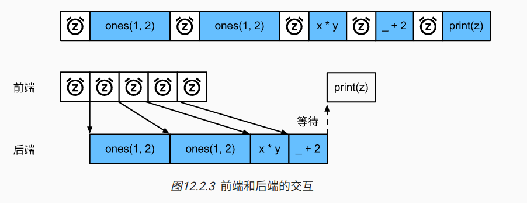

# 命令式编程和符号式混合编程

本书到目前为止都是一直在使用命令式编程，它使用编程语句改变程序状态。考虑下面的命令式程序:

```python
def add(a, b):
    return a + b

def fancy_func(a, b, c, d):
    e = add(a, b)
    f = add(c, d)
    g = add(e, f)
    return g

fancy_func(1, 2, 3, 4) # 10
```

和我们预测的一样，在运行语句`e=add(a, b)`时，Python会做加法运算并将结果存储在变量`e`中，从而令程序的状态发生改变。类似的后面的两条语句`f = add(c, d)`, `f = add(e, f)`会依次做加法运算并存储变量。

虽然使用命令式编程很方便，但他的运行可能会很慢，一方面，即使`fancy_func`中的函数`add`是被重复调用的函数，python也会逐一执行这三条函数调用语句。另一方面，我们需要保存变量e, f的值直到`fancy_func`中所有语句执行结束。这是因为在执行`e=add(a,b)`和`f=add(c,d)`这两条语句之后我们并不知道变量e,f是否会被其他部分使用。

与命令式编程不同，符号式编程通常在计算流程完全定义好之后才被执行。多个深度学习框架如Thaeno, Tensorflow，都使用了符号式编程，通常，符号式编程的程序需要下面3个步骤：

1. 定义计算流程
2. 把计算流程编译成可执行程序
3. 给定输入，调用编译好的程序执行

下面我们使用符号式编程重新实现本节开头给出的命令式编程代码。

```python
def add_str():
    return '''
def add(a, b):
    return a + b
'''

def fancy_func_str():
    return '''
def fancy_func(a, b, c, d):
    e = add(a, b)
    f = add(c, d)
    g = add(e, f)
    return g
'''

def evoke_str():
    return add_str() + fancy_func_str() + '''
print(fancy_func(1, 2, 3, 4))
'''

prog = evoke_str()
print(prog)
y = compile(prog, '', 'exec')
exec(y)
```

输出:

```
def add(a, b):
    return a + b

def fancy_func(a, b, c, d):
    e = add(a, b)
    f = add(c, d)
    g = add(e, f)
    return g

print(fancy_func(1, 2, 3, 4))

10
```

以上定义的3个函数都是仅以字符串的形式返回计算流程。最后我们通过compile函数编译完整的计算流程并运行。由于在编译时系统能够完整的获取整个程序，因此有更多空间优化计算。例如，编译的时候可以改写成`print((1+2) + (3+4))`甚至直接改成print(10)。这样不仅节省了函数调用也节省了内存。

对比这两种编程方式，我们可以看到以下2点：

* 命令式编程更方便。当我们在python中使用命令式编程时，大部分代码编写起来都很直观，同时命令式编程更容易调试，这是因为我们可以很方便的获取打印中间变量值，或者使用python的调试工具。
* 符号式编程更高效并更容易移植。一方面，在编译的时候系统容易做更多优化；另一方面，符号式编程可以将程序变成一个与python无关的格式，从而可以使程序在非python环境中运行，可以避开python解释器的问题。


## 混合式编程取两者之长

大部分深度学习框架在命令式和符号式编程间2选1，例如，Theano和受启发的后来者Tensorflow使用了符号式编程，Chainer和他的追随者Pytorch使用了命令式编程，而Gluon采用了混合式编程的方式。


# 异步计算

今天的计算机是高度并行的系统，由多个CPU，GPU，处理单元组成，通常每个CPU核有多个线程，每个设备有多个GPU，每个GPU有多个处理单元，总之，我们可以同时处理很多事情，并且是在不同的设备上。但是python并不善于编写并行和异步代码，归根结底python是单线程的，因此Tensorflow和MXNet采用了一种异步编程模型来提高性能，而pytorch使用了python自己的调度器来实现不同的性能权衡。对pytorch来说GPU操作在默认情况下是异步的，当调用了一个使用GPU的函数时，操作会排队到默认的设备上，但不一定等到以后才执行。这允许我们并行执行更多的运算，包括在CPU，GPU的其他操作。


## 通过后端异步处理

作为热身，我们考虑一个简单问题：我们生成一个随机矩阵并将其相乘。让我们在Numpy和Pytorch张量中都这么做，看看他们的区别。请注意，pytorch的tensor是在GPU上定义的。

```python
import numpy.random
import torch

from Code.Utils.benchmark import BenchMark

# GPU计算热身
device = "cuda" if torch.cuda.is_available() else "cpu"
a = torch.randn(size=(1000, 1000), device=device)
b = torch.mm(a, a)


with BenchMark("numpy"):
    for _ in range(10):
        a = numpy.random.normal(size=(1000, 1000))
        b = numpy.dot(a, a)


with BenchMark("torch"):
    for _ in range(10):
        a = torch.randn((1000, 1000), device=device)
        b = torch.mm(a, a)

```

输出如下:

```text
numpy: 0.468 sec
torch: 0.000 sec
```

通过pytorch的基准输入比numpy高出了几个数量级，numpy的计算是在CPU上进行的，Pytorch是在GPU上计算的，后者的速度快的多，但巨大的时间差表明一定还有其他原因。默认情况下，GPU操作在pytorch中是异步的，强制Pytorch在返回之前完成所有计算，这种强制说明了之前发生的情况，计算是由后端执行，而前段将控制权返还给了pytorch。


广义的说，pytorch有一个用于与用户交互的前端（python），也有用于计算的后端，不管前端是什么语言，计算大都发生在使用C++编写的后端，后端管理自己的线程，这些线程不断收集和执行排队的任务。要使其工作，后端必须能够处理计算图之间各步骤的依赖关系。因此，不可能并行化相互依赖的操作




## 自动并行

上一节提到，默认情况下，GPU操作是异步的，当调用一个使用GPU的函数时，这些操作在特定设备中排队，但不一定会在稍后执行。这允许我们并行更多的计算，下面看一个简单的例子：

首先导入需要的包和模块，注意：至少需要2块GPU才能运行本节实验。

```python
import torch
import time

assert torch.cuda.device_count() >= 2
```

先实现一个简单的计时类：

```python
class Benchmark():  # 本类已保存在d2lzh_pytorch包中方便以后使用
    def __init__(self, prefix=None):
        self.prefix = prefix + ' ' if prefix else ''

    def __enter__(self):
        self.start = time.time()

    def __exit__(self, *args):
        print('%stime: %.4f sec' % (self.prefix, time.time() - self.start))
```

定义run函数,令他做20000次矩阵乘法

```python
def run(x):
    for _ in range(20000):
        y = torch.mm(x, x)        
```

然后分别在2个GPU上创建Tensor,并开始计算

```python

x_gpu1 = torch.rand(size=(100, 100), device="cuda:0")
x_gpu2 = torch.rand(size=(100, 100), device="cuda:1")

with BenchMark("GPU1"):
    run(x_gpu1)
    torch.cuda.synchronize()

with BenchMark("GPU2"):
    run(x_gpu2)
    torch.cuda.synchronize()

```

输出：

```
Run on GPU1. time: 0.2989 sec
Then run on GPU2. time: 0.3518 sec
```

尝试系统自动并行2个任务

```python
with Benchmark('Run on both GPU1 and GPU2 in parallel.'):
    run(x_gpu1)
    run(x_gpu2)
    torch.cuda.synchronize()
```

输出:

```
Run on both GPU1 and GPU2 in parallel. time: 0.5076 sec
```

可以看到并行计算的时间小于分别执行的时间之和,这说明Pytorch能够有效的在2个设备上分别执行并行计算.


## 多GPU计算

相对前几节，本章遇到的情况更加常见，这里主要谈论单主机多GPU的分布式计算。

本节中主要谈论的是多块GPU计算同一个模型，运行本节程序至少需要2个GPU，事实上，一天机器上多个GPU很常见，主板上通常会有多个GPU插槽。如果正确安装GPU驱动，可以通过命令`nvidia-smi`查看计算机中的全部GPU。

```
Wed May 15 23:12:38 2019
+-----------------------------------------------------------------------------+
| NVIDIA-SMI 390.48                 Driver Version: 390.48                    |
|-------------------------------+----------------------+----------------------+
| GPU  Name        Persistence-M| Bus-Id        Disp.A | Volatile Uncorr. ECC |
| Fan  Temp  Perf  Pwr:Usage/Cap|         Memory-Usage | GPU-Util  Compute M. |
|===============================+======================+======================|
|   0  TITAN X (Pascal)    Off  | 00000000:02:00.0 Off |                  N/A |
| 46%   76C    P2    87W / 250W |  10995MiB / 12196MiB |      0%      Default |
+-------------------------------+----------------------+----------------------+
|   1  TITAN X (Pascal)    Off  | 00000000:04:00.0 Off |                  N/A |
| 53%   84C    P2   143W / 250W |  11671MiB / 12196MiB |      4%      Default |
+-------------------------------+----------------------+----------------------+
|   2  TITAN X (Pascal)    Off  | 00000000:83:00.0 Off |                  N/A |
| 62%   87C    P2   190W / 250W |  12096MiB / 12196MiB |    100%      Default |
+-------------------------------+----------------------+----------------------+
|   3  TITAN X (Pascal)    Off  | 00000000:84:00.0 Off |                  N/A |
| 51%   83C    P2   255W / 250W |   8144MiB / 12196MiB |     58%      Default |
+-------------------------------+----------------------+----------------------+

+-----------------------------------------------------------------------------+
| Processes:                                                       GPU Memory |
|  GPU       PID   Type   Process name                             Usage      |
|=============================================================================|
|    0     44683      C   python                                      3289MiB |
|    0    155760      C   python                                      4345MiB |
|    0    158310      C   python                                      2297MiB |
|    0    172338      C   /home/yzs/anaconda3/bin/python              1031MiB |
|    1    139985      C   python                                     11653MiB |
|    2     38630      C   python                                      5547MiB |
|    2     43127      C   python                                      5791MiB |
|    2    156710      C   python3                                      725MiB |
|    3     14444      C   python3                                     1891MiB |
|    3     43407      C   python                                      5841MiB |
|    3     88478      C   /home/tangss/.conda/envs/py36/bin/python     379MiB |
+-----------------------------------------------------------------------------+
Copy to clipboardErrorCopied
```

从上面的输出可以看出总共4块Titan X，每一块总共12Gb的显存。此时有程序在执行每块显存都占用的差不多了。还有GPU使用率、运行的程序等信息。

Pytorch在0.4.0之后提供了多GPU的训练方式，本文用简单的例子讲解使用Pytorch进行多GPU训练的方式和注意的地方。

### 代码

先定义一个模型:

```python
import torch

net = torch.nn.Linear(10, 1).cuda()
print(net)
```

输出：

```
Linear(in_features=10, out_features=1, bias=True)
```

要想使用Pytorch进行多GPU运算，最简单的方式使用`DataParallel`将模型Warp一下即可

```python
net = torch.nn.DataParallel(net)
print(net)
```

输出:

```
DataParallel(
  (module): Linear(in_features=10, out_features=1, bias=True)
)
```

这时,默认所有的GPU都会被使用。

如果我们机器中有很多GPU，但我们只想用0, 3号GPU，我们可以使用参数`device_ids`指定即可`torch.nn.DataParallel(net, device_ids=[0, 3])`


## 多GPU模型的保存与加载

下面我们尝试下模型的保存与加载，保存模型：

```python
torch.save(net.state_dict(), "./model.pt")
```

加载模型前我们需要先进行以下模型的定义，此时的new并没有使用多GPU：

```python
new_net = torch.nn.Linear(10, 1)
new_net.load_state_dict(torch.load("./model.pt"))
```

然后我们发现报错了：

```
RuntimeError: Error(s) in loading state_dict for Linear:
    Missing key(s) in state_dict: "weight", "bias". 
    Unexpected key(s) in state_dict: "module.weight", "module.bias". 
```

事实上`DataParallel`也是一个`nn.Module`，只是这个类其中有一个module就是传入的实际模型。因此当我们调用`Dataparallel`后，模型结构变了。所以直接加载肯定会报错，因为模型结构对不上。

所以正确的方法是保存的时候只保存net.module

```python
torch.save(net.module.state_dict(), "./8.4_model.pt")
new_net.load_state_dict(torch.load("./8.4_model.pt")) # 加载成功
```

或者先将`new_net`用`DataParallel`包裹，再用上面报错的方法加载：

```python
torch.save(net.state_dict(), "./8.4_model.pt")
new_net = torch.nn.Linear(10, 1)
new_net = torch.nn.DataParallel(new_net)
new_net.load_state_dict(torch.load("./8.4_model.pt")) # 加载成功
```

