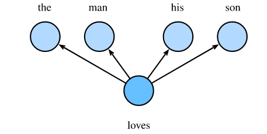
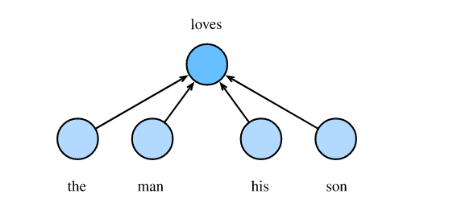
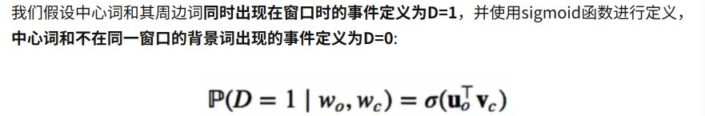
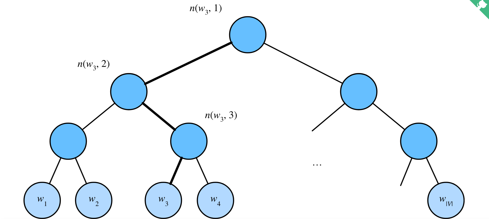
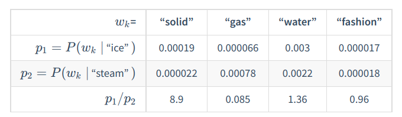

# 一、词嵌入

自然语言是一套用来表达含义的复杂系统。这套系统中，词是表义的基本单元。顾名思义，词向量是用来表示词的向量，也可被认为是词的特征向量和词的表征。把词映射为实数域向量的技术也叫词嵌入(word embedding)。近年来，词嵌入已逐渐成为自然语言处理的基础知识。

## 1.1 为什么不使用onehot向量

我们在RNN学习中使用one-hot向量表示词。假设词典中不同词的数量（词典大小）为N，每个词可以从0到N-1的连续整数一一对应。这些与词对应的整数也叫词的索引。假设一个词索引为i，为了得到改词的one-hot向量表示，我们创建一个全长为N的向量，并将其第i位设置为1。这样一来每个词就变为了一个长度为N的向量，可以被神经网络所使用。

虽然one-hot词向量构造起来很容易，但通常不是一个好选择。一个主要的原因是，one-hot词向量无法表达不同词之间的相似度，如我们常使用的余弦相似度。对于向量$x,y \in \mathbb{R}^d$，他们的余弦相似度是他们之间夹角的余弦值。

​																								$\frac{x^\top y}{||x|| ||y||} \in [-1, 1]$

由于任何两个不同词的ont-hot向量余弦相似度都为0，多个不同词的相似度难以通过one-hot向量表示出来。

word2vec工具的提出就是为了解决上面这个问题，他将每个词表示为一个定长的向量，并使得这些向量能够表达不同词之间相似和类比关系。word2vec工具包含了2个模型，即跳字模型(skip-gram)和连续词袋模型(continuous bag of words)。接下来让我们介绍这两种模型。

## 1.2 跳字模型

跳字模型假设基于某个词来生成它在文本序列周围的词。举个例子，假设文本是序列为“the”“man”“loves”“his”“son”，以love为中心词，设背景窗口大小为2。如图所示，跳字模型所关心的是，给定中心词love，生成与它距离不超过2个词的背景词'the' 'man' 'his' 'son'的条件概率，即

​																					$P('the', 'man', 'his', 'son'| 'love')$

假设给定中心词的情况下，背景词的生成是相互独立的，那么上式可以改写成：

​														$P('the'|'love') \cdot P('man'|'love') \cdot P('his'|'love') \cdot P('son'|'love')$



在跳字模型中，每个词被表示为2个d维向量，用来计算条件概率。假设这个词在词典中索引为i，当它为中心词时向量表示为$v_i \in \mathbb{R}^d$，而为背景词时向量表示为$u_i \in \mathbb{R}^d$。设中心词$w_c$在词典中的索引为c，背景词$w_o$在词典中的索引为o，给定中心词生成背景词的条件概率可以通过对向量内积做softmax运算得来。

​																					$P(w_o|w_c) = \frac{\exp(u_o^\top v_c)}{\sum_{i \in \nu}\exp(u_i^\top v_c)}$

其中词典索引集$\nu = {0, 1,...,|\nu-1|}$。假设给定一个长度为T的文本序列，设时间步为t的词为$w^{(t)}$。假设给定中心词的情况下背景词的生成相互独立，当背景窗口大小为m时，跳字模型的似然函数即给定任意中心词生成所有背景词的概率

​																					$\prod_{t=1}^{T} \prod_{-m \le j \le m, j\ne0} P (w^{(t+j)} | w^{(t)})$

这里小于1和大于T的时间步可以忽略。

## 1.3 训练跳字模型

跳字模型的参数是每个词所对应的中心词向量和背景词向量。训练中我们通过最大化似然函数来学习模型参数，即最大化似然估计。这等价于最小化以下损失函数：

​																				$-\sum_{t=1}^{T} \sum_{-m \le j \le m,j \ne 0} log,P(w^{t+j}|w^{(t)})$

通过使用随机梯度下降，那么在每一次的迭代中我们随机采样一个较短的子序列来计算有关子序列的损失，然后计算梯度来更新模型参数。梯度的计算关键是条件概率的对数有关中心词向量和背景词向量的梯度。根据定义，首先得到

​																			$\log P(w_o|w_c) = u^\top_o v_c - \log(\sum_{i \in \nu}\exp(u_i^\top v_c))$

通过微分，我们可以得到上式中$v_c$的梯度

​																	$\large{\frac{\partial logP(w_0|w_c)}{\partial v_c} = u_0 - \frac{\sum_{j \in \nu} exp(u_j^\top v_c)u_j}{exp(u_i^\top v_c)}}$

​																								$\large{= u_0 - \sum_{j\in \nu}(\frac{\exp(u_j^\top v_c)}{\sum_{i\in\nu}\exp(u_i^\top v_c)})u_j}$

​																								$\large{=u_0-\sum_{j \in \nu} P(w_j | w_c)u_j}$

它的计算需要词典中所有词以$w_c$为中心词的条件概率。有关其他词向量梯度同理可得。

训练结束后，对于词典中任意索引为i的词，我们均得到该词作为中心词和背景词的2组向量$v_i$和$u_i$。在自然语言处理应用中，一般使用跳字模型的中心词向量作为词的表征向量。


## 1.4 连续词袋模型

连续词袋模型与跳字模型相似。与跳字模型最大的不同在于，连续词袋模型假设基于某中心词在文本序列前后背景词来生成该中心词。

在同样的文本序列'the' 'man' 'loves' 'his' 'son'中，以'loves'作为中心词，且背景窗口大小为2时，连续词袋模型关心的是，给定背景词“the”“man”“his”“son”生成中心词“loves”的条件概率（如下图所示）。也就是

​																	$P('loves' | 'the','man','his','son')$



因为连续词袋模型的背景词有多个，我们将这些背景词向量取平均，然后使用和跳字模型一样的方法来计算条件概率。设$v_i \in \mathbb{R}^d$和$u_i \in \mathbb{R}^d$分别表示词典中索引为i的词作为背景词和中心词的向量（注意符号的含义和跳字模型中相反）。设中心词$w_c$在词典中的索引为c，背景词$w_{o1}...w_{o2m}$在词典中的索引为$o_1...o_{2m}$，那么给定背景词生成中心词的概率

​																		$P(w_c|w_{o1},...,w_{o2m}) = \frac{\exp(\frac{1}{2m}u_c^\top(v_{o1}+...+v_{o2m}))}{\sum_{i \in \nu} \exp(\frac{1}{2m}u_i^\top(v_{o1}+...+v_{o2m}))}$

为了让符号更加简单，我们记$W_o = {w_o1,...,w_{o2m}}$，且$\bar{v}_o = (v_{o1} + ... + v_{o2m})/2m$，那么上式可以简写成

​																		$P(w_c|W_o) = \frac{\exp(u_c^\top \bar{v}_o)}{\sum_{i\in \nu}\exp(u_i^\top \bar{v}_o)}$

给定一个长度为T的文本序列，设时间步t的词为$w^{(t)}$，背景窗口大小为m，连续词袋模型的似然函数是由背景词生成任一中心词的概率

​																			$\Pi^T_{t=1} P(w^{(t)} | w^{(t-m)}...w^{(t-1)},w^{(t+1)},...,w^{(t+m)})$


## 1.5 训练连续词袋模型

训练连续词袋模型同训练跳字模型基本一致。连续词袋模型的最大似然估计等价于最小化损失函数

​																			$-\sum_{t=1}^{T} logP(w^{(t)}|w^{(t-m)},...,w^{(t-1)},w^{(t+1)}...w^{(t+m)})$

注意到

​																			$logP(w_c|W_o) = u_c^\top \bar{v}_o - log(\sum_{i\in \nu}exp(u_i^\top \bar{v}_o))$

通过微分，我们可以计算出上式中条件概率的对数有关任一背景词向量$v_{oi}(i=1,...,2m)$的梯度

​												$\frac{\partial\log P(w_c|W_o)}{\partial v_{oi}} = \frac{1}{2m}(u_c-\sum_{j \in \nu}\frac{\exp(u_j^\top \bar{v}_o)u_j}{\sum_{i \in \nu}\exp(u_i^\top \bar{v}_o)}) = \frac{1}{2m}(u_c - \sum_{j \in \nu}P(w_j|W_o)u_j)$

有关其他词向量的梯度同理可得。同跳字模型不一样的一点在于，我们一般使用连续词袋模型的背景词向量作为词的表征向量。


# 二、近似训练

回忆上一节内容，跳字模型的核心在于使用softmax运算得到给定中心词$w_c$生成背景词$w_o$的条件概率

​																					$\large{P(w_o|w_c)=\frac{\exp(u_o^\top v_c)}{\sum_{i\in\nu}\exp(u_i^\top v_c)}}$

该条件概率对应的参数损失

​																			$-logP(w_o|w_c) = -u_o^\top v_c + log(\sum_{i \in \nu}\exp(u_i^{\top}v_c))$

由于softmax运算考虑了背景词可能是词典$\nu$中任意词，以上损失包含了词典大小数目的项的累加。上一节中我们看到，无论是跳字模型还是连续词袋模型，由于条件概率使用了softmax运算，每一度的梯度计算都包含词典大小数目项的累加。对于含几十万或上百万的大词典，每次的梯度计算开销过大。为了降低该计算复杂度，本节中将介绍2种近似的训练方法，即负采样（negative sampling）或层序softmax（hierarchical softmax）。由于跳字模型和连续词袋模型类似，本节中仅以跳字模型为例。

## 2.1 负采样

负采样修改了原来的目标参数。给定中心词$w_c$的一个背景窗口，我们把背景词$w_o$出现在该背景窗口看作是一个事件，并将该事件的概率计算为

​																								$P(D=1|w_c,w_o) = \sigma(u_o^\top v_c)$

其中的$\sigma$函数与sigmoid激活函数的定义相同：

​																								$\sigma(x) = \frac{1}{1+\exp(-x)}$

我们先考虑最大化文本序列中所有该事件的联合概率来训练词向量。具体来说，给定一个长度为T的文本序列，设时间步t的词为$w^{(t)}$且背景窗口大小为m，考虑最大化联合概率

​																							$\prod_{t=1}^T \prod_{-m \le j \le m,j\ne 0}P(D=1|w^{(t)},w^{(t+j)})$

然而，以上模型中包含的事件仅考虑了正类样本。这导致当所有词向量相等且值为无限大时，以上的联合概率才被最大化为1。很明显，这样的词向量毫无意义。负采样通过采样并添加负类样本使目标函数变得更有意义。设背景词$w_o$出现在中心词$w_c$背景窗口事件为P，我们根据分布$P(w)$采样K个未出现在该背景窗口 的词，即噪声词。设噪声词$w_k (k=1,...,K)$不出现在中心词$w_c$背景窗口的事件为$N_k$。假设同时含有正类样本和负类样本的事件P， $N_1...N_k$相互独立，负采样将以上需要最大化的仅考虑正采样的联合概率改写为

​																							$\prod_{t=1}^{T}\prod_{-m \le j \le m, j\ne 0} P(w^{(t+j)}|w^{(t)})$

其中条件概率被近似表示为

​																				$P(w^{(t+j)}|w^{(t)}) = P(D=1|w^{(t)},w^{(t+j)})\prod_{k=1,w_k\sim P(w)}P(D=0|w^{(t)}, w_k)$


> 个人疑惑:P(D=1)，P(D=0)代表什么？？
>
> 百度了下，发现是以下含义



设文本序列中时间步t的词$w^{(t)}$在词典中的索引为$i_t$,噪声词$w_k$在词典中的索引为$h_k$。有关以上条件概率的对数损失为

​											$-logP(w^{(t+j)}|w^{(t)}) = -logP(D=1|w^{(t)}, w^{(t+j)}) - \sum_{k=1,w_k\sim P(w)}^{K} log(P(D=0|w^{(t)},w_k))$

​																  			  $=-log \sigma(u_{i_{t}+j}^\top v_{i_{t}}) - \sum_{k=1,w_k\sim P(w)}^K log(1-\sigma(u_{h_{k}}^\top v_{i_t}))$

​																				$=-log \sigma(u_{i_t+j}^\top) - \sum_{k=1,w_k\sim P(w)}^K log  \sigma(-u_{h_k}^\top v_{i_t})$

现在，训练中每一步的梯度计算开销不再与词典大小相关，而与KK*K*线性相关。当KK*K*取较小的常数时，负采样在每一步的梯度计算开销较小。


## 2.2 层序softmax

层序softmax是一种近似训练法，它使用了二叉树这一数据结构，树的每个叶节点代表词典$\nu$中的每个词



假设$L(w)$为从二叉树的根节点到词w的叶节点的路径上的节点数（包括根节点和叶节点），设$n(w,j)$为该路径上第j个节点，并设该节点背景词向量为$u_{n(w,j)}$，上图中$L(w_3)=4$。层序softmax将跳字模型中的条件概率近似表示为：

​									$P(w_o|w_c) = \prod_{j=1}^{L(w_o)-1}\sigma([[n(w_o, j+1)==leftChild(n(w_o,j))]]\cdot u_{n(w_o, j)}^{\top}v_c)$

其中$\sigma$为sigmoid激活函数，LeftChild(n)是节点n的左子节点：如果判断x为真。[[x]] = 1反之[[x]] = -1。

让我们计算上图中给定词$w_c$生成词$w_3$的条件概率。我们需要将$w_c$的词向量$v_c$和根节点到$w_3$路径上的非叶节点向量一一求内积。由于在二叉树中由根节点到叶节点$w_3$需要左-右-左的遍历，我们得到：

​																			$P(w_3|w_c) = \sigma(u^\top_{n(w_3,1)}v_c) \cdot \sigma(-u_{n(w_3,2)}^\top v_c) \cdot \sigma(u_{n(w_3, 3)}^\top v_c)$

由于$\sigma(x) + \sigma(-x) = 1$，给定中心词$w_c$生成词典$\nu$中任意词的条件概率之和为1这一条件也将满足：

​																			$\sum_{w\in \nu} P(w|w_c)=1$

此外，由于$L(w_o)-1$的数量级为$O(log_2|\nu|)$，当词典很大时，层序softmax在训练中每一步的计算开销相较未使用近似训练时大幅降低。


# 三、word2vec的实现

本节是对前两节内容的实践。我们以跳字模型和近似训练中的负采样为例，介绍在语料库中训练词嵌入模型。还会介绍一些实现中的技巧，例如二次采样（subsamping）

首先导入模块：

```
```

## 3.1 处理数据集

PTB(Penn tree bank)是一个常用的小型语句库。他采样自《华尔街日报》的文章。包括训练集，验证集和测试集。我们将在PTB数据集上训练词嵌入模型。该数据集的每一行作为一个句子。句子中的每个词由空格隔开。

> 数据集已经放到了Datasets/ptb下

```python
data_dir = os.path.join(DATADIR, "ptb")
assert os.path.isdir(data_dir)

with open(os.path.join(data_dir, "ptb.train.txt")) as f:
    lines = f.readlines()
    raw_dataset = [st.split() for st in lines]

print("Len of sequence:", len(raw_dataset))
```

Output:

```
1.11.0+cu102
Len of sequence: 42068
```

```python
for st in raw_dataset[:3]:
    print("# tokens: ", len(st), st[:5])
```

Output:

```
# tokens:  24 ['aer', 'banknote', 'berlitz', 'calloway', 'centrust']
# tokens:  15 ['pierre', '<unk>', 'N', 'years', 'old']
# tokens:  11 ['mr.', '<unk>', 'is', 'chairman', 'of']
```


## 3.2 建立词语索引

为了计算简单，我们只保留在数据集中至少出现5次的词

```python
counter = collections.Counter([tk for st in raw_dataset for tk in st])
counter = dict(filter(lambda x: x[1] >= 5, counter.items()))

idx_to_token = [tk for tk, _ in counter.items()]
token_to_idx = {tk: idx for idx, tk in enumerate(counter)}
dataset = [[token_to_idx[tk] for tk in st if tk in token_to_idx] for st in raw_dataset]

num_tokens = sum([len(st) for st in dataset])
print("tokens number:", num_tokens)
```

Outputs:

```
tokens number: 887100
```


## 3.3 二次采样

文本数据中一般会出现高频词，如英文中的`the, a, in`等。通常来说，在一个背景窗口中，一个词(如"chip")和较低频词（如"microprocessor"）同时出现比和较高频词（如“the”）同时出现对训练词嵌入模型更有益。因此，训练词嵌入模型时可以对词进行二次采样。具体来说，数据集中每个被索引词$w_i$将有一定几率被丢弃，概率为：

​																				$P(w_i) = max(1-\sqrt{\frac{t}{f(w_i)}}, 0)$

其中$f(w_i)$是数据集中词$w_i$的个数与总词数的对比，常数t是一个超参数（通常为$10^{-4}$），可见，只有当$f(w_i)>t$时，我们才有可能在二次采样中丢弃词$w_i$，并且越高频的词丢弃几率越大。

```python
def discard(idx):
    return random.uniform(0, 1) < 1 - math.sqrt(1e-4 / counter[idx_to_token[idx]] * num_tokens)

subsampled_datasets = [[tk for tk in st if not discard(tk)] for st in dataset]
print("# subsampled token: %d" % sum([len(st) for st in subsampled_datasets]))
```

Outputs:

```
# subsampled token: 375581
```

可以看到，二次采样后丢掉了一半左右的词。下面比较一个词在二次采样后出现在数据集中的次数。可见高频词'the'的采样率不足1/20,但是低频词'join'却被完好的保留下来

```python
def compare_counts(token):
    return "# %s: before=%d, after=%d" % (token, sum([st.count(token_to_idx[token]) for st in dataset]),
                                          sum([st.count(token_to_idx[token]) for st in subsampled_datasets]))


print(compare_counts('the'))
print(compare_counts("join"))
```

Outputs:

```
# the: before=50770, after=2140
# join: before=45, after=45
```


## 3.4 提取中心词和背景词

我们将与中心词距离不超过背景窗口大小的词称为背景词。下面定义函数提取出所有中心词和背景词。它每次在1和`max_window_size`之间均匀的采样一个整数作为背景窗口大小。

```python
def get_center_and_contexts(dataset, max_window_size):
    centers, contexts = [], []
    for st in dataset:
        if len(st) < 2:
            continue
        centers += st
        for center_i in range(len(st)):
            window_size = random.randint(1, max_window_size)
            indices = list(range(max(0, center_i - window_size), min(len(st), center_i+1+window_size)))
            indices.remove(center_i)
            contexts.append([st[idx] for idx in indices])
    return centers, contexts

```

下面我们创建一个人工数据集。其中含有词数分别为7和3的两个句子。设最大背景窗口为2，打印所有中心词和它的背景词。

```python
tiny_dataset = [list(range(7)), list(range(7, 10))]
print("dataset", tiny_dataset)
for center, context in zip(*get_center_and_contexts(tiny_dataset, 2)):
    print("center", center, "has contexts", context)

```

输出

```
center 0 has contexts [1, 2]
center 1 has contexts [0, 2, 3]
center 2 has contexts [0, 1, 3, 4]
center 3 has contexts [1, 2, 4, 5]
center 4 has contexts [3, 5]
center 5 has contexts [3, 4, 6]
center 6 has contexts [4, 5]
center 7 has contexts [8]
center 8 has contexts [7, 9]
center 9 has contexts [8]
```

实验中,我们设置最大窗口大小为5,下面提取数据集中所有中心词和背景词.

```python
all_centers, all_contexts = get_center_and_contexts(subsampled_datasets, 5)
```


## 3.5 负采样

我们使用负采样来进行近似训练。对于一个中心词和背景词，我们随机采样K个噪声词，实验中K=5。根据Vec2rec论文的建议，噪声词改样概率$P(w)$设为w词频与总词频之比的0.75次方。

```python
def get_negatives(all_contexts, sampling_weights, K):
    all_negatives, neg_candidates, i = [], [], 0
    population = list(range(len(sampling_weights)))
    for contexts in all_contexts:
        negatives = []
        while len(negatives) < len(contexts) * K:
            if i == len(neg_candidates):
                # 根据每个词的权重，随机生成k个词的索引作为噪声词
                # 为了高效计算，可以将k设置的较大一点
                i, neg_candidates = 0, random.choices(
                    population, sampling_weights, k=int(1e5)
                )
            neg, i = neg_candidates[i], i + 1
            if neg not in set(contexts):
                negatives.append(neg)
        all_negatives.append(negatives)
    return all_negatives

sampling_weights = [counter[w]**0.75 for w in idx_to_token]
all_negatives = get_negatives(all_contexts, sampling_weights, 5)
```


## 3.6 读取数据

我们从数据集中提取所有中心词`all_centers`，以及每个中心词对应的背景词`all_contexts`和噪声词`all_negatives`。我们先定义一个`Dataset`类。

```python
class MyDataset(torch.utils.data.Dataset):
    def __init__(self, centers, contexts, negatives):
        assert len(centers) == len(contexts) == len(negatives)
        self.centers = centers
        self.contexts = contexts
        self.negatives = negatives

    def __getitem__(self, index):
        return self.centers[index], self.contexts[index], self.negatives[index]

    def __len__(self):
        return len(self.centers)
```

我们将通过随机小批量来读取它们。在一个小批量数据中，第ii*i*个样本包括一个中心词以及它所对应的$n_i$个背景词和$m_i$个噪声词。由于每个样本的背景窗口大小可能不一样，其中背景词与噪声词个数之和$n_i+m_i$也会不同。在构造小批量时，我们将每个样本的背景词和噪声词连结在一起，并添加填充项0直至连结后的长度相同，即长度均为$maxm_i + n_i$（`max_len`变量）。为了避免填充项对损失函数计算的影响，我们构造了掩码变量`masks`，其每一个元素分别与连结后的背景词和噪声词`contexts_negatives`中的元素一一对应。当`contexts_negatives`变量中的某个元素为填充项时，相同位置的掩码变量`masks`中的元素取0，否则取1。为了区分正类和负类，我们还需要将`contexts_negatives`变量中的背景词和噪声词区分开来。依据掩码变量的构造思路，我们只需创建与`contexts_negatives`变量形状相同的标签变量`labels`，并将与背景词（正类）对应的元素设1，其余为0。

下面我们实现这个小批量读取函数`batchify`。它的小批量输入`data`是一个长度为批量大小的列表，其中每个元素分别包含中心词`center`、背景词`context`和噪声词`negative`。该函数返回的小批量数据符合我们需要的格式，例如，包含了掩码变量。

```python
def batchify(data):
    """用作DataLoader的参数collate_fn: 输入是个长为batchsize的list,
       list中的每个元素都是Dataset类调用__getitem__得到的结果
    """
    max_len = max(len(c) + len(n) for _, c, n in data)
    centers, contexts_negatives, masks, labels = [], [], [], []
    for center, context, negative in data:
        cur_len = len(context) + len(negative)
        centers += [center]
        contexts_negatives += [context + negative + [0] * (max_len - cur_len)]
        masks += [[1] * cur_len + [0] * (max_len - cur_len)]
        labels += [[1] * len(context) + [0] * (max_len - len(context))]
    return torch.tensor(centers.view(-1, 1)), torch.tensor(contexts_negatives), \
            torch.tensor(masks), torch.tensor(labels)

```

我们用刚刚定义的`batchify`函数指定`DataLoader`实例中小批量的读取方式，然后打印读取的第一个批量中各个变量的形状。

```python
batch_size = 512
num_workers = 0 if sys.platform.startswith("win32") else 4
dataset = MyDataset(all_centers, all_contexts, all_negatives)
data_iter = Data.DataLoader(dataset, batch_size, shuffle=True, collate_fn=batchify, num_workers=num_workers)
for batch in data_iter:
    for name, data in zip(["centers", "context_negatives", "masks", "labels"], batch):
        print(name, "shape:", data.shape)
    break

```

```
centers shape: torch.Size([512, 1])
context_negatives shape: torch.Size([512, 60])
masks shape: torch.Size([512, 60])
labels shape: torch.Size([512, 60])
```

我们可以看到,最大的seq_len为60


##  3.7 跳字模型

我们将使用嵌入层和小批量乘法来实现跳字模型。它们也常常用于实现其他自然语言处理的应用。

### 3.7.1 嵌入层

获取词嵌入的层称为嵌入层，在PyTorch中可以通过创建`nn.Embedding`实例得到。嵌入层的权重是一个矩阵，其行数为词典大小（`num_embeddings`），列数为每个词向量的维度（`embedding_dim`）。我们设词典大小为20，词向量的维度为4。

```python
embed = nn.Embedding(num_embeddings=20, embedding_dim=4)
print(embed.weight)
```

output:

```
Parameter containing:
tensor([[ 1.7665, -0.0904, -0.1557, -0.1911],
        [-0.9430,  1.1416, -0.6508, -0.3069],
        [ 0.1909, -0.4214, -0.2789, -0.3581],
        [ 0.4295,  1.1073,  0.3567, -1.0862],
        [ 0.7001,  0.1817, -0.7141,  0.7780],
        [-0.7774, -0.5413,  0.0239,  0.1521],
        [ 1.1258,  0.0095,  2.2494,  1.4401],
        [-0.5810,  1.0880,  0.8917, -0.7926],
        [ 1.8375,  1.8209,  3.0391,  1.6769],
        [-0.8210, -0.2823,  1.1510, -0.3150],
        [-0.0673,  0.7126, -0.1225, -1.0268],
        [ 0.0564, -1.0007, -0.4132,  0.6513],
        [ 0.8142, -0.1394,  1.1522, -1.6391],
        [ 0.4468,  0.8075, -0.7970,  0.7027],
        [ 0.9740, -0.5812,  0.1767,  0.7874],
        [-0.1079, -0.7104, -0.1527,  0.3626],
        [-0.1566, -1.1855, -0.7095,  0.6450],
        [ 1.1894,  0.9038, -1.1017,  0.8107],
        [ 0.2020, -0.1568,  1.3432,  0.4032],
        [-0.2938,  1.5895, -1.0708, -1.2117]], requires_grad=True)
```

嵌入层的输入为词的索引。输入一个词的索引i，嵌入层返回权重矩阵的第i行作为它的词向量。下面我们将形状为(2, 3)的索引输入进嵌入层，由于词向量的维度为4，我们得到形状为(2, 3, 4)的词向量。

```python
x = torch.tensor([[1, 2, 3], [4, 5, 6]], dtype=torch.long)
print(embed(x))
```

```
tensor([[[ 0.8261,  1.2063,  1.7328,  0.4950],
         [ 0.4269,  1.1740, -0.1234,  1.0767],
         [-1.0721,  0.2993,  1.1361,  0.9285]],

        [[-0.5880,  0.0162,  2.0593, -1.1829],
         [-0.7544, -0.0465,  2.5391, -1.3565],
         [-0.3635, -0.5079,  2.0606, -0.9702]]], grad_fn=<EmbeddingBackward0>)
```


### 3.7.2 小批量乘法

我们可以使用小批量乘法运算`bmm`对两个小批量中的矩阵一一做乘法。假设第一个小批量中包含n个形状为$a \times b$的矩阵$X_1...X_n$，第二个小批量中包含n个形状为$b\times c$的矩阵$Y_1...Y_n$。这两个小批量的矩阵乘法输出为n个形状为$a\times c$的矩阵$X_1Y_1...X_nY_n$。因此，给定两个形状分别为(n,a,b)和(n,b,c)的`Tensor`。小批量乘法输出的形状为(n, a, c)

```python
X = torch.ones((2, 1, 4))
Y = torch.ones((2, 4, 6))
print(torch.bmm(X, Y).shape)
```

Output:

```
torch.Size([2, 1, 6])
```


### 3.7.3 跳字模型前向计算

在前向计算中，跳字模型的输入包括中心词索引`center`以及连接背景词的噪声词索引`contexts_and_negatives`，其中中心词`center`形状为$(批量大小,1,max\_len)$。这两个变量先由词嵌入层分别由词索引变换为词向量，再通过小批量乘法得到形状为$(批量大小,1,max\_len)$的输出。输出中每个元素的中心词向量与背景词向量或噪声词向量的内积。

```python
def skip_gram(center, contexts_and_negatives, embed_v, embed_u):
    v = embed_v(center)
    u = embed_u(contexts_and_negatives)
    pred = torch.bmm(v, u.permute(0,2,1))

    return pred
```


## 3.8 训练模型

在训练词嵌入模型之前，我们需要定义模型的损失函数。

### 3.8.1 二元交叉熵损失函数

根据负采样损失函数的定义，我们可以使用二元交叉熵损失函数。下面定义`SigmoidBinaryCrossEntropyLoss`

```python
# 二元交叉熵损失函数
class SigmoidBinaryCrossEntropyLoss(nn.Module):
    def __init__(self):
        super(SigmoidBinaryCrossEntropyLoss, self).__init__()

    def forward(self, input, target, mask=None):
        """
        input – Tensor shape: (batch_size, len)
        target – Tensor of the same shape as input
        """
        input, target, mask = input.float(), target.float(), mask.float()
        res = F.binary_cross_entropy_with_logits(input, target, reduction="none", weight=mask)
        return res.mean(dim=1)

loss = SigmoidBinaryCrossEntropyLoss()
```

值得一提的是，我们可以通过掩码变量指定小批量中参与损失函数计算的部分预测值和标签：当掩码为1时，相应位置的预测值和标签将参与损失函数的计算；当掩码为0时，相应位置的预测值和标签则不参与损失函数的计算。我们之前提到，掩码变量可用于避免填充项对损失函数计算的影响。

```python
loss = SigmoidBinaryCrossEntropyLoss()
pred = torch.tensor([[1.5, 0.3, -1, 2], [1.1, -0.6, 2.2, 0.4]])
# 标签变量label中的1和0分别代表背景词和噪声词
label = torch.tensor([[1, 0, 0, 0], [1, 1, 0, 0]])
mask = torch.tensor([[1, 1, 1, 1], [1, 1, 1, 0]])  # 掩码变量
print(loss(pred, label, mask) * mask.shape[1] / mask.float().sum(dim=1))
```

Output:

```
tensor([0.8740, 1.2100])
```


### 3.8.2 初始化模型参数

我们构造中心词和背景词的嵌入层，并将超参数词向量维度`embed_size`设置成100

```python
embed_size = 100
net = nn.Sequential(
    nn.Embedding(num_embeddings=len(idx_to_token), embedding_dim=embed_size),
    nn.Embedding(num_embeddings=len(idx_to_token), embedding_dim=embed_size)
)
```


### 3.8.3 定义训练函数

由于填充项的存在，与之前的训练函数相比，损失函数的计算稍有不同。

```python
def train(net, lr, num_epochs):
    device = torch.device("cuda" if torch.cuda.is_available() else "cpu")
    print("train on %s" % device)
    net = net.to(device)
    optimizer = torch.optim.Adam(net.parameters(), lr=lr)
    for epoch in range(num_epochs):
        start, l_sum, n = time.time(), 0.0, 0
        for batch in data_iter:
            center, context_negative, mask, label = [d.to(device) for d in batch]
            pred = skip_gram(center, context_negative, net[0], net[1])
            l = (loss(pred.view(label.shape), label, mask) * mask.shape[1]/mask.float().sum(dim=1)).mean()
            optimizer.zero_grad()
            l.backward()
            optimizer.step()

            l_sum += l.cpu().item()
            n += 1
        print("epoch %d, loss %.2f, time %.1fs") % (epoch + 1, l_sum / n, time.time() - start)
```

现在我们就可以使用负采样训练跳字模型了。

```python
train(net, 0.01, 10)
```

输出：

```
train on cuda
epoch 1, loss 1.98, time 6.2s
epoch 2, loss 0.62, time 6.2s
epoch 3, loss 0.45, time 6.2s
epoch 4, loss 0.39, time 6.2s
epoch 5, loss 0.37, time 6.2s
epoch 6, loss 0.35, time 6.2s
epoch 7, loss 0.34, time 6.2s
epoch 8, loss 0.33, time 6.2s
epoch 9, loss 0.32, time 6.3s
epoch 10, loss 0.32, time 6.2s
```


### 3.8.4 应用词嵌入模型

训练好词嵌入模型之后，我们可以根据两个词向量的余弦相似度表示词与词之间在语义上的相似度。可以看到，使用训练得到的词嵌入模型时，与词“chip”语义最接近的词大多与芯片有关。

```python
def get_similar_tokens(query_token, k, embed):
    w = embed.weight.data
    x = w[token_to_idx[query_token]]
    # 这个1e-9是为了增加数值稳定性
    cos = torch.matmul(w, x) / (torch.sum(w * w, dim=1) * torch.sum(x * x) + 1e-9).sqrt()
    _, topk = torch.topk(cos, k=k+1)
    topk = topk.cpu().numpy()
    # 除去原词
    for i in topk[1:]:
        print("cosine: sim=%.3f: %s" % (cos[i], idx_to_token[i]))
```

Output:

```
cosine: sim=0.549: intel
cosine: sim=0.478: product
cosine: sim=0.451: computer
```


# 四、子词嵌入（fastText）

英语单词通常有其内部结构和形成方式。例如，我们可以从“dog”“dogs”和“dogcatcher”的字面上推测它们的关系。这些词都有同一个词根“dog”，但使用不同的后缀来改变词的含义。而且，这个关联可以推广至其他词汇。例如，“dog”和“dogs”的关系如同“cat”和“cats”的关系，“boy”和“boyfriend”的关系如同“girl”和“girlfriend”的关系。这一特点并非为英语所独有。在法语和西班牙语中，很多动词根据场景不同有40多种不同的形态，而在芬兰语中，一个名词可能有15种以上的形态。事实上，构词学（morphology）作为语言学的一个重要分支，研究的正是词的内部结构和形成方式。

在word2vec中，我们并没有直接利用构词学中的信息。无论是在跳字模型还是连续词袋模型中，我们都将形态不同的单词用不同的向量来表示。例如，“dog”和“dogs”分别用两个不同的向量表示，而模型中并未直接表达这两个向量之间的关系。鉴于此，fastText提出了子词嵌入（subword embedding）的方法，从而试图将构词信息引入word2vec中的跳字模型 [1]。

在fastText中，每个中心词被表示成子词的集合。下面我们用单词“where”作为例子来了解子词是如何产生的。首先，我们在单词的首尾分别添加特殊字符“<”和“>”以区分作为前后缀的子词。然后，将单词当成一个由字符构成的序列来提取nn*n*元语法。例如，当n=3n=3*n*=3时，我们得到所有长度为3的子词：“<wh>”“whe”“her”“ere”“<re>”以及特殊子词“<where>”。

在fastText中，对于一个词w，我们将它所有长度在3∼6的子词和特殊子词的并集记为$g_w$，那么词典则是所有词的子词集合的并集。假设词典中子词g的向量为$z_j$，那么跳字模型中词w的作为中心词的向量$v_w$则表示成

​																									$v_w = \sum_{g \in g_w} z_g$

fastText的其余部分同跳字模型一致，不在此重复。可以看到，与跳字模型相比，fastText中词典规模更大，造成模型参数更多，同时一个词的向量需要对所有子词向量求和，继而导致计算复杂度更高。但与此同时，较生僻的复杂单词，甚至是词典中没有的单词，可能会从同它结构类似的其他词那里获取更好的词向量表示。


# 五、全局向量的词嵌入(GloVe)

让我们先回顾一下word2vec中的跳字模型。将跳字模型中使用softmax运算表达的条件概率$P(w_j|w_i)$记做$q_{ij}$，即

​																					$\large q_{ij} = \frac{exp(u_j^\top v_i)}{\sum_{k \in \nu}exp(u_k^\top v_i)}$

其中$u_i$和$v_i$是索引为i的词作为中心词和背景词的向量表示。$\nu = {0,1...|\nu|-1}$为词典索引集。

对于词$w_i$，他在数据集中可能多次出现。我们将每一次以他为中心词的所有背景词全部汇总并保留重复元素，记做多重集(multi set)$C_i$。一个元素在多重集中的个数称为重数(multiplicity)。举例来说，假设词$w_i$在数据集中出现2次：文本序列中以这两个$w_i$作为中心词的背景窗口分别包含背景词索引`2，1，5，2`和`2，3，2，1`。那么多重集$C_i = {1,1,2,2,2,2,3,5}$。其中元素1的重数为2，元素2的重数为4。元素3，5的重数都为1。将多重集$C_i$中元素$j$的重数记做$x_{ij}$:他表示了数据集中所有以$w_i$为中心词时背景窗口中$w_j$的出现次数。那么，跳字模型的损失函数还有另一种表达：

​																					$-\sum_{i \in \nu} \sum_{j\in \nu} x_{ij}\log q_{ij}$

我们将数据集中所有以词$w_i$为中心词的背景词之和$|C_i|$记为$x_i$，并将以$w_i$为中心词生成背景词$w_j$的条件概率$x_{ij}/x_i$记做$p_{ij}$。我们可以进一步改写跳字模型的损失函数为

​																				$-\sum_{i\in \nu}x_i\sum_{j \in \nu} p_{ij} \log q_{ij}$

上式中，$-\sum p_{ij}\log q_{ij}$计算的是以$w_i$为中心词的背景词条件概率分布$p_{ij}$和模型预测的条件概率分布$q_{ij}$的交叉熵，且损失函数使用所有以词$w_i$为中心词的背景词数量之和来加权。最小化上式中的损失函数会令预测的条件概率分布尽可能接近真实的条件概率分布。

然而，作为常用损失函数的一种，交叉熵损失函数有时并不是好的选择。一方面，正如我们在10.2节（近似训练）中所提到的，令模型预测$q_{ij}$成为合法概率分布的代价是它在分母中基于整个词典的累加项。这很容易带来过大的计算开销。另一方面，词典中往往有大量生僻词，它们在数据集中出现的次数极少。而有关大量生僻词的条件概率分布在交叉熵损失函数中的最终预测往往并不准确。


## 5.1 GloVe模型

鉴于此，作为在word2vec之后提出来的词嵌入模型，GloVe采用了平方损失，并基于该损失对跳字模型进行了三种改动：

1. 使用非概率分布的变量$p'_{ij} = x_{ij}$和$q'_{ij} = \exp(u_j^\top v_i)$。并对他们取对数。因此，平方损失项是$(\log p'_{ij} - \log q'_{ij})^2 = (u_j^\top v_i- \log x_{ij})^2$

2. 为每个词$w_i$添加2个为标量的模型参数：中心词偏差项$b_i$和背景词偏差项$c_i$
3. 将每个损失项的权重替换为函数$h(x_{ij})$。权重函数$h(x)$是值域在[0,1]的单调递增函数。

如此一来，GloVe模型的目标是最小化损失函数

​																			$\sum_{i\in \nu}\sum_{j \in \nu}h(x_{ij})(u_j^\top v_i + b_i + c_j   - log x_{ij})^2$

其中权重函数$h(x)$的建议选项为:当$x<c$时（如c=100），令$h(x) = (x/c)^\alpha$(如$\alpha=0.75$)。反之，令$h(x) = 1$。因为$h(0)=0$,所以对于$x_{ij}=0$的平方损失可以直接忽略。当使用小批量随机梯度下降时，每个时间步我们随机采样小批量非零$x_ij$，然后计算梯度来迭代模型参数。这些非零$x_{ij}$是预先基于整个数据集计算得到的，包含了数据集的全局统计信息。因此，GloVe模型的取名意义为"Global Vectors"

需要注意的是，如果词$w_i$出现在$w_j$的背景窗口里，那么$w_j$也会出现在词$w_i$的背景窗口里。也就是说，$w_{ij} = w_{ji}$，不同于word2vec中拟合的是非对称的条件概率$p_{ij}$,GloVe模型拟合的是对称的$\log x_{ij}$。因此，任意词的中心词向量和背景词向量在Glove模型中是等价的。但由于初始化值的不同，同一个词最终学习到的2组词向量可能不同。当学习得到所有词向量以后，GloVe模型使用中心词向量和背景词向量之和作为最终的词向量。


### 5.1.1 从条件概率比值理解GloVe模型

我们还可以从另一个角度理解GloVe模型，沿用本节前面的符号，$P(w_j|w_i)$表示数据集中以$w_i$为中心词生成背景词$w_j$的概率，记做$p_{ij}$。作为源于某大型语料库的真实例子，以下列举了2组分别以“ice”和"steam"为中心词的条件概率以及他们的比值：



我们可以观察到以下现象：

* 对于与`ice`相关而以`steam`不相关的词$w_k$，如$w_k=solid$，我们期望条件概率比值较大，如上表最后一行中的值8.9
* 对于与`ice`不相关而与`steam`相关的词$w_k=gas$，我们希望条件概率比值较小，如上表中最后一行的值0.085
* 对于与`ice`和`steam`都相关的词$w_k=water$，我们期望条件概率比值接近1，如上表的1.36.
* 对于与`ice`和`steam`都不相关的词$w_k=fashion$，我们期望条件概率比值接近1，如上表最后一行的值0.96.

由此可见，条件概率比值能够比较直观的表达词与词之间的关系。我们可以构造一个词向量函数，使它能够有效拟合条件概率比值。我们知道任意一个这样的比值需要3个词$w_i,w_j,w_k$。以$w_i$作为中心词的条件概率比值为$p_{ij}/p_{ik}$，我们可以找一个函数，它使用词向量来拟合这个条件概率比值

​																					$f(u_j, u_k, v_i) \approx \frac{p_{ij}}{p_{ik}}$

这里的函数f的设计并不唯一，我们只需考虑一种较为合理的可能性。注意到条件概率比值是一个标量，我们可以将f限制为一个标量函数:$f(u_j, u_k, v_i) = f((u_j-u_k)^\top v_i)$，交换j,k之后可以看出函数f应该满足$f(-x)f(x) = 1$，因此有一种可能是$f(x) = exp(x)$,于是：

​																					$f(u_j, u_k, v_i) = \frac{\exp(u_j^\top v_i)}{\exp(u_k^\top v_i)} \approx \frac{p_{ij}}{p_{ik}}$

满足最右边约等号的条件是$\exp(u_j^\top v_i) \approx \alpha p_{ij}$，这里的$\alpha$是一个常数。考虑到$p_{ij} = x_{ij}/x_i$，取对数后$u_j^\top v_i \approx \log \alpha + \log x_{ij} - \log x_i$。我们使用额外的偏差项来拟合$-\log \alpha + log x_i$，例如，中心词偏差项$b_i$和背景词偏差项$c_i$:

​																						$u_j^\top v_i + b_i + c_j \approx \log(x_{ij})$

对上式左右两边取平方误差并加权，我们可以得到GloVe模型的损失函数。


# 六、求近义词和类比词

在第三节中，我们在小规模数据集上训练了一个word2vec词嵌入模型，并通过词向量的余弦相似度搜索近义词。实际中，在大规模语料上预训练的词向量常常可以应用到下游自然语言处理任务中。本节将演示如何使用这些预训练的词向量来求近义词和类比词。我们还将在后面2节继续应用预训练的词向量


## 6.1 使用预训练的词向量

基于PyTorch的关于自然语言处理的常用包有官方的[torchtext](https://github.com/pytorch/text)以及第三方的[pytorch-nlp](https://github.com/PetrochukM/PyTorch-NLP)等等。你可以使用`pip`很方便地按照它们，例如命令行执行

```
pip install torchtext
```

本节中使用torchtext进行练习。下面查看它目前提供的预训练词嵌入的名称。

```python
import os
import torch
import torchtext.vocab as vocab
from Code import DATADIR

print(vocab.pretrained_aliases.keys())
```

Output:

```
dict_keys(['charngram.100d', 'fasttext.en.300d', 'fasttext.simple.300d', 'glove.42B.300d', 'glove.840B.300d', 'glove.twitter.27B.25d', 'glove.twitter.27B.50d', 'glove.twitter.27B.100d', 'glove.twitter.27B.200d', 'glove.6B.50d', 'glove.6B.100d', 'glove.6B.200d', 'glove.6B.300d'])
```

下面查看查看该`glove`词嵌入提供了哪些预训练的模型。每个模型的词向量维度可能不同，或是在不同数据集上预训练得到的。

```python
print([key for key in vocab.pretrained_aliases.keys()
        if "glove" in key])
```

```
['glove.42B.300d', 'glove.840B.300d', 'glove.twitter.27B.25d', 'glove.twitter.27B.50d', 'glove.twitter.27B.100d', 'glove.twitter.27B.200d', 'glove.6B.50d', 'glove.6B.100d', 'glove.6B.200d', 'glove.6B.300d']
```

预训练的GloVe模型的命名规范大致是“模型.（数据集.）数据集词数.词向量维度”。更多信息可以参考GloVe和fastText的项目网站。下面我们使用基于维基百科子集预训练的50维GloVe词向量。

第一次创建预训练词向量实例时会自动下载相应的词向量到`cache`指定文件夹（默认为`.vector_cache`），因此需要联网。

```python
cache_dir = os.path.join(DATADIR, "glove_6b_50d")
glove = vocab.GloVe(name="6B", dim=50, cache=cache_dir)
```

返回的实例主要有以下三个属性：

- `stoi`: 词到索引的字典：
- `itos`: 一个列表，索引到词的映射；
- `vectors`: 词向量。

打印词典大小。其中含有40万个词。

```python
print("一共有%d个词向量" % len(glove.stoi))
```

```
/home/zhaozijian/Code/Deeplearning/Datasets/glove_6b_50d/glove.6B.zip: 862MB [02:49, 5.08MB/s]                           
100%|█████████▉| 399999/400000 [00:05<00:00, 71123.98it/s]
一共有400000个词向量
```

我们可以通过词来获取它在词典中的索引，也可以通过索引获取词。

```python
print((glove.stoi["computer"], glove.itos[3355]))
# (951, 'factors')
```


## 6.2 应用预训练词向量

下面我们以GloVe模型为例，展示预训练词向量的应用。

### 6.2.1 求近义词

这里重新实现3.8节中介绍的余弦相似度求近义词的算法。我们将k近邻方法封装到`knn`函数中。

```python
def knn(w, x, k):
    cos = torch.matmul(w, x.view((-1,))) / ((torch.sum(w * w, dim=1) + 1e-9).sqrt() * torch.sum(x * x).sqrt())
    _, topk = torch.topk(cos, k)
    topk = topk.cpu().numpy()
    return topk, [cos[i].item() for i in topk]
```

然后，我们通过预训练词向量实例`embed`来搜索近义词。

```python
def get_similar_tokens(query_token, k, embed):
    topk, cos = knn(embed.vectors, embed.vectors[embed.stoi[query_token]], k+1)
    for i, c in zip(topk[1:], cos[1:]):
        print("Cosine sim=%.3f: %s" % (c, embed.itos[i]))
```

搜索chip(芯片)的近义词

```python
get_similar_tokens('chip', 3, glove)
```

```
Cosine sim=0.856: chips
Cosine sim=0.749: intel
Cosine sim=0.749: electronics
```


### 6.2.2 求类比词

除了求近义词外，我们还可以使用预训练词向量求词与词之间的类比关系。例如，man对于woman类似于son对于daughter。求类比词问题可以定义为，对于类比关系的4个词a-b:c-d。给定前三个词abc，求d。设词w的词向量为$vec(w)$。求类比词的思路是，搜索与$vec(c) + vec(b) - vec(a)$的结果向量最相似的词向量。
