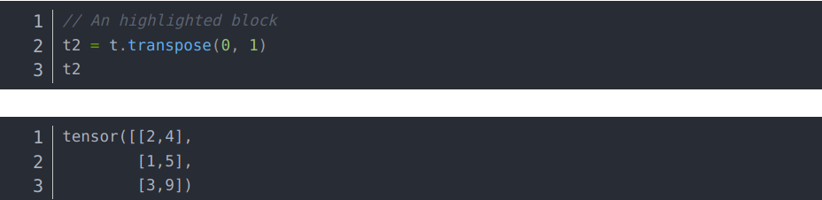
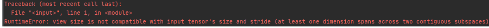

# Tensor初始化

## 初始化一个range

**torch.arange(start:int, end:int)**

说明：初始化一个1维的数组


# tensor对象的方法

## 转换形状

**tensor.view(shape:[int, tuple])**

说明：将一个tuple的维度进行转换

view对张量的改变形状实际上并没有改变其真正在内存中的形状，而是改变了其访问规则，还是与原来的张量共享内存。


**tensor.transpose(dim0, dim1)**

说明：交换tensor的两个维度，交换dim0和dim1


**tensor.contigurous()**

说明：语义上是"连续的"的意思，经常与torch.permute()、torch.transpose()、torch.view()一起使用，这是因为

pytorch与numpy在存储MxN的数组时，均是按照行优先将数组拉伸至一维存储，比如对于一个二维张量

```python
t = torch.tensor([[2, 1, 3], [4, 5, 9]])
```

在内存中实际上是[2,1,3,4,5,9]

当我们使用transpose()或者permute()方法后，改变了张量的形状。



如果此时对该tensor使用view，回报错



这是因为改变了形状的tensor在内存中还是跟之前一样没有变更，此时如果拉伸，数字不连续，此时contiguous就派上用场了。

我们执行该方法后，使用tensor.view(-1)可以查看其在内存中的存储方法

```Python
t3 = t2.contiguous()
print(t3.view(-1))
```


我们发现，**Contiguous函数实际上就是修改了tensor在内存中的存储顺序，使其更加连续**。


## 数据/设备转换

**tensor.to(obj)**

说明： 转换数据计算方式，转换数据存储位置

转换数据类型，如下，将数据类型转换为float

```Python
t = torch.ones((3,3))
t.to(torch.float)
```

说明：如果需要在gpu中计算，那么需要先进行数据设备转换

```Python
net(X.to("cuda"))
```


**tensor.cpu()**

说明:  将存储在gpu中的数据转到cpu中


## 使数据进行脱离计算图

**tensor.detach_()**

说明：使这个tensor分离计算图，计算梯度时，计算到此处时将不会按照整体向量进行计算。


# 网络/计算层的初始化

## 最大池化层初始化

**torch.nn.MaxPool2d(size:[int, tuple], padding:[int, tuple], stride:[int, tuple])**

说明：初始化一个最大池化层

参数：

​	size: 池化层形状

​	padding: 输入填充，int类型代表4面填充，(int, int)代表高填充，宽填充

​	stride: 步幅，类型同padding

## 平均池化层初始化

**torch.nn.AvgPool2d(size:[int, tuple], padding:[int, tuple], stride:[int, tuple])**

说明: 初始化一个平均池化层

参数同最大池化层


## 卷积层初始化

**torch.nn.Conv2d(in_channel:[int, tuple], out_channel:[int, tuple], kelnel_size:[int, tuple], stride=1, padding=0)**

说明：创建一个卷积层

参数：

in_channel: 输入通道数

out_channel: 输出通道数

kelnel_size: 卷积核大小，int值代表长度一致的正方形核，否则为高宽为(int, int)的核

stride：卷积核移动一次的步长，默认为1

padding: 对原始数据进行补零的大小，默认不补零，int代表4个方向补零，(int, int)代表高宽补零


# torch.nn.Module方法

## 转换计算设备

**net_obj.to(device:[str, device obj])**

说明：将数据转到另一个设备计算。注意，存储在不同设备的数据不能进行直接运算

案例：

```
net.to("cuda")
net.to("cuda:0")
device = list(net1.parameters())[0].device
net.to(device)
```


# Torch模块内方法

## 拼接

**torch.cat(tensors:iterable, dim)**

说明：拼接多个张量

参数：

​	tensors: 多个tensor

​	dim: 维度，按照维度进行拼接, dim=0：行拼接， dim=1:列拼接


**torch.stack(tensors:iterable)**

说明：沿着新维度，对输入张量序列进行连接，tensors中的所有张量形状应当相同

简单点说就是：把2个2维张量拼接成一个3维张量


​	

# 优化器

说明：优化器是对线性或神经网络进行参数优化的工具，常用的优化器有SGD（随机梯度下降）等。

使用：

```Python
import torch.optim as opt
optimizer = opt.SGD(net.parameters())
# 清零梯度
optimizer.zero_grad()
...
loss.backward()
...
# 执行优化
optimizer.step()
```


## SGD

说明：随机梯度下降优化器

使用：

```Python
optimizer = opt.SGD(net.parameters(), lr=0.01)
```

参数：

	1. 参数列表
	2. 学习率


## Adam

说明：是SGD优化的延伸，可以看成是加了个动量（Momentum）的SGD

使用：

```Python
optimizer = opt.Adam(net.parameters(), lr=0.01)
```

