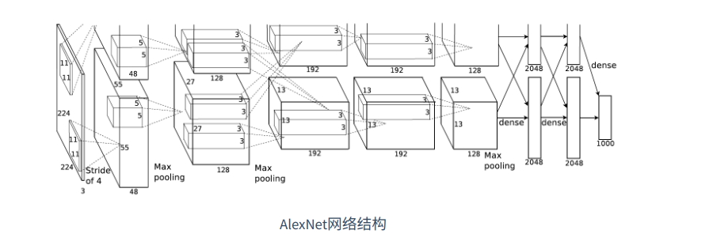

# 卷积神经网络(LeNet)

**引入**：

前一章节，我们实现了含单隐藏层的多层感知机模型来对Fashion-Mnist进行分类，每张图像为1*784的向量，然而这种分类方法有一定的局限性：

1 图像在同一列的像素可能在转换成向量后距离较远，构成的模式可能难以被识别

2 对于大尺寸图像，使用全连接层容易造成模型过大，假设高和宽为1000*1000的3通道图片，全连接层输出数为256，那么他会占用大概3000000 * 256 ≈ 3GB的内存或显存空间

卷积层尝试解决这些问题，一方面，卷积层保留输入性状，使得图像在高和宽的相关性得到保留，其次通过滑动窗口，避免重复计算，避免参数尺寸过大

**说明**：

卷积神经网络就是含有卷积层的网络，本节介绍一个早期的用来识别手写数字的卷积神经网络：LeNet，这个名字来源于LeNet论文作者Yann LeCun，Lenet展示了通过梯度下降训练卷积神经网络能够达到的最先进效果。


## Lenet模型

分类2个部分：卷积层和全连接层

卷积层：基本单位是卷积层+最大池化层，卷积层用来识别图像空间模式，最大池化层用来降低对位置的敏感度，卷积层块由这样的2个单位重复堆叠而成，所有卷积层使用5*5窗口，输出使用sigmod激活函数，第一个卷积层输出通道为6，第二个是16，因为第二个卷积层输入比第一层高和宽要小，增加输出通道使2个卷积层的尺寸类似，最大池化层的尺寸为2 * 2，步幅为2

卷积层块的形状为（批量大小，通道数，高，宽），当输出传入全连接层后，全连接层会将输入压缩成2维，数据维度的长度为**通道数 * 长 * 宽**， 包含3个全连接层，输出个数为120， 84， 10


## 代码实现

```Python
import torch
from torch import nn, optim

from Code.Utils.train import train
from Code.Utils.load_data import get_data_fashion_mnist


device = torch.device("cuda" if torch.cuda.is_available() else "cpu")


class LeNet(nn.Module):
    def __init__(self):
        super(LeNet, self).__init__()
        # 定义卷积层
        self.conv = nn.Sequential(
            # in_channels, out_channels, kernel_size
            nn.Conv2d(1, 6, 5),
            nn.Sigmoid(),
            nn.MaxPool2d(2, 2),
            nn.Conv2d(6, 16, 5),
            nn.Sigmoid(),
            nn.MaxPool2d(2, 2)
        )
        # 定义线性层（全连接层）
        self.fc = nn.Sequential(
            nn.Linear(16*4*4, 120),
            nn.Sigmoid(),
            nn.Linear(120, 84),
            nn.Sigmoid(),
            nn.Linear(84, 10)
        )

    def forward(self, img):
        feature = self.conv(img)
        output = self.fc(feature.view(img.shape[0], -1))
        return output
```

(训练代码，准确率评估代码见/Code/Utils/train.py 和 evaluate_accuracy.py)

打印模型：

```Python
net = LeNet()
print(net)
```


## 开始训练

```Python
net = LeNet()
batch_size = 256
train_iter, test_iter = get_data_fashion_mnist(batch_size)
lr = 0.01
num_epoch = 5
optimizer = optim.Adam(net.parameters(), lr)
train(net, train_iter, test_iter, batch_size, optimizer, device, num_epoch)
```

输出：


# 深度卷积神经网络

虽然leNet可以在早期的小数据集上表现出更好的成绩，但是在更大的数据集上表现的不尽如人意

在图像识别中，我们直接将像素点转化为输出结果，这种端到端的方式节省了很多中间步骤，但是还有更长的时间，人们研究模型参数，并生成一段手工特征，然后进行分类，主要流程为：

1. 获取图像数据集；
2. 使用已有的特征提取函数生成图像的特征；
3. 使用机器学习模型对图像的特征分类。

但是也有人认为特征应当学习得来，他们提出，复杂模型下的特征应当分级表示，多级神经网络可以学习到数据的多级表征。然而，由于数据和硬件方面的原因，这种通过多级表征学习的方法一直没有实现。


## Alexnet



### 结构

AlexNet 2012年提出，使用了8层神经网络，他首次证明了学习到的特征能够超越手工设计的特征。

它包含了5层卷积和2层全连接层，和一层全连接输出层

第一层：卷积窗口形状为11*11， 由于图片较大，所以需要较大的卷积窗口捕获物体

第二层：卷积窗口形状为5*5

第3-5层：卷积窗口为3*3

1，2，5层后，都用了3*3，步幅为2的池化层，而且输入通道数也比LeNet大数10倍。

全连接6-7层：输出都为4096

### 特性

1 AlexNet将Sigmod换成了更加简单的ReLU激活函数，这使得计算更加简单，其次，ReLU函数在不同的参数初始化方法下使得模型更容易训练，这是因为Sigmod函数输出绝对值越大时，斜率越趋近于0，这使得每次迭代的优化值越趋近于0，而RELU函数在正区间内的斜率永远为1，Sigmod函数可能在正区间取得几乎为0的梯度，使得模型无法有效训练。

2 AlexNet使用丢弃法来控制全连接层的模型复杂度，LeNet没有

3 AlexNet使用了大量的图像增广，如翻转，剪裁和颜色变化，从而进一步扩大数据集，减少过拟合，后面详述。

### 代码实现-简化版AlexNet

代码位置：Code/Example/AlexNet.py

```Python

import time
import torch
from torch import nn
import torchvision


device = torch.device("cuda" if torch.cuda.is_available() else "cpu")


class AlexNet(nn.Module):
    def __init__(self):
        super(AlexNet, self).__init__()
        self.conv = nn.Sequential(
            # in_channel, out_channel, kernel_size, stride
            nn.Conv2d(1, 96, 11, 4),
            nn.ReLU(),
            nn.MaxPool2d(3, 2),
            # 减小卷积窗口，使用填充为2，保证输入输出形状一致
            nn.Conv2d(96, 256, 5, 1, 2),
            nn.ReLU(),
            nn.MaxPool2d(3, 2),
            # 连续3个卷积层，进一步增大了通道数
            nn.Conv2d(256, 384, 3, 1, 1),
            nn.ReLU(),
            nn.Conv2d(384, 384, 3, 1, 1),
            nn.ReLU(),
            nn.Conv2d(384, 256, 3, 1, 1),
            nn.ReLU(),
            nn.MaxPool2d(3, 2)
        )
        self.fc = nn.Sequential(
            nn.Linear(256*5*5, 4096),
            nn.ReLU(),
            nn.Dropout(0.5),
            nn.Linear(4096, 4096),
            nn.ReLU(),
            nn.Dropout(0.5),
            # 这里使用FashionMnist，所以就不将输出搞成1000了
            nn.Linear(4096, 10),
        )

    def forward(self, img):
        features = self.conv(img)
        out = self.fc(features.view(img.shape[0], -1))
        return out

```


# 重复元素的网络（VGG）

虽然AlexNet在识别中取得了非常不错的结果，但是创作者并没有指明如何去设计一个新的网络，我们这边指出一项神经网络的设计思路之一：VGG网络

VGG网络提出了使用简单的基础块构建深度模型


## VGG块

定义：

连续使用数个相同的 填充为1，窗口形状为3*3的卷基层，随后接上一个步幅为2的2 * 2最大池化层

### 代码实现

代码位置：Code/CNN/VGG.py

```Python
import torch


def vgg_block(num_convs, in_channel, out_channel):
    """
    Param num_convs: 卷基层数
    Param in_channel: 输入通道数
    Param out_channel: 输出通道数
    """
    blk = []
    for i in range(num_convs):
        if i == 0:
            blk.append(torch.nn.Conv2d(in_channel, out_channel, (3, 3), padding=1))
        else:
            blk.append(torch.nn.Conv2d(out_channel, out_channel, (3, 3), padding=1))
        blk.append(torch.nn.ReLU())
    blk.append(torch.nn.MaxPool2d(2, 2))
    return torch.nn.Sequential(*blk)

```


## VGG网络

和AlexNet和LeNet差不多，VGG网络由卷积模块后接全连接层构成

**构造一个VGG-11网络**

卷基层模块：串联数个VGG块，其超参数由变量**conv_arch**定义，该变量指定了每个VGG块中的卷基层个数和输入输出通道数

全连接模块：和AlexNet一样，也采用了丢弃法进行隐藏层丢弃。我们采用3层全连接层

现在，我们构造一个5个VGG卷积块（2个单卷积层+3个双卷积层）总计8个卷积层

因为总共8+3层，我们一般称此网络为**VGG-11网络**

```Python
conv_arch = ((1, 1, 64), (1, 64, 128), (2, 128, 256), (2, 256, 512), (2, 512, 512))
# 经过5个vgg_block, 宽高会减半5次, 变成 224/32 = 7
fc_features = 512 * 7 * 7 # c * w * h
fc_hidden_units = 4096 # 任意
```

说明：我们定义的第一层输入通道为1（因为Fashion-Mnist的输入通道为1），输出通道为64，此后的通道一直翻倍，直到512

### 代码

```Python
def vgg_11(conv_arch, fc_features, fc_hidden_units):
    net = torch.nn.Sequential()
    for i, (num_conv, in_channel, out_channel) in enumerate(conv_arch):
        # 由于池化层的关系，每次VGG输出的形状，会比输入的形状减小1/2
        net.add_module("VGG_%d" % i, vgg_block(num_conv, in_channel, out_channel))

    net.add_module("fc", torch.nn.Sequential(
        FlattenLayer(),
        # 1
        torch.nn.Linear(fc_features, fc_hidden_units),
        torch.nn.ReLU(),
        torch.nn.Dropout(0.5),
        # 2
        torch.nn.Linear(fc_hidden_units, fc_hidden_units),
        torch.nn.ReLU(),
        torch.nn.Dropout(0.5),
        # 3
        torch.nn.Linear(fc_hidden_units, 10)
    ))
    return net
```

### 验证层级变化

代码：

```Python
x = torch.rand((1, 1, 224, 224))
print("original x shape:", x.shape)
net = vgg_11(conv_arch, fc_features, fc_hidden_units)
for name, blk in net.named_children():
    x = blk(x)
    print(name, "output shape:", x.shape)
```

输出：

```
original x shape: torch.Size([1, 1, 224, 224])
VGG_0 output shape: torch.Size([1, 64, 112, 112])
VGG_1 output shape: torch.Size([1, 128, 56, 56])
VGG_2 output shape: torch.Size([1, 256, 28, 28])
VGG_3 output shape: torch.Size([1, 512, 14, 14])
VGG_4 output shape: torch.Size([1, 512, 7, 7])
fc output shape: torch.Size([1, 10])
```

结论：

我们发现，每次我们将输入的高和宽减半，直到最后为7*7，穿入最后的全连接层，与此同时，输出通道数却翻倍，变成512

因为每个卷积核大小一致，所以每层的模型参数尺寸和模型复杂度与输入的高，宽，输入输出通道数成正比。


