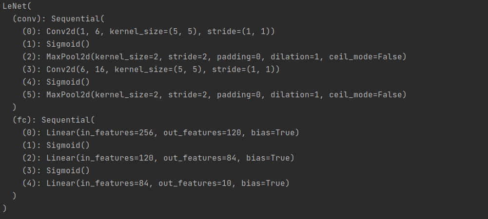

# 卷积神经网络(LeNet)

**引入**：

前一章节，我们实现了含单隐藏层的多层感知机模型来对Fashion-Mnist进行分类，每张图像为1*784的向量，然而这种分类方法有一定的局限性：

1 图像在同一列的像素可能在转换成向量后距离较远，构成的模式可能难以被识别

2 对于大尺寸图像，使用全连接层容易造成模型过大，假设高和宽为1000*1000的3通道图片，全连接层输出数为256，那么他会占用大概3000000 * 256 ≈ 3GB的内存或显存空间

卷积层尝试解决这些问题，一方面，卷积层保留输入性状，使得图像在高和宽的相关性得到保留，其次通过滑动窗口，避免重复计算，避免参数尺寸过大

**说明**：

卷积神经网络就是含有卷积层的网络，本节介绍一个早期的用来识别手写数字的卷积神经网络：LeNet，这个名字来源于LeNet论文作者Yann LeCun，Lenet展示了通过梯度下降训练卷积神经网络能够达到的最先进效果。


## Lenet模型

分类2个部分：卷积层和全连接层

卷积层：基本单位是卷积层+最大池化层，卷积层用来识别图像空间模式，最大池化层用来降低对位置的敏感度，卷积层块由这样的2个单位重复堆叠而成，所有卷积层使用5*5窗口，输出使用sigmod激活函数，第一个卷积层输出通道为6，第二个是16，因为第二个卷积层输入比第一层高和宽要小，增加输出通道使2个卷积层的尺寸类似，最大池化层的尺寸为2 * 2，步幅为2

卷积层块的形状为（批量大小，通道数，高，宽），当输出传入全连接层后，全连接层会将输入压缩成2维，数据维度的长度为**通道数 * 长 * 宽**， 包含3个全连接层，输出个数为120， 84， 10


## 代码实现

```Python
import torch
from torch import nn, optim

from Code.Utils.train import train
from Code.Utils.load_data import get_data_fashion_mnist


device = torch.device("cuda" if torch.cuda.is_available() else "cpu")


class LeNet(nn.Module):
    def __init__(self):
        super(LeNet, self).__init__()
        # 定义卷积层
        self.conv = nn.Sequential(
            # in_channels, out_channels, kernel_size
            nn.Conv2d(1, 6, 5),
            nn.Sigmoid(),
            nn.MaxPool2d(2, 2),
            nn.Conv2d(6, 16, 5),
            nn.Sigmoid(),
            nn.MaxPool2d(2, 2)
        )
        # 定义线性层（全连接层）
        self.fc = nn.Sequential(
            nn.Linear(16*4*4, 120),
            nn.Sigmoid(),
            nn.Linear(120, 84),
            nn.Sigmoid(),
            nn.Linear(84, 10)
        )

    def forward(self, img):
        feature = self.conv(img)
        output = self.fc(feature.view(img.shape[0], -1))
        return output
```

(训练代码，准确率评估代码见/Code/Utils/train.py 和 evaluate_accuracy.py)

打印模型：

```Python
net = LeNet()
print(net)
```



## 开始训练

```Python
net = LeNet()
batch_size = 256
train_iter, test_iter = get_data_fashion_mnist(batch_size)
lr = 0.01
num_epoch = 5
optimizer = optim.Adam(net.parameters(), lr)
train(net, train_iter, test_iter, batch_size, optimizer, device, num_epoch)
```

输出：

